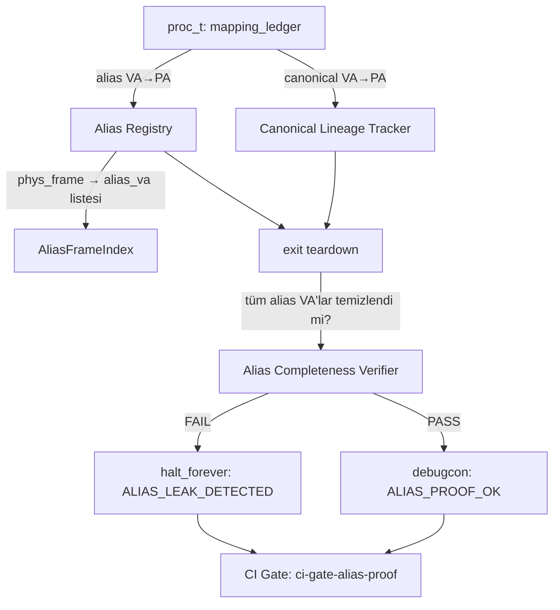
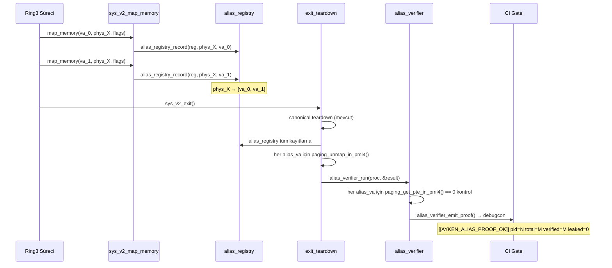

# Tasarım Belgesi: Alias-Aware Address Space Leak Proof

## Genel Bakış

Bu özellik, AykenOS'ta bir süreç çıkışından (exit) sonra adres uzayındaki **tüm alias eşlemelerinin** — yani birden fazla sanal adresin aynı fiziksel frame'e işaret ettiği durumların — eksiksiz temizlendiğini kanıtlamak için bir doğrulama altyapısı tasarlar. Mevcut teardown kanıtı yalnızca canonical lineage'ı (tek sanal adres → fiziksel frame) doğrulamaktadır; bu tasarım, alias eşlemelerini (N sanal adres → aynı fiziksel frame) kapsama alarak tam adres uzayı sızıntısızlık kanıtını tamamlar.

Mevcut kanıt hattı: single-exit proof ✅, parametric N-exit proof ✅, adversarial interleaving proof ✅. Bu tasarım, alias-aware tam adres uzayı sızıntısızlık kanıtını ekler.

### Tasarım Sınırı (v1 Dürüstlük Beyanı)

Bu tasarım **shadow registry** modeline dayanır: `alias_registry_t`, `sys_v2_map_memory()` çağrıları sırasında doldurulur. Bu şu anlama gelir:

- **Kanıtlanan**: Registry'ye giren alias'ların tamamı teardown sonrası temizlendi.
- **Henüz kanıtlanmayan**: Tüm alias'ların registry'ye girdiği.

Registry ile page table arasında divergence oluşursa — örneğin bir mapping registry'ye yazılmadan PTE kurulursa — sistem `PASS` verir ama gerçekte leak vardır. Bu **false negative** riskidir.

**Doğru ifade**: v1, kabul edilen mapping yüzeyi içinde registry–page-table tutarlılığını fail-closed olarak garanti eder; ancak global authoritativeness garanti etmez. Yani registry doğruluğu ✅, sistemin tamamı ❌.

**v2 hedefi** (bu tasarımın kapsamı dışında): Page-table tabanlı authoritative cross-check — teardown sonrası PML4 walk ile registry'den bağımsız alias tespiti ve karşılaştırma. Bu adım tamamlandığında kanıt "instrumentation + check" seviyesinden "tam kanıt" seviyesine yükselir.

### Faz Konumlandırması

Bu tasarım **Phase 11: Memory Model Verification** başlangıcına karşılık gelir.

- Phase 10B (execution correctness, teardown lineage proof) tamamlandı.
- Bu tasarım, execution sonrası memory correctness'ı ele alır: alias consistency ve leak proof.
- Phase 11'in ilk slice'ı olarak konumlanır; v2 (page-table walk) Phase 11'in tamamlanma koşuludur.

## Mimari




## Bileşenler ve Arayüzler

### Bileşen 1: AliasRegistry (kernel/mm/alias_registry.c)

**Amaç**: Bir sürecin adres uzayındaki tüm alias eşlemelerini (phys_frame → [va_0, va_1, ..., va_N]) takip eden kernel-tarafı veri yapısı. Ring0 mekanizma katmanında yaşar; politika kararı içermez.

**Arayüz**:
```c
/* Alias kayıt defteri — proc_t içine gömülü, heap tahsisi yok */
#define AYKEN_MAX_ALIAS_ENTRIES   32
#define AYKEN_MAX_ALIASES_PER_FRAME 8

typedef struct {
    uint8_t  in_use;
    uint64_t phys_frame;                              /* izlenen fiziksel frame */
    uint64_t alias_vas[AYKEN_MAX_ALIASES_PER_FRAME];  /* bu frame'e eşlenen VA'lar */
    uint32_t alias_count;
    uint32_t reserved;
} alias_entry_t;

typedef struct {
    alias_entry_t entries[AYKEN_MAX_ALIAS_ENTRIES];
    uint32_t      entry_count;
    uint32_t      reserved;
} alias_registry_t;

/* API */
int  alias_registry_record(alias_registry_t *reg,
                           uint64_t phys_frame,
                           uint64_t alias_va);

int  alias_registry_remove(alias_registry_t *reg,
                           uint64_t phys_frame,
                           uint64_t alias_va);

alias_entry_t *alias_registry_find(alias_registry_t *reg,
                                   uint64_t phys_frame);

uint32_t alias_registry_count_for_frame(alias_registry_t *reg,
                                        uint64_t phys_frame);
```

**Sorumluluklar**:
- Bir fiziksel frame'e yapılan tüm sanal adres eşlemelerini kayıt altına almak
- Eşleme kaldırıldığında kaydı silmek
- Teardown sırasında doğrulayıcıya veri sağlamak
- Statik boyutlu dizi kullanmak (heap tahsisi yok — Ring0 güvenlik kuralı)

**Kapsam Kısıtlamaları (v1)**:
- Yalnızca `sys_v2_map_memory()` üzerinden geçen user-space mapping'leri kapsar
- Kernel-internal mapping'ler, identity mapping'ler ve shared memory bu registry'ye yazılmaz
- `fork`, `remap`, `copy-on-write` lifecycle olayları bu versiyonda desteklenmez
- Kapasite aşımında (`-ENOMEM`) eşleme reddedilir; PTE kurulmaz — bu sayede registry ile page table arasında divergence oluşmaz (fail-closed kapasite politikası)

**Hard Cap Davranışı**:
- `AYKEN_MAX_ALIAS_ENTRIES=32` veya `AYKEN_MAX_ALIASES_PER_FRAME=8` aşılırsa `alias_registry_record()` `-ENOMEM` döner
- `sys_v2_map_memory()` bu durumda eşlemeyi **reddeder** — PTE kurulmaz
- Sonuç: registry ile page table her zaman senkrondur; silent failure yoktur
- Bu kısıt, v1 içinde admitted surface düzeyinde registry–page-table consistency garantisinin temelidir

### Bileşen 2: AliasCompletenessVerifier (kernel/mm/alias_verifier.c)

**Amaç**: Süreç çıkışı sonrasında, alias_registry'deki tüm kayıtların PTE düzeyinde temizlendiğini doğrular. Kanıt üretir ve debugcon'a yazar.

**Arayüz**:
```c
typedef struct {
    uint32_t total_alias_entries;    /* toplam alias kaydı sayısı */
    uint32_t verified_clean;         /* PTE=0 doğrulanan alias VA sayısı */
    uint32_t leaked_count;           /* hâlâ present=1 olan alias VA sayısı */
    uint64_t first_leaked_va;        /* ilk sızan VA (debug için) */
    uint64_t first_leaked_phys;      /* ilk sızan frame (debug için) */
} alias_proof_result_t;

int alias_verifier_run(proc_t *p,
                       alias_proof_result_t *out_result);

void alias_verifier_emit_proof(const alias_proof_result_t *result,
                               int pid);
```


### Bileşen 3: proc_t Genişletmesi

**Amaç**: `proc_t` yapısına `alias_registry_t` alanı eklenerek her sürecin kendi alias kaydını tutması sağlanır.

```c
/* kernel/include/proc.h — mevcut proc_t yapısına eklenti */
typedef struct proc {
    /* ... mevcut alanlar ... */
    proc_mapping_entry_t mapping_ledger[AYKEN_MAX_PROC_GENERIC_MAPPINGS];
    alias_registry_t     alias_reg;   /* YENİ: alias eşleme kaydı */
} proc_t;
```

### Bileşen 4: CI Gate (ci-gate-alias-proof)

**Amaç**: QEMU boot log'unu analiz ederek `[[AYKEN_ALIAS_PROOF_OK]]` witness'ını doğrular. Mevcut exit proof gate'leriyle aynı pattern'i izler.

**Arayüz** (Makefile hedefi):
```makefile
ci-gate-alias-proof:
    AYKEN_ALIAS_PROOF_SELFTEST=1 \
    KERNEL_PROFILE=validation \
    $(MAKE) run-validation-boot 2>&1 | \
    tools/validation/alias_proof_audit.sh
```

## Veri Modelleri

### Model 1: alias_entry_t

```c
typedef struct {
    uint8_t  in_use;                              /* 0=boş, 1=aktif */
    uint64_t phys_frame;                          /* izlenen fiziksel frame PA */
    uint64_t alias_vas[AYKEN_MAX_ALIASES_PER_FRAME]; /* bu frame'e eşlenen VA'lar */
    uint32_t alias_count;                         /* geçerli alias sayısı */
    uint32_t reserved;
} alias_entry_t;
```

**Doğrulama Kuralları**:
- `phys_frame` 4KB hizalı olmalı (`phys_frame & 0xFFF == 0`)
- `alias_count <= AYKEN_MAX_ALIASES_PER_FRAME`
- `in_use == 1` ise `alias_count >= 1`
- Aynı `alias_va` aynı entry'de iki kez kaydedilemez

### Model 2: alias_proof_result_t

```c
typedef struct {
    uint32_t total_alias_entries;  /* teardown öncesi kayıtlı alias VA sayısı */
    uint32_t verified_clean;       /* PTE=0 doğrulanan VA sayısı */
    uint32_t leaked_count;         /* PTE≠0 kalan VA sayısı (0 olmalı) */
    uint64_t first_leaked_va;      /* ilk sızan VA (leaked_count>0 ise geçerli) */
    uint64_t first_leaked_phys;    /* ilk sızan frame (leaked_count>0 ise geçerli) */
} alias_proof_result_t;
```

**Doğrulama Kuralları**:
- Kanıt geçerli ise: `verified_clean == total_alias_entries && leaked_count == 0`
- `leaked_count > 0` → `MEMORY.LEAK` ihlali → `halt_forever()`

## Sıralı Diyagramlar

### Ana Akış: Alias Kayıt ve Teardown




## Algoritmik Pseudocode

### Algoritma 1: alias_registry_record

```pascal
PROCEDURE alias_registry_record(reg, phys_frame, alias_va)
  INPUT:  reg        — alias_registry_t pointer
          phys_frame — fiziksel frame PA (4KB hizalı)
          alias_va   — eşlenecek sanal adres
  OUTPUT: 0 başarı, -EINVAL geçersiz girdi, -ENOMEM kapasite aşımı

  PRECONDITION: reg ≠ NULL
  PRECONDITION: phys_frame & 0xFFF = 0
  PRECONDITION: alias_va ≠ 0

  BEGIN
    IF reg = NULL OR phys_frame = 0 THEN
      RETURN -EINVAL
    END IF

    // Mevcut entry'yi ara
    entry ← alias_registry_find(reg, phys_frame)

    IF entry = NULL THEN
      // Yeni entry oluştur
      IF reg.entry_count >= AYKEN_MAX_ALIAS_ENTRIES THEN
        RETURN -ENOMEM
      END IF
      entry ← reg.entries[reg.entry_count]
      entry.in_use ← 1
      entry.phys_frame ← phys_frame
      entry.alias_count ← 0
      reg.entry_count ← reg.entry_count + 1
    END IF

    // Duplicate kontrolü
    FOR i ← 0 TO entry.alias_count - 1 DO
      IF entry.alias_vas[i] = alias_va THEN
        RETURN 0  // zaten kayıtlı, idempotent
      END IF
    END FOR

    IF entry.alias_count >= AYKEN_MAX_ALIASES_PER_FRAME THEN
      RETURN -ENOMEM
    END IF

    entry.alias_vas[entry.alias_count] ← alias_va
    entry.alias_count ← entry.alias_count + 1

    RETURN 0
  END

  POSTCONDITION: alias_registry_find(reg, phys_frame) ≠ NULL
  POSTCONDITION: alias_registry_count_for_frame(reg, phys_frame) ≥ 1
END PROCEDURE
```

### Algoritma 2: alias_verifier_run

```pascal
PROCEDURE alias_verifier_run(proc, out_result)
  INPUT:  proc       — proc_t pointer (teardown sonrası)
          out_result — alias_proof_result_t pointer
  OUTPUT: 0 kanıt geçerli (sızıntı yok), -1 sızıntı tespit edildi

  PRECONDITION: proc ≠ NULL
  PRECONDITION: proc.state = PROC_ZOMBIE  (teardown tamamlanmış)
  PRECONDITION: out_result ≠ NULL

  BEGIN
    out_result.total_alias_entries ← 0
    out_result.verified_clean ← 0
    out_result.leaked_count ← 0
    out_result.first_leaked_va ← 0
    out_result.first_leaked_phys ← 0

    reg ← &proc.alias_reg

    FOR i ← 0 TO reg.entry_count - 1 DO
      entry ← reg.entries[i]

      IF entry.in_use = 0 THEN
        CONTINUE
      END IF

      FOR j ← 0 TO entry.alias_count - 1 DO
        va ← entry.alias_vas[j]
        out_result.total_alias_entries ← out_result.total_alias_entries + 1

        // LOOP INVARIANT: verified_clean + leaked_count = işlenen alias sayısı
        pte ← paging_get_pte_in_pml4(proc.pml4_phys, va)

        IF pte = 0 THEN
          out_result.verified_clean ← out_result.verified_clean + 1
        ELSE
          out_result.leaked_count ← out_result.leaked_count + 1
          IF out_result.first_leaked_va = 0 THEN
            out_result.first_leaked_va ← va
            out_result.first_leaked_phys ← entry.phys_frame
          END IF
        END IF
      END FOR
    END FOR

    IF out_result.leaked_count > 0 THEN
      RETURN -1
    END IF

    RETURN 0
  END

  POSTCONDITION: out_result.verified_clean + out_result.leaked_count
                 = out_result.total_alias_entries
  POSTCONDITION: RETURN 0 ⟹ out_result.leaked_count = 0
  POSTCONDITION: RETURN -1 ⟹ out_result.leaked_count > 0

  LOOP INVARIANT: Her iterasyonda verified_clean + leaked_count
                  = o ana kadar işlenen toplam alias VA sayısı
END PROCEDURE
```

### Algoritma 3: exit teardown alias temizleme (sys_v2_exit entegrasyonu)

```pascal
PROCEDURE exit_teardown_alias_phase(proc)
  INPUT:  proc — çıkış yapan proc_t pointer
  OUTPUT: void (fail-closed: sızıntı varsa halt_forever)

  PRECONDITION: proc ≠ NULL
  PRECONDITION: proc.state = PROC_ZOMBIE
  PRECONDITION: proc.teardown_started = 1
  // FREEZE INVARIANT: teardown_started=1 iken sys_v2_map_memory() bu proc için -EINVAL döner
  // Yani teardown başladıktan sonra yeni alias kaydı gelmez; verifier penceresi temizdir

  BEGIN
    reg ← &proc.alias_reg

    // Adım 1: Tüm alias VA'ları PML4'ten temizle
    FOR i ← 0 TO reg.entry_count - 1 DO
      entry ← reg.entries[i]
      IF entry.in_use = 0 THEN CONTINUE END IF

      FOR j ← 0 TO entry.alias_count - 1 DO
        va ← entry.alias_vas[j]
        paging_unmap_in_pml4(proc.pml4_phys, va)
        sys_v2_invalidate_local_page_if_active(proc.pml4_phys, va)
        // KAYNAK DOĞRULAMA NOTU: sys_v2_invalidate_local_page_if_active()
        // gerçekten invlpg instruction'ı ürettiği kaynak koddan doğrulanmalıdır.
        // Doğrulanmıyorsa bu satır yerine doğrudan invlpg(va) çağrılmalıdır.
        // "Muhtemelen yapıyor" varsayımı kabul edilmez — TLB flush olmadan
        // bu tasarım "page-table-proof" olur, "leak-proof" olmaz.
      END FOR
    END FOR

    // Adım 2: Kanıt doğrulaması
    result ← alias_proof_result_t{}
    verdict ← alias_verifier_run(proc, &result)

    // Adım 3: Kanıt yayını (debugcon)
    alias_verifier_emit_proof(&result, proc.pid)

    // Adım 4: Fail-closed enforcement
    IF verdict ≠ 0 THEN
      debugcon_write("[[AYKEN_ALIAS_LEAK_DETECTED]]\n")
      halt_forever()
    END IF
  END

  POSTCONDITION: tüm alias VA'lar için paging_get_pte_in_pml4() = 0
  POSTCONDITION: debugcon'da [[AYKEN_ALIAS_PROOF_OK]] witness mevcut
END PROCEDURE
```


## Temel Fonksiyonlar ve Formal Spesifikasyonlar

### alias_registry_record()

```c
int alias_registry_record(alias_registry_t *reg,
                          uint64_t phys_frame,
                          uint64_t alias_va);
```

**Önkoşullar:**
- `reg != NULL`
- `phys_frame != 0 && (phys_frame & 0xFFF) == 0` (4KB hizalı)
- `alias_va != 0`
- `reg->entry_count <= AYKEN_MAX_ALIAS_ENTRIES`

**Sonkoşullar:**
- Başarı (0): `alias_registry_find(reg, phys_frame) != NULL`
- Başarı (0): `alias_registry_count_for_frame(reg, phys_frame) >= 1`
- Hata (-ENOMEM): kayıt değişmez
- Idempotent: aynı `(phys_frame, alias_va)` çifti iki kez kaydedilirse ikinci çağrı 0 döner, sayaç artmaz

**Döngü Değişmezi:** Duplicate tarama döngüsünde, `i < k` olan tüm `alias_vas[i] != alias_va`

### alias_verifier_run()

```c
int alias_verifier_run(proc_t *p,
                       alias_proof_result_t *out_result);
```

**Önkoşullar:**
- `p != NULL && p->state == PROC_ZOMBIE`
- `out_result != NULL`
- `p->pml4_phys != 0`

**Sonkoşullar:**
- `out_result->verified_clean + out_result->leaked_count == out_result->total_alias_entries`
- Dönüş 0 ⟹ `out_result->leaked_count == 0`
- Dönüş -1 ⟹ `out_result->leaked_count > 0`
- Yan etki yok: `p->alias_reg` değişmez

**Döngü Değişmezi:** Her iterasyon sonunda `verified_clean + leaked_count == işlenen_alias_sayısı`

### alias_verifier_emit_proof()

```c
void alias_verifier_emit_proof(const alias_proof_result_t *result,
                               int pid);
```

**Önkoşullar:**
- `result != NULL`
- `pid > 0`

**Sonkoşullar:**
- `leaked_count == 0` ise debugcon'a `[[AYKEN_ALIAS_PROOF_OK]]` yazılır
- `leaked_count > 0` ise debugcon'a `[[AYKEN_ALIAS_LEAK_DETECTED]]` yazılır
- Çıktı formatı deterministik ve CI gate tarafından parse edilebilir

**Çıktı Formatı:**
```
[[AYKEN_ALIAS_PROOF_OK]] pid=<N> total=<M> verified=<M> leaked=0 tlb_scope=local
```
veya sızıntı durumunda:
```
[[AYKEN_ALIAS_LEAK_DETECTED]] pid=<N> total=<M> verified=<V> leaked=<L> first_va=0x<VA> first_phys=0x<PA> tlb_scope=local
```

`tlb_scope=local`: v1'in yalnızca local-core TLB flush garantilediğini, remote-core TLB shootdown'ın kapsam dışı olduğunu proof report yüzeyinde açıkça taşır. CI gate bu alanı parse ederek kapsam sınırını evidence'a yansıtır.

## Örnek Kullanım

```c
// Örnek 1: İki alias eşleme kaydı
proc_t *p = proc_create_user_process("alias-test", ...);
uint64_t phys_X = phys_alloc_frame();

// İki farklı VA'yı aynı fiziksel frame'e eşle
paging_map_page_in_pml4(p->pml4_phys, 0x1000, phys_X, AYKEN_PTE_USER);
alias_registry_record(&p->alias_reg, phys_X, 0x1000);

paging_map_page_in_pml4(p->pml4_phys, 0x2000, phys_X, AYKEN_PTE_USER);
alias_registry_record(&p->alias_reg, phys_X, 0x2000);

// Örnek 2: Exit teardown sırasında alias temizleme
// (sys_v2_exit() içinde otomatik çağrılır)
exit_teardown_alias_phase(p);
// → debugcon: [[AYKEN_ALIAS_PROOF_OK]] pid=3 total=2 verified=2 leaked=0

// Örnek 3: Validation selftest makro koruması
#if defined(AYKEN_VALIDATION) && (AYKEN_ALIAS_PROOF_SELFTEST == 1)
    proc_run_alias_proof_selftest(owner_proc);
#endif
```

## Hata Yönetimi

### Hata Senaryosu 1: Alias Kaydı Kapasite Aşımı

**Koşul**: `alias_registry_record()` çağrısında `entry_count >= AYKEN_MAX_ALIAS_ENTRIES` veya `alias_count >= AYKEN_MAX_ALIASES_PER_FRAME`

**Yanıt**: `-ENOMEM` döner; `sys_v2_map_memory()` bu hatayı `ESYS_V2_RESOURCE_BUSY` olarak yansıtır

**Kurtarma**: Eşleme reddedilir; PTE kurulmaz; kayıt değişmez

### Hata Senaryosu 2: Teardown Sonrası Sızıntı Tespit

**Koşul**: `alias_verifier_run()` sonucunda `leaked_count > 0`

**Yanıt**: `[[AYKEN_ALIAS_LEAK_DETECTED]]` debugcon'a yazılır; `halt_forever()` çağrılır

**Kurtarma**: Fail-closed — sistem durur. Bu `MEMORY.LEAK.INTENTIONAL` NON_OVERRIDABLE kuralının doğrudan uygulamasıdır.

### Hata Senaryosu 3: Geçersiz phys_frame (hizasız)

**Koşul**: `alias_registry_record()` çağrısında `phys_frame & 0xFFF != 0`

**Yanıt**: `-EINVAL` döner

**Kurtarma**: Kayıt yapılmaz; çağıran hata kodunu işler


## Test Stratejisi

### Birim Test Yaklaşımı

`kernel/tests/validation/alias_proof_test.c` dosyasında aşağıdaki test senaryoları yer alır:

- `test_alias_registry_single_frame_two_aliases()`: Tek frame'e iki VA kaydı, her ikisinin de temizlendiğini doğrula
- `test_alias_registry_idempotent_record()`: Aynı `(phys, va)` çiftinin iki kez kaydedilmesi — sayaç artmamalı
- `test_alias_registry_capacity_limit()`: `AYKEN_MAX_ALIAS_ENTRIES` sınırında `-ENOMEM` dönmeli
- `test_alias_verifier_clean_pass()`: Teardown sonrası tüm PTE'ler sıfır — `leaked_count == 0`
- `test_alias_verifier_leak_detection()`: Kasıtlı sızdırılmış PTE — `leaked_count > 0` ve `first_leaked_va` doğru

### Selftest İzolasyon Zorunluluğu

Her selftest senaryosu bağımsız witness üretmelidir. Monolitik akış yasaktır:

```
[[AYKEN_ALIAS_SELFTEST_PASS: single_frame_two_aliases]]
[[AYKEN_ALIAS_SELFTEST_PASS: idempotent_record]]
[[AYKEN_ALIAS_SELFTEST_PASS: capacity_limit]]
[[AYKEN_ALIAS_SELFTEST_PASS: clean_teardown]]
[[AYKEN_ALIAS_SELFTEST_PASS: leak_detection]]
[[AYKEN_ALIAS_PROOF_OK]] pid=N total=M verified=M leaked=0 tlb_scope=local
```

Nihai `[[AYKEN_ALIAS_PROOF_OK]]` yalnızca tüm senaryolar ayrı ayrı geçtikten sonra yazılır. Tek bir `[[AYKEN_ALIAS_PROOF_OK]]` tüm senaryoların geçtiğini kanıtlamaz; hangi senaryo düştü CI log'da ayırt edilebilmelidir.

### Özellik Tabanlı Test Yaklaşımı

**Özellik Test Kütüphanesi**: Validation selftest (mevcut pattern ile uyumlu — `AYKEN_ALIAS_PROOF_SELFTEST=1`)

**Özellik 1 — Evrensel Temizlik**: Her alias kaydı için, teardown sonrasında `paging_get_pte_in_pml4(pml4, va) == 0` olmalı.

```
∀ entry ∈ alias_reg.entries, ∀ va ∈ entry.alias_vas:
    proc.state == PROC_ZOMBIE ⟹ paging_get_pte_in_pml4(proc.pml4_phys, va) == 0
```

**Özellik 2 — Sayaç Tutarlılığı**: `verified_clean + leaked_count == total_alias_entries` her zaman geçerli.

**Özellik 3 — Canonical Lineage Korunumu**: Alias temizleme, canonical mapping_ledger'daki kayıtları etkilemez.

### Entegrasyon Test Yaklaşımı

QEMU boot log analizi — `tools/validation/alias_proof_audit.sh`:

```bash
# Beklenen witness
grep -c '\[\[AYKEN_ALIAS_PROOF_OK\]\]' boot.log | grep -q '^1$'
# Sızıntı yokluğu
grep -c '\[\[AYKEN_ALIAS_LEAK_DETECTED\]\]' boot.log | grep -q '^0$'
```

## Correctness Properties

*Bir özellik (property), sistemin tüm geçerli çalışmalarında doğru olması gereken bir karakteristik veya davranıştır — özünde, sistemin ne yapması gerektiğine dair formal bir ifadedir. Özellikler, insan tarafından okunabilir spesifikasyonlar ile makine tarafından doğrulanabilir doğruluk garantileri arasındaki köprüyü oluşturur.*

### Property 1: Kayıt Sonrası Erişilebilirlik

*Herhangi bir* geçerli `(phys_frame, alias_va)` çifti için, `alias_registry_record()` başarıyla çağrıldıktan sonra `alias_registry_find(reg, phys_frame)` NULL olmayan bir pointer döner ve `alias_registry_count_for_frame(reg, phys_frame) >= 1` koşulu sağlanır.

**Validates: Requirements 1.4, 1.9, 1.11**

---

### Property 2: Idempotens

*Herhangi bir* geçerli `(phys_frame, alias_va)` çifti için, `alias_registry_record()` iki kez çağrıldığında `alias_registry_count_for_frame()` değeri tek çağrıyla aynıdır; kayıt sayısı artmaz ve her iki çağrı da 0 döner.

**Validates: Requirements 1.5, 10.4**

---

### Property 3: Entry Kapasite Sınırı

*Herhangi bir* registry için, `AYKEN_MAX_ALIAS_ENTRIES` (32) farklı fiziksel frame kaydedildikten sonra yeni bir frame için `alias_registry_record()` çağrısı `-ENOMEM` döner ve registry durumu değişmez.

**Validates: Requirements 1.2, 2.1**

---

### Property 4: Per-Frame Kapasite Sınırı

*Herhangi bir* fiziksel frame için, `AYKEN_MAX_ALIASES_PER_FRAME` (8) farklı alias VA kaydedildikten sonra aynı frame için yeni bir VA ile `alias_registry_record()` çağrısı `-ENOMEM` döner ve registry durumu değişmez.

**Validates: Requirements 1.3, 2.2, 10.2**

---

### Property 5: Hizasız Frame Reddi

*Herhangi bir* `phys_frame & 0xFFF != 0` koşulunu sağlayan değer için, `alias_registry_record()` çağrısı `-EINVAL` döner ve registry durumu değişmez.

**Validates: Requirements 1.6, 10.1**

---

### Property 6: Fail-Closed Kapasite Politikası

*Herhangi bir* dolu registry (kapasite aşımı koşulu) için, `sys_v2_map_memory()` çağrısı eşlemeyi reddeder, PTE kurmaz ve hata kodu döner; registry ile page table arasında divergence oluşmaz.

**Validates: Requirements 2.3, 2.4, 2.5, 3.2**

---

### Property 7: map_memory → Registry Senkronizasyonu

*Herhangi bir* geçerli `(va, phys_frame)` çifti için, `sys_v2_map_memory()` başarıyla tamamlandığında `proc.alias_reg` içinde bu çiftin kaydı mevcuttur.

**Validates: Requirements 3.1**

---

### Property 8: Teardown Freeze Invariantı

*Herhangi bir* süreç için, `proc.teardown_started == 1` koşulu sağlandıktan sonra `sys_v2_map_memory()` çağrısı `-EINVAL` döner, PTE kurmaz ve `proc.alias_reg` değişmez.

**Validates: Requirements 3.4, 4.1, 4.2, 4.3, 4.4**

---

### Property 9: Evrensel Teardown Temizliği

*Herhangi bir* süreç ve o sürecin `alias_registry`'sindeki *herhangi bir* alias VA için, `exit_teardown_alias_phase()` tamamlandıktan sonra `paging_get_pte_in_pml4(proc.pml4_phys, va) == 0` koşulu sağlanır.

```
∀ entry ∈ alias_reg.entries, ∀ va ∈ entry.alias_vas:
    proc.state == PROC_ZOMBIE ⟹ paging_get_pte_in_pml4(proc.pml4_phys, va) == 0
```

**Validates: Requirements 5.1**

---

### Property 10: Verifier Sayaç Tutarlılığı

*Herhangi bir* alias kaydı kümesi için, `alias_verifier_run()` tamamlandığında `verified_clean + leaked_count == total_alias_entries` koşulu sağlanır; `leaked_count == 0` ise dönüş değeri 0, `leaked_count > 0` ise dönüş değeri -1'dir.

**Validates: Requirements 5.4, 5.5, 5.6**

---

### Property 11: Verifier Yan Etki Yok

*Herhangi bir* süreç için, `alias_verifier_run()` çağrısı öncesi ve sonrası `proc.alias_reg` içeriği değişmez.

**Validates: Requirements 5.7**

---

### Property 12: Emit Proof Determinizmi

*Herhangi bir* `alias_proof_result_t` değeri için, `alias_verifier_emit_proof()` iki kez çağrıldığında her iki çağrı da aynı debugcon çıktısını üretir.

**Validates: Requirements 6.3**

---

### Property 13: Emit Proof Format Tutarlılığı

*Herhangi bir* `alias_proof_result_t` değeri için, `leaked_count == 0` ise debugcon çıktısı `[[AYKEN_ALIAS_PROOF_OK]]` token'ını içerir; `leaked_count > 0` ise `[[AYKEN_ALIAS_LEAK_DETECTED]]` token'ını içerir.

**Validates: Requirements 6.1, 6.2**

---

### Property 14: Canonical Lineage Korunumu

*Herhangi bir* süreç için, `exit_teardown_alias_phase()` tamamlandıktan sonra `proc.mapping_ledger` içindeki tüm canonical kayıtlar değişmemiştir.

```
∀ e ∈ mapping_ledger: alias_teardown(proc) ⟹ e değişmez
```

**Validates: Requirements 7.1, 7.2, 7.3**

---

### Property 15: Veri Bütünlüğü Invariant'ları

*Herhangi bir* kayıt işlemi dizisi sonrasında, `AliasRegistry` içindeki tüm aktif (`in_use == 1`) entry'ler için: `phys_frame & 0xFFF == 0` ve `alias_count >= 1` koşulları sağlanır.

**Validates: Requirements 10.1, 10.3**

---

### v1 Kapsamı Dışındaki Özellikler (Henüz Kanıtlanmayan)

Bu özellikler v1.5 ve v2 tasarımlarının hedefidir:

- **Authoritativeness**: `sys_v2_map_memory()` dışı yollardan kurulan mapping'lerin (kernel-internal, identity, shared memory) de yakalandığı. Kernel bug veya direct PTE manipulation durumunda registry boş kalır ama PTE var olabilir → false negative.
- **Lifecycle Completeness**: `fork`, `remap`, `copy-on-write` sonrası alias durumunun doğru izlendiği. Uzun vadede admitted surface'in büyük bölümü bu yollardan geçer.
- **TLB/Cache Temizliği**: `pte == 0` kontrolü gerekli ama yeterli değil; CPU TLB veya cache hâlâ dirty olabilir. Bu ileri seviye risk; v2 kapsamında ele alınacak.
- **Concurrent Happen-Before Garantisi**: Registry mutation'larının `teardown_started` set edilmesinden önce tamamlandığı formal olarak garanti edilmeli. Gerekli ordering: `alias_registry_write happens-before teardown_started=1`. Freeze invariantı TOCTOU'yu kapatıyor; ancak bu memory ordering garantisi ayrıca belgelenmeli ve uygulanmalı.
- **Page-Table Cross-Check**: Registry'den bağımsız olarak PML4 walk ile alias tespiti ve registry ile karşılaştırma.
  `alias_registry_count == pml4_walk_alias_count(proc.pml4_phys)`

**v1 Bilinen Açık Riskler (bilinçli karar, belgelenmiş):**

**Risk 1 — Remote-Core TLB Correctness (Phase 11 closure blocker)**:
`invlpg(va)` yalnızca local-core TLB'yi geçersiz kılar. Multi-core sistemde:
Core 0 teardown + `invlpg` yapar → verifier PASS verir; ancak Core 1 hâlâ eski
TLB entry üzerinden erişim sağlayabilir → sistem gerçekte leak içerir.
`tlb_scope=local` alanı bu sınırı CI evidence yüzeyine taşır.
**Kapatma yolu**: v1.5'te remote-core TLB shootdown (`smp_call_function_single()` +
`invlpg`) eklenmeli; `tlb_scope` alanı `global` olarak güncellenmelidir.
Bu risk Phase 11 v1 closure için kabul edilmiş; Phase 11 final closure için
kapatılması zorunludur.

**Risk 2 — AliasRegistry Linear Scan Scalability**:
`alias_registry_find()` O(N) linear scan kullanır (N = `AYKEN_MAX_ALIAS_ENTRIES=32`).
v1'de bounded ve kabul edilebilir. Ancak v1.5/v2'de page-table walk eklendikçe
ve registry kapasitesi büyüdükçe bu tarama bottleneck olabilir.
**Kapatma yolu**: v2'de hash-indexed lookup veya sorted array + binary search
ile O(1)/O(log N) erişim. v1 arayüzü (`alias_registry_find()` imzası) kırılmaz;
yalnızca iç implementasyon değişir.

**Geliştirme yolu ve v1.5 vs v2 kararı**:
- v1 (bu tasarım): registry-backed alias proof, admitted surface
- v1.5: hybrid cross-check — registry sonucu + sınırlı page-table walk karşılaştırması; tam v2 kadar ağır olmadan false negative riskini azaltır
- v2: page-table authoritative alias proof — registry yalnız observability surface olur, asıl truth PML4 walk'tan gelir

**v1.5 mi, direkt v2 mi?** Net karar: **v1.5 önce, v2 sonra.**

Gerekçe:
- v1 → v2 doğrudan geçiş, PML4 walk altyapısı olmadan çok büyük bir sıçrama; ara doğrulama yüzeyi yok
- v1.5 hybrid cross-check, v1'in false negative riskini düşük maliyetle azaltır; verifier arayüzü (`alias_verifier_run()` + `alias_proof_result_t`) kırılmaz, yalnızca backend değişir
- v1.5 tamamlandığında v2'ye geçiş için PML4 walk altyapısı zaten hazır olur
- v2'yi v1.5 olmadan yapmak: hem daha riskli hem daha uzun; v1.5 hem güven hem hız kazandırır

```
v1  → admitted surface registry proof        (bu tasarım)
v1.5 → registry + partial PML4 walk cross-check  (sonraki slice)
v2  → full authoritative PML4 walk proof     (Phase 11 kapanışı)
```

## CI Gate Entegrasyonu

### Yeni Gate: ci-gate-alias-proof

Mevcut `ci-gate-low-half-kheap-exit-proof` pattern'ini izler.

**Makefile hedefi**:
```makefile
ci-gate-alias-proof:
    @echo "[CI] Running alias-aware address space leak proof gate..."
    @AYKEN_VALIDATION=1 \
     AYKEN_ALIAS_PROOF_SELFTEST=1 \
     KERNEL_PROFILE=validation \
     $(MAKE) -s run-validation-boot QEMU_TIMEOUT=30 > \
     $(EVIDENCE_DIR)/gates/alias-proof/boot.log 2>&1; \
    tools/validation/alias_proof_audit.sh \
     $(EVIDENCE_DIR)/gates/alias-proof/boot.log \
     $(EVIDENCE_DIR)/gates/alias-proof/report.json
```

**Audit script beklentileri** (`tools/validation/alias_proof_audit.sh`):

Aşağıdaki beş kontrol bağımsız olarak doğrulanmalı; her başarısızlık `violations.txt`'e ayrı satır olarak yazılmalıdır:

1. `[[AYKEN_ALIAS_PROOF_OK]]` witness: tam olarak 1 kez
2. `[[AYKEN_ALIAS_LEAK_DETECTED]]` witness: tam olarak 0 kez
3. `leaked=0` alanı mevcut ve değeri sayısal 0
4. `total` ve `verified` alanları sayısal olarak eşit
5. `report.json`'da `proof_scope=admitted_surface` alanı mevcut

Toplu "bir şeyler yanlış" mesajı yeterli değildir. Her kontrol ayrı exit code üretmeli; hangi kontrol neden başarısız oldu `violations.txt`'te ayrı satırda görünmelidir.

**Evidence çıktıları**:
- `evidence/run-<RUN_ID>/gates/alias-proof/boot.log`
- `evidence/run-<RUN_ID>/gates/alias-proof/report.json`
- `evidence/run-<RUN_ID>/gates/alias-proof/violations.txt`

**Gate başarısızlığı → Merge REJECT**

### ci-freeze Zinciri Entegrasyonu

Bu gate, mevcut 23-gate zincirinin sonuna eklenir:

```makefile
# ci-freeze hedefinde, ci-kill-switch-phase13'ten önce:
make ci-gate-alias-proof   # 24. Alias-aware address space leak proof
```

## Performans Değerlendirmeleri

**Admitted surface kısıtı**: Alias kaydı yalnızca `sys_v2_map_memory()` üzerinden geçen admitted mapping yüzeyinde çalışır. "Her map için ağır kontrol" değil, "admitted alias surface için sabit maliyetli kayıt" modelidir. Normal fast path dallandırılmaz.

**Maliyet noktaları**:
- `alias_registry_t` yapısı `proc_t` içine gömülüdür; heap tahsisi yoktur
- `AYKEN_MAX_ALIAS_ENTRIES=32`, `AYKEN_MAX_ALIASES_PER_FRAME=8` → maksimum 256 alias VA takibi, sabit ve tahmin edilebilir
- `alias_verifier_run()` O(N×M) karmaşıklığı: N=entry sayısı, M=alias/frame — sabit üst sınır
- Teardown verifier turu: `AYKEN_MAX_ALIAS_ENTRIES × AYKEN_MAX_ALIASES_PER_FRAME` PTE okuma — bu **validation profile cost**'tur, üretim fast path'e sızmaz
- Validation-only path: `AYKEN_ALIAS_PROOF_SELFTEST=1` yalnızca `KERNEL_PROFILE=validation` ile aktif

**v2 geçiş öngörüsü**: Verifier arayüzü (`alias_verifier_run()` + `alias_proof_result_t`) sabit tutulur; backend değişebilir. v1: registry-backed. v1.5: hybrid cross-check (registry + sınırlı page-table walk). v2: page-table authoritative (registry yalnız observability surface olur). Üst arayüz kırılmaz.

## Güvenlik Değerlendirmeleri

**Kapsam sınırı (kritik)**: Bu tasarım "tam sistem leak proof" değil, **"admitted alias surface leak proof"**'tur. `sys_v2_map_memory()` dışı yollardan kurulan mapping'ler (kernel-internal, identity, shared memory, fork/remap/COW) kapsam dışıdır. Güvenlikte en büyük risk yanlış kapsam algısıdır; bu sınır her değerlendirmede göz önünde tutulmalıdır.

**Fail-closed kapasite politikası**: `-ENOMEM` durumunda PTE kurulmaz. Registry ile page table arasında sessiz divergence oluşmaz. Bu olmadan sistem "kanıt PASS" deyip gerçekte leak taşıyabilirdi.

**Rollback atomiklik zorunluluğu**: `alias_registry_record()` başarısız olduğunda PTE rollback zorunludur ve rollback'in gerçekten yapıldığı `paging_get_pte_in_pml4(proc->pml4_phys, va) == 0` assert'i ile doğrulanmalıdır. Kısmi rollback (PTE silinmiş ama hata kodu yanlış yansıtılmış) tam rollback yapmamaktan daha tehlikelidir — sistemi "temiz" sanmaya iter ve false negative üretir.

**Teardown mapping freeze invariantı**: Teardown başladıktan sonra yeni mapping kabul edilmez.
```
PRECONDITION: proc.teardown_started == 1
INVARIANT: ∀ new mapping attempt during teardown → REJECT (-EINVAL)
```
Bu olmadan: T1 teardown başlar → T2 yeni alias map yapar → T3 verifier PASS verir → false positive. Teardown flag'i set edildiği anda `sys_v2_map_memory()` bu process için `-EINVAL` döner.

**Memory ordering enforcement — HARD CORRECTNESS CONTRACT (v1'de zorunlu)**: `teardown_started = 1` set edilmeden önce tüm `alias_registry_record()` yazmaları tamamlanmış olmalıdır. Bu, CPU reorder ve multi-core race'e karşı koruma sağlar. Gerekli sıra:

```c
/* teardown başlatılmadan önce: */
smp_wmb();                    /* tüm registry yazmaları görünür hale gelsin */
proc->teardown_started = 1;
smp_mb();                     /* full barrier — sonraki okumalar güncel değeri görür */

/* alias_registry_record() içinde: */
if (proc->teardown_started) {
    smp_rmb();                /* read barrier — teardown_started'ı taze oku */
    return -EINVAL;
}
```

Bu barrier'lar olmadan: Core 1 `teardown_started=1` set eder, Core 2 hâlâ `alias_registry_record()` içindedir → verifier yanlış snapshot alır → false negative. **Bu bir gereksinim değil, kernel correctness boundary'dir.** Uygulama sırasında şu invariant ASSERT seviyesinde enforce edilmelidir:

```c
/* Teardown başlamadan önce: registry yazmaları tamamlanmış olmalı */
AYKEN_ASSERT(!proc->teardown_started || alias_registry_writes_complete(proc));
/* Eşdeğer: teardown_started=1 ⟹ artık registry'ye yazma yok */
```

Bu contract kırılırsa sistem sessizce yanlış PASS verir — bu `KERNEL.SAFETY.CRITICAL` NON_OVERRIDABLE ihlalidir.

**Barrier yorum sözleşmesi (ZORUNLU)**: Her barrier çağrısının yanında happens-before ilişkisi kod yorumu olarak belgelenmek zorundadır. Kabul edilen format:
```c
/* smp_wmb(): alias_registry_record() writes happen-before teardown_started=1 */
/* smp_rmb(): read teardown_started after all prior writes are visible */
```
Yorum olmayan barrier, barrier yokmuş gibi değerlendirilir ve review'da reddedilir. "Barrier koydum" yeterli değil; happens-before ilişkisi reviewable olmalıdır. Yorum olmayan barrier 3 ay sonra yanlış yere taşınır, sistem sessizce bozulur.

**TLB flush garantisi (v1'de zorunlu)**: `pte == 0` kontrolü gerekli ama yeterli değildir. PTE silinmiş olsa bile CPU TLB'de eski mapping hâlâ geçerli olabilir; bu durumda verifier PASS verir ama CPU erişim sağlayabilir. Bu gerçek bir güvenlik açığıdır. Her alias VA temizlenirken `invlpg(va)` çağrısı zorunludur:

```c
/* exit_teardown_alias_phase() içinde, her VA için: */
paging_unmap_in_pml4(proc->pml4_phys, va);
invlpg(va);   /* TLB entry'yi geçersiz kıl — ZORUNLU */
```

`sys_v2_invalidate_local_page_if_active()` bu görevi üstlenebilir; ancak çağrının gerçekten `invlpg` yaptığı doğrulanmalıdır. TLB flush olmadan bu tasarım "page-table-proof" olur, "leak-proof" olmaz.

**TLB flush kaynak doğrulama zorunluluğu**: `sys_v2_invalidate_local_page_if_active()` implementasyonu kaynak koddan okunmalı ve gerçekten `invlpg` instruction'ı ürettiği doğrulanmalıdır. "Muhtemelen yapıyor" varsayımı kabul edilmez. Doğrulanmıyorsa doğrudan `invlpg(va)` çağrılmalı, wrapper'a güvenilmemelidir.

**Sızıntı tespitinde halt_forever()**: `leaked_count > 0` durumu yalnızca hata değil, doğrudan güven sınırı ihlalidir. `MEMORY.LEAK.INTENTIONAL` NON_OVERRIDABLE kuralının doğrudan uygulamasıdır — bypass yok.

**Verifier yan etki yasağı**: `alias_verifier_run()` yalnızca ölçer, müdahale etmez. `alias_reg` içindeki hiçbir alan (in_use, alias_count, alias_vas, phys_frame) verifier çalışması sırasında yazılmamalıdır. Registry'yi "düzeltmeye", "normalize etmeye" veya "temizlemeye" çalışan verifier, proof motoru değil örtbas motorudur — bu `KERNEL.SAFETY.CRITICAL` NON_OVERRIDABLE ihlalidir.

**Canonical/alias mekanik sınır**: `exit_teardown_alias_phase()` içinde yalnızca `proc->alias_reg` üzerinde döngü kurulmalıdır; `proc->mapping_ledger`'a hiçbir koşulda dokunulmamalıdır. Bu ayrım kod seviyesinde mekanik olmalıdır: `alias_reg` döngüsü ve `mapping_ledger` döngüsü aynı fonksiyonda birleştirilmemeli, ayrı scope'larda tutulmalıdır. Canonical VA yanlışlıkla silinirse test geçer ama veri modeli sessizce bozulur — bu sessiz veri kaybıdır.

**Hard cap ABI-visible contract**: `AYKEN_MAX_ALIAS_ENTRIES=32` ve `AYKEN_MAX_ALIASES_PER_FRAME=8` sınırları implementation detail değil, ABI-visible contract'tır. Validation profile'da `sys_v2_map_memory()` bu limitleri aşınca `ESYS_V2_RESOURCE_BUSY` döner; userspace bu davranışı gözlemleyebilir. Limit değişikliği ABI değişikliğidir — RFC gerektirir. `alias_registry.h` başına zorunlu yorum formatı bkz. Gereksinim 1.2.

**SECURITY.INFORMATION.LEAK önlemi**: Alias eşlemeler temizlenmezse bir süreç başka sürecin fiziksel frame'ine erişebilir. Bu tasarım admitted surface içinde bunu önler.

**Ring0 mekanizma kuralı**: `alias_registry` ve `alias_verifier` politika kararı içermez; yalnızca mekanizma sağlar. Verifier normal runtime kararlarını etkilemez, yalnızca proof/enforcement katmanında çalışır.

**Statik boyut**: Heap tahsisi yok — bellek güvenliği garantisi.

## Bağımlılıklar

- `kernel/mm/paging.c`: `paging_get_pte_in_pml4()`, `paging_unmap_in_pml4()` (mevcut)
- `kernel/proc/proc.c`: `proc_t` yapısı genişletmesi, `sys_v2_exit()` entegrasyonu (mevcut)
- `kernel/sys/syscall_v2.c`: `sys_v2_map_memory()` içinde `alias_registry_record()` çağrısı (mevcut)
- `tools/validation/alias_proof_audit.sh`: Yeni audit script (yeni)
- `AYKEN_ALIAS_PROOF_SELFTEST` derleme bayrağı: Mevcut `AYKEN_LOW_HALF_KHEAP_EXIT_PROOF_SELFTEST` pattern'i ile uyumlu

## Mevcut Kanıt Hattıyla İlişki

| Kanıt | Kapsam | Durum |
|-------|--------|-------|
| single-exit proof | Canonical VA→PA, tek süreç | ✅ Tamamlandı |
| parametric N-exit proof | Canonical VA→PA, N süreç | ✅ Tamamlandı |
| adversarial interleaving proof | Canonical VA→PA, örtüşen çıkışlar | ✅ Tamamlandı |
| **alias-aware proof v1** | **Alias VA→PA (N:1), sys_v2_map_memory kapsamı** | 🔄 Bu tasarım |
| alias-aware proof v2 | Alias VA→PA (N:1), page-table authoritative cross-check | 🔲 Sonraki adım |

Mevcut kanıtlar yalnızca `mapping_ledger` canonical kayıtlarını doğrular. Bu tasarım (v1), `alias_registry` üzerinden N:1 eşlemeleri kapsama alır; ancak registry `sys_v2_map_memory()` çağrılarıyla doldurulduğundan admitted surface dışındaki mapping'ler için registry–page-table consistency garantisi bu yola bağlıdır. v2, PML4 walk ile bu bağımlılığı ortadan kaldırarak tam kanıtı tamamlayacaktır.
