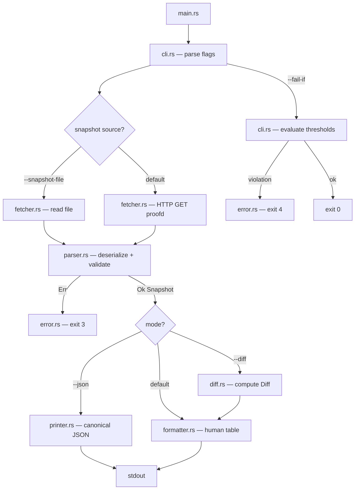

# Design Document: obs-cli-consumer

## Overview

`ayken obs` is a read-only CLI consumer for the AykenOS observability system. It fetches the
`machine_structured` projection from proofd's `/diagnostics/summary` endpoint, parses it into a
typed `Snapshot`, and formats it for human consumption, diff comparison, and CI integration.

The tool is a pure formatter. It holds no state, produces no authority, and makes no decisions.
All output is deterministic: identical input always produces identical output. No floating-point
values appear anywhere — neither in internal logic nor in output.

Key design decisions:
- Synchronous HTTP via `ureq` (no async runtime, no Tokio dependency)
- `BTreeMap<String, usize>` for `incident_groups` — lexicographic key order is a type-level guarantee
- No `f32`/`f64` anywhere in the codebase
- No `unwrap()`/`expect()` in non-test code — all errors propagate via `Result`
- Exit codes are the only side-channel to CI: 0=success, 1=usage, 2=I/O, 3=schema/parse, 4=threshold violation
- The `Printer` (canonical JSON serializer) is the single source of truth for snapshot files and `--json` output
- `threshold.rs` is a separate module from `cli.rs` — flag parsing and threshold evaluation are distinct concerns
- `--fail-if` parser trims whitespace and resolves operators longest-match first (`>=` before `>`)

---

## Architecture



### Module Responsibilities

| Module | Responsibility |
|---|---|
| `main.rs` | Entry point; wires modules; maps `AppError` to exit code |
| `cli.rs` | Flag parsing only — produces `Flags` struct; no evaluation logic |
| `threshold.rs` | `ThresholdCondition` parsing, `CountField` enum, `evaluate` and `evaluate_all` |
| `fetcher.rs` | HTTP GET via `ureq`; file read for `--snapshot-file`; returns raw `Vec<u8>` |
| `parser.rs` | Deserializes raw bytes into `Snapshot`; enforces epistemic boundary invariants |
| `formatter.rs` | Converts `Snapshot` or `Diff` into human-readable text |
| `printer.rs` | Serializes `Snapshot` to canonical JSON (used for `--json` and `--save-snapshot`) |
| `diff.rs` | Computes field-by-field `Diff` between two `Snapshot`s |
| `error.rs` | `AppError` enum; `exit_code()` method; error message formatting |

---

## Components and Interfaces

### `cli.rs`

```rust
pub struct Flags {
    pub proofd_addr: String,       // default: "http://127.0.0.1:7777"
    pub timeout_ms: u64,           // default: 5000
    pub snapshot_file: Option<PathBuf>,
    pub save_snapshot: Option<PathBuf>,
    pub diff_baseline: Option<PathBuf>,
    pub json_output: bool,
    pub fail_if: Vec<ThresholdCondition>,
}

impl Flags {
    pub fn parse(args: &[String]) -> Result<Flags, AppError>;
}
```

Flag parsing rules:
- `--proofd-addr` and `--snapshot-file` are mutually exclusive → `AppError::Usage`
- `--timeout-ms` must parse as a non-negative integer → `AppError::Usage` on failure
- `--fail-if` values are forwarded to `ThresholdCondition::parse` in `threshold.rs`

### `threshold.rs`

```rust
pub struct ThresholdCondition {
    pub field: CountField,
    pub op: CompareOp,
    pub value: usize,
}

pub enum CountField {
    PartitionCount,
    TotalNodes,
    TotalIncidents,
    AgreementCount,
    ConflictCount,
    IslandCount,
}

pub enum CompareOp { Gt, Gte, Lt, Lte, Eq }

impl ThresholdCondition {
    /// Parse a condition string like "conflict_count > 0" or "total_incidents>=5".
    /// Trims whitespace around the operator. Resolves operators longest-match first
    /// (">=" before ">", "<=" before "<") to avoid misparse.
    /// Returns AppError::Usage with a descriptive message on any parse failure.
    pub fn parse(s: &str) -> Result<ThresholdCondition, AppError>;

    pub fn evaluate(&self, snapshot: &Snapshot) -> bool;
}

/// Resolve a field name string to a CountField enum variant.
/// Returns None for unknown field names.
pub fn resolve_field(s: &str) -> Option<CountField>;

/// Evaluate all conditions against a snapshot.
/// Returns Ok(()) if none are violated, Err(AppError::Threshold(violations)) otherwise.
pub fn evaluate_all(
    conditions: &[ThresholdCondition],
    snapshot: &Snapshot,
) -> Result<(), AppError>;
```

Parsing rules for `ThresholdCondition::parse`:
- Input is trimmed of leading/trailing whitespace
- Operator is resolved longest-match first: try `>=`, `<=`, `==` before `>`, `<`
- Whitespace around the operator is accepted: `conflict_count > 0` and `conflict_count>0` are equivalent
- Field name is resolved via `resolve_field`; unknown field → `AppError::Usage` with message:
  `invalid condition: unknown field '<name>'; valid fields: partition_count, total_nodes, total_incidents, agreement_count, conflict_count, island_count`
- Value must parse as a non-negative integer → `AppError::Usage` with message:
  `invalid condition: value '<v>' is not a non-negative integer`
- On any other parse failure → `AppError::Usage` with message:
  `invalid condition: '<input>'; expected: <field><op><value> where op is >, >=, <, <=, ==`

### `fetcher.rs`

```rust
pub fn fetch_from_proofd(addr: &str, timeout_ms: u64) -> Result<Vec<u8>, AppError>;
pub fn read_snapshot_file(path: &Path) -> Result<Vec<u8>, AppError>;
pub fn write_snapshot_file(path: &Path, data: &[u8]) -> Result<(), AppError>;
```

`fetch_from_proofd` constructs the URL as `{addr}/diagnostics/summary?display_mode=machine_structured`,
issues a single GET request with the configured timeout, and returns the response body on HTTP 200.
Non-200 responses map to `AppError::Http(status_code, body_string)` with the status code and body included.
Connection failures and timeouts map to `AppError::Io`.

### `parser.rs`

```rust
pub fn parse_snapshot(raw: &[u8]) -> Result<Snapshot, AppError>;
```

Validation steps (in order):
1. Deserialize JSON → `AppError::Parse` on malformed JSON
2. Check all required fields present → `AppError::Parse` with field name on missing field
3. Reject any numeric field that is a JSON float (has decimal point or exponent) → `AppError::Schema`
4. Assert `authority_classification == "non_authoritative"` → `AppError::Schema`
5. Assert `produces_truth == false && produces_decision == false && produces_ranking == false` → `AppError::Schema`
6. Construct and return `Snapshot`

### `formatter.rs`

```rust
pub fn format_snapshot(snapshot: &Snapshot) -> String;
pub fn format_diff(diff: &Diff) -> String;
```

`format_snapshot` output structure:
```
authority: non_authoritative
produces_truth: false
produces_decision: false
produces_ranking: false

counts:
  partition_count:   <n>
  total_nodes:       <n>
  total_incidents:   <n>
  agreement_count:   <n>
  conflict_count:    <n>
  island_count:      <n>

incident_groups:
  <key>: <count>     (sorted lexicographically, or "no incidents recorded")
```

`format_diff` output structure:
```
diff:
  field              baseline   current    delta
  partition_count    <n>        <n>        +/-/0<n>
  ...

incident_groups diff:
  <key>: <baseline> → <current> (<delta>)  (added/removed/changed, sorted lexicographically)
```

Forbidden output vocabulary enforced at compile time via a `const` slice checked in tests:
`["best", "worst", "recommended", "optimal", "trust score", "ranking", "decision", "recommendation"]`

### `printer.rs`

```rust
pub fn to_canonical_json(snapshot: &Snapshot) -> Result<Vec<u8>, AppError>;
```

Uses `serde_json::to_vec` with the `Snapshot`'s `Serialize` impl. The `incident_groups`
`BTreeMap` guarantees lexicographic key order in the serialized output.

### `diff.rs`

```rust
pub fn compute_diff(baseline: &Snapshot, current: &Snapshot) -> Diff;
```

All arithmetic is signed integer subtraction (`current - baseline`). No floats.

### `error.rs`

```rust
pub enum AppError {
    Usage(String),          // exit code 1
    Http(u16, String),      // exit code 2 — non-200 HTTP response (status, body)
    Io(String),             // exit code 2 — connection failure, file I/O
    Parse(String),          // exit code 3
    Schema(String),         // exit code 3
    Threshold(Vec<String>), // exit code 4
}

impl AppError {
    pub fn exit_code(&self) -> i32;
    pub fn message(&self) -> String;
}
```

All error messages are written to stderr. Stdout is never written on error paths.

---

## Data Models

### `Snapshot`

```rust
#[derive(Debug, Clone, PartialEq, Serialize, Deserialize)]
pub struct Snapshot {
    pub authority_classification: String,
    pub counts: Counts,
    pub flags: Flags,
    pub incident_groups: BTreeMap<String, usize>,
}
```

### `Counts`

```rust
#[derive(Debug, Clone, PartialEq, Serialize, Deserialize)]
pub struct Counts {
    pub partition_count: usize,
    pub total_nodes: usize,
    pub total_incidents: usize,
    pub agreement_count: usize,
    pub conflict_count: usize,
    pub island_count: usize,
}
```

All fields are `usize` — non-negative integers. No `f32`/`f64`.

### `EpistemicBoundary` / `Flags`

```rust
#[derive(Debug, Clone, PartialEq, Serialize, Deserialize)]
pub struct SnapshotFlags {
    pub produces_truth: bool,
    pub produces_decision: bool,
    pub produces_ranking: bool,
}
```

Parser enforces all three are `false`. If any is `true`, the response is rejected with exit code 3.

### `Diff`

```rust
#[derive(Debug, Clone, PartialEq)]
pub struct Diff {
    pub counts: CountsDiff,
    pub incident_groups: BTreeMap<String, IncidentGroupDelta>,
}

#[derive(Debug, Clone, PartialEq)]
pub struct CountsDiff {
    pub partition_count: i64,
    pub total_nodes: i64,
    pub total_incidents: i64,
    pub agreement_count: i64,
    pub conflict_count: i64,
    pub island_count: i64,
}

#[derive(Debug, Clone, PartialEq)]
pub enum IncidentGroupDelta {
    Added(usize),
    Removed(usize),
    Changed { baseline: usize, current: usize, delta: i64 },
    Unchanged(usize),
}
```

All delta values are `i64` (signed). No floats. `BTreeMap` guarantees lexicographic key order.

### `ThresholdCondition`

```rust
pub struct ThresholdCondition {
    pub field: CountField,
    pub op: CompareOp,
    pub value: usize,
}
```

Parsed from strings of the form `<field><op><value>` where `<op>` is one of `>`, `>=`, `<`, `<=`, `==`.
Valid fields: `partition_count`, `total_nodes`, `total_incidents`, `agreement_count`, `conflict_count`, `island_count`.

---

## Correctness Properties

*A property is a characteristic or behavior that should hold true across all valid executions of a system — essentially, a formal statement about what the system should do. Properties serve as the bridge between human-readable specifications and machine-verifiable correctness guarantees.*

### Property 1: Snapshot round-trip

*For any* valid `Snapshot`, serializing it to canonical JSON with the `Printer` and then parsing the result with the `Parser` must produce a `Snapshot` equal to the original.

**Validates: Requirements 2.7, 2.8**

### Property 2: Parser rejects float values

*For any* otherwise-valid `machine_structured` JSON body where any numeric field in `counts` or `incident_groups` is replaced with a JSON floating-point number (e.g. `1.5`, `2.0e1`), the `Parser` must return an error and the process must exit with code 3.

**Validates: Requirements 2.2, 11.4**

### Property 3: Parser enforces epistemic boundary

*For any* JSON body where `authority_classification` is not `"non_authoritative"`, or where any of `produces_truth`, `produces_decision`, `produces_ranking` is `true`, the `Parser` must return an error and the process must exit with code 3.

**Validates: Requirements 2.3, 2.4, 9.4**

### Property 4: Parser rejects missing required fields

*For any* valid `machine_structured` JSON body with exactly one required field removed, the `Parser` must return an error naming the absent field and the process must exit with code 3.

**Validates: Requirements 2.6**

### Property 5: Parser rejects malformed JSON

*For any* byte sequence that is not valid JSON, the `Parser` must return an error and the process must exit with code 3.

**Validates: Requirements 2.5**

### Property 6: Formatter output contains all required fields

*For any* valid `Snapshot`, the output of `format_snapshot` must contain all six count field labels, all three flag field labels, and the `authority_classification` value.

**Validates: Requirements 3.1, 3.2, 3.3, 9.2, 9.3**

### Property 7: Formatter sorts incident_groups lexicographically

*For any* valid `Snapshot` with a non-empty `incident_groups` map, the incident group entries in the `format_snapshot` output must appear in lexicographic order by key.

**Validates: Requirements 3.4, 8.4**

### Property 8: Formatter output contains no forbidden vocabulary

*For any* valid `Snapshot`, the output of `format_snapshot` must not contain any of the words: `best`, `worst`, `recommended`, `optimal`, `trust score`, `ranking`, `decision`, `recommendation`.

**Validates: Requirements 3.6, 9.1**

### Property 9: Formatter is deterministic

*For any* valid `Snapshot` and any set of flags, calling `format_snapshot` (or `format_diff`) twice with the same inputs must produce byte-identical output both times.

**Validates: Requirements 3.7, 4.4, 6.8, 8.2**

### Property 10: Diff correctness — deltas equal current minus baseline

*For any* two valid `Snapshot`s (baseline and current), the `delta` for each count field in the computed `Diff` must equal `current_value - baseline_value` as a signed integer, and the sign prefix in the formatted output must match the sign of the delta (`+` for positive, `-` for negative, no prefix for zero).

**Validates: Requirements 6.2, 6.3, 6.4, 6.5**

### Property 11: Self-diff shows all zeros

*For any* valid `Snapshot`, diffing it against itself must produce a `Diff` where all count deltas are zero and all `incident_groups` entries are `Unchanged`.

**Validates: Requirements 6.9**

### Property 12: Snapshot save/load round-trip

*For any* valid `Snapshot`, saving it to a file with `--save-snapshot` and then loading it with `--snapshot-file` must produce a `Snapshot` equal to the original.

**Validates: Requirements 5.1, 5.3**

### Property 13: Threshold evaluation — exit code reflects violation status

*For any* valid `Snapshot` and any set of `--fail-if` conditions, the process must exit with code 4 if and only if at least one condition evaluates to true against the snapshot's count fields; otherwise it must exit with code 0.

**Validates: Requirements 7.2, 7.3**

### Property 14: Invalid --fail-if syntax or unknown field → exit code 1

*For any* `--fail-if` condition string that references a field name not in the six count fields, or that contains an invalid operator or non-integer value, the process must exit with code 1.

**Validates: Requirements 7.5, 7.6**

### Property 15: Invalid --timeout-ms value → exit code 1

*For any* string that cannot be parsed as a non-negative integer, passing it as `--timeout-ms` must cause the process to exit with code 1.

**Validates: Requirements 1.7**

### Property 16: Non-200 HTTP response → exit code 2

*For any* HTTP status code other than 200 returned by proofd, the process must exit with code 2.

**Validates: Requirements 1.3**

### Property 17: Error messages go to stderr, not stdout

*For any* invocation that results in a non-zero exit code, the process must write at least one error message to stderr and must write nothing to stdout.

**Validates: Requirements 10.1, 10.2, 10.4**

### Property 18: Same HTTP response body produces identical CLI stdout

*For any* valid `machine_structured` response body, two successive invocations of the CLI with the same response body and the same flags must produce byte-identical stdout output.

**Validates: Requirements 8.2, 4.4**

### Property 19: Same snapshot and same conditions produce identical exit code

*For any* valid `Snapshot` and any set of `--fail-if` conditions, two successive evaluations of `evaluate_all` with the same inputs must return the same result (same exit code, same violation list).

**Validates: Requirements 7.2, 7.3, 8.2**

---

## Error Handling

| Condition | `AppError` variant | Exit code | Output |
|---|---|---|---|
| Bad flag / unknown field in `--fail-if` / invalid `--timeout-ms` | `Usage(msg)` | 1 | stderr |
| `--snapshot-file` + `--proofd-addr` both supplied | `Usage(msg)` | 1 | stderr |
| TCP connection failure / timeout | `Io(msg)` | 2 | stderr |
| Non-200 HTTP response | `Http(status, body)` | 2 | stderr |
| File read failure | `Io(msg)` | 2 | stderr |
| File write failure | `Io(msg)` | 2 | stderr |
| Malformed JSON | `Parse(msg)` | 3 | stderr |
| Missing required field | `Parse(msg)` | 3 | stderr |
| Float detected in numeric field | `Schema(msg)` | 3 | stderr |
| `authority_classification` violation | `Schema(msg)` | 3 | stderr |
| Any flag `true` in parsed Snapshot | `Schema(msg)` | 3 | stderr |
| One or more `--fail-if` conditions true | `Threshold(violations)` | 4 | stderr (each violation) |

`main.rs` maps `AppError` to exit code via `AppError::exit_code()`, writes the message to stderr,
and calls `std::process::exit(code)`. No `unwrap()`/`expect()` in non-test code.

---

## Testing Strategy

### Unit Tests

Unit tests cover specific examples, edge cases, and error conditions:

- `parse_snapshot` with a valid body → correct `Snapshot`
- `parse_snapshot` with a float in `counts` → `AppError::Schema`
- `parse_snapshot` with `authority_classification: "authoritative"` → `AppError::Schema`
- `parse_snapshot` with `produces_truth: true` → `AppError::Schema`
- `parse_snapshot` with missing `conflict_count` field → `AppError::Parse` naming the field
- `parse_snapshot` with invalid JSON bytes → `AppError::Parse`
- `format_snapshot` with empty `incident_groups` → output contains `"no incidents recorded"`
- `format_snapshot` with non-empty `incident_groups` → keys appear in lexicographic order
- `ThresholdCondition::parse("conflict_count>0")` → correct struct
- `ThresholdCondition::parse("total_incidents>=5")` → correct struct
- `ThresholdCondition::parse("unknown_field>0")` → `AppError::Usage`
- `ThresholdCondition::parse("conflict_count>>0")` → `AppError::Usage`
- `Flags::parse` with `--snapshot-file` and `--proofd-addr` both present → `AppError::Usage`
- `Flags::parse` with `--timeout-ms abc` → `AppError::Usage`
- `compute_diff` with identical snapshots → all deltas zero
- `compute_diff` with differing counts → correct signed deltas
- `format_diff` delta sign formatting: positive → `+n`, negative → `-n`, zero → `0`

### Property-Based Tests

Property tests use the `proptest` crate. Each test runs a minimum of 100 iterations.
Each test carries a tag comment in the format:
`// Feature: obs-cli-consumer, Property N: <property_text>`

**Property 1 — Snapshot round-trip**
```rust
// Feature: obs-cli-consumer, Property 1: snapshot round-trip
proptest! {
    fn prop_snapshot_round_trip(snapshot in arb_snapshot()) {
        let bytes = to_canonical_json(&snapshot).unwrap();
        let parsed = parse_snapshot(&bytes).unwrap();
        prop_assert_eq!(snapshot, parsed);
    }
}
```

**Property 2 — Parser rejects float values**
```rust
// Feature: obs-cli-consumer, Property 2: parser rejects float values
proptest! {
    fn prop_parser_rejects_floats(snapshot in arb_snapshot(), field in arb_count_field_name()) {
        let mut json = serde_json::to_value(&snapshot).unwrap();
        json["counts"][field] = serde_json::Value::Number(
            serde_json::Number::from_f64(1.5).unwrap()
        );
        let bytes = serde_json::to_vec(&json).unwrap();
        let result = parse_snapshot(&bytes);
        prop_assert!(result.is_err());
        prop_assert_eq!(result.unwrap_err().exit_code(), 3);
    }
}
```

**Property 3 — Parser enforces epistemic boundary**
```rust
// Feature: obs-cli-consumer, Property 3: parser enforces epistemic boundary
proptest! {
    fn prop_parser_rejects_authority_violation(
        snapshot in arb_snapshot(),
        bad_classification in arb_non_authoritative_string(),
    ) {
        let mut json = serde_json::to_value(&snapshot).unwrap();
        json["authority_classification"] = serde_json::Value::String(bad_classification);
        let bytes = serde_json::to_vec(&json).unwrap();
        let result = parse_snapshot(&bytes);
        prop_assert!(result.is_err());
        prop_assert_eq!(result.unwrap_err().exit_code(), 3);
    }
}
```

**Property 4 — Parser rejects missing required fields**
```rust
// Feature: obs-cli-consumer, Property 4: parser rejects missing required fields
proptest! {
    fn prop_parser_rejects_missing_field(
        snapshot in arb_snapshot(),
        field in arb_required_field_name(),
    ) {
        let mut json = serde_json::to_value(&snapshot).unwrap();
        json.as_object_mut().unwrap().remove(field);
        let bytes = serde_json::to_vec(&json).unwrap();
        let result = parse_snapshot(&bytes);
        prop_assert!(result.is_err());
        prop_assert_eq!(result.unwrap_err().exit_code(), 3);
    }
}
```

**Property 5 — Parser rejects malformed JSON**
```rust
// Feature: obs-cli-consumer, Property 5: parser rejects malformed JSON
proptest! {
    fn prop_parser_rejects_malformed_json(bytes in arb_invalid_json_bytes()) {
        let result = parse_snapshot(&bytes);
        prop_assert!(result.is_err());
        prop_assert_eq!(result.unwrap_err().exit_code(), 3);
    }
}
```

**Property 6 — Formatter output contains all required fields**
```rust
// Feature: obs-cli-consumer, Property 6: formatter output contains all required fields
proptest! {
    fn prop_formatter_contains_all_fields(snapshot in arb_snapshot()) {
        let output = format_snapshot(&snapshot);
        for label in &["partition_count", "total_nodes", "total_incidents",
                       "agreement_count", "conflict_count", "island_count",
                       "produces_truth", "produces_decision", "produces_ranking",
                       "authority"] {
            prop_assert!(output.contains(label), "missing label: {}", label);
        }
    }
}
```

**Property 7 — Formatter sorts incident_groups lexicographically**
```rust
// Feature: obs-cli-consumer, Property 7: formatter sorts incident_groups lexicographically
proptest! {
    fn prop_formatter_incident_groups_sorted(snapshot in arb_snapshot_with_incidents()) {
        let output = format_snapshot(&snapshot);
        let keys: Vec<&str> = extract_incident_group_keys(&output);
        let mut sorted = keys.clone();
        sorted.sort();
        prop_assert_eq!(keys, sorted);
    }
}
```

**Property 8 — Formatter output contains no forbidden vocabulary**
```rust
// Feature: obs-cli-consumer, Property 8: formatter output contains no forbidden vocabulary
const FORBIDDEN: &[&str] = &[
    "best", "worst", "recommended", "optimal",
    "trust score", "ranking", "decision", "recommendation",
];
proptest! {
    fn prop_formatter_no_forbidden_vocabulary(snapshot in arb_snapshot()) {
        let output = format_snapshot(&snapshot).to_lowercase();
        for word in FORBIDDEN {
            prop_assert!(!output.contains(word), "forbidden word '{}' found", word);
        }
    }
}
```

**Property 9 — Formatter is deterministic**
```rust
// Feature: obs-cli-consumer, Property 9: formatter is deterministic
proptest! {
    fn prop_formatter_deterministic(snapshot in arb_snapshot()) {
        let a = format_snapshot(&snapshot);
        let b = format_snapshot(&snapshot);
        prop_assert_eq!(a, b);
    }
}
```

**Property 10 — Diff correctness**
```rust
// Feature: obs-cli-consumer, Property 10: diff deltas equal current minus baseline
proptest! {
    fn prop_diff_delta_correctness(baseline in arb_snapshot(), current in arb_snapshot()) {
        let diff = compute_diff(&baseline, &current);
        prop_assert_eq!(
            diff.counts.conflict_count,
            current.counts.conflict_count as i64 - baseline.counts.conflict_count as i64
        );
        // ... repeat for all six count fields
    }
}
```

**Property 11 — Self-diff shows all zeros**
```rust
// Feature: obs-cli-consumer, Property 11: self-diff shows all zeros
proptest! {
    fn prop_self_diff_all_zeros(snapshot in arb_snapshot()) {
        let diff = compute_diff(&snapshot, &snapshot);
        prop_assert_eq!(diff.counts.partition_count, 0);
        prop_assert_eq!(diff.counts.total_nodes, 0);
        prop_assert_eq!(diff.counts.total_incidents, 0);
        prop_assert_eq!(diff.counts.agreement_count, 0);
        prop_assert_eq!(diff.counts.conflict_count, 0);
        prop_assert_eq!(diff.counts.island_count, 0);
        for (_, delta) in &diff.incident_groups {
            prop_assert!(matches!(delta, IncidentGroupDelta::Unchanged(_)));
        }
    }
}
```

**Property 12 — Snapshot save/load round-trip**
```rust
// Feature: obs-cli-consumer, Property 12: snapshot save/load round-trip
proptest! {
    fn prop_snapshot_save_load_round_trip(snapshot in arb_snapshot()) {
        let dir = tempfile::tempdir().unwrap();
        let path = dir.path().join("snap.json");
        let bytes = to_canonical_json(&snapshot).unwrap();
        write_snapshot_file(&path, &bytes).unwrap();
        let loaded_bytes = read_snapshot_file(&path).unwrap();
        let loaded = parse_snapshot(&loaded_bytes).unwrap();
        prop_assert_eq!(snapshot, loaded);
    }
}
```

**Property 13 — Threshold evaluation exit code**
```rust
// Feature: obs-cli-consumer, Property 13: threshold evaluation exit code reflects violation status
proptest! {
    fn prop_threshold_exit_code(
        snapshot in arb_snapshot(),
        conditions in arb_threshold_conditions(),
    ) {
        let violations: Vec<_> = conditions.iter()
            .filter(|c| c.evaluate(&snapshot))
            .collect();
        let expected_code = if violations.is_empty() { 0 } else { 4 };
        // verify evaluate_all returns the correct exit code
        prop_assert_eq!(evaluate_all(&conditions, &snapshot).exit_code(), expected_code);
    }
}
```

**Property 14 — Invalid --fail-if → exit code 1**
```rust
// Feature: obs-cli-consumer, Property 14: invalid --fail-if syntax or unknown field → exit code 1
proptest! {
    fn prop_invalid_fail_if_exits_1(s in arb_invalid_condition_string()) {
        let result = ThresholdCondition::parse(&s);
        prop_assert!(result.is_err());
        prop_assert_eq!(result.unwrap_err().exit_code(), 1);
    }
}
```

**Property 15 — Invalid --timeout-ms → exit code 1**
```rust
// Feature: obs-cli-consumer, Property 15: invalid --timeout-ms value → exit code 1
proptest! {
    fn prop_invalid_timeout_exits_1(s in arb_non_integer_string()) {
        let args = vec!["ayken".to_string(), "obs".to_string(),
                        "--timeout-ms".to_string(), s];
        let result = Flags::parse(&args);
        prop_assert!(result.is_err());
        prop_assert_eq!(result.unwrap_err().exit_code(), 1);
    }
}
```

**Property 16 — Non-200 HTTP response → exit code 2**
```rust
// Feature: obs-cli-consumer, Property 16: non-200 HTTP response → exit code 2
// Tested via a mock HTTP server that returns arbitrary non-200 status codes.
proptest! {
    fn prop_non_200_exits_2(status in arb_non_200_status()) {
        // spin up a mock server returning `status`, invoke fetch_from_proofd,
        // assert the returned AppError has exit_code() == 2
    }
}
```

**Property 17 — Error messages go to stderr, not stdout**
```rust
// Feature: obs-cli-consumer, Property 17: error messages go to stderr not stdout
// Tested by capturing stdout/stderr for each error-producing invocation and
// asserting stdout is empty and stderr is non-empty.
proptest! {
    fn prop_errors_go_to_stderr(error in arb_app_error()) {
        // capture output, assert stdout empty, stderr non-empty
    }
}
```

**Property 18 — Same HTTP response body produces identical CLI stdout**
```rust
// Feature: obs-cli-consumer, Property 18: same HTTP response body → identical CLI stdout
proptest! {
    fn prop_http_response_deterministic(snapshot in arb_snapshot()) {
        let bytes = to_canonical_json(&snapshot).unwrap();
        let parsed_a = parse_snapshot(&bytes).unwrap();
        let parsed_b = parse_snapshot(&bytes).unwrap();
        let out_a = format_snapshot(&parsed_a);
        let out_b = format_snapshot(&parsed_b);
        prop_assert_eq!(out_a, out_b);
    }
}
```

**Property 19 — Same snapshot and same conditions produce identical exit code**
```rust
// Feature: obs-cli-consumer, Property 19: same snapshot + same conditions → identical exit code
proptest! {
    fn prop_threshold_evaluation_deterministic(
        snapshot in arb_snapshot(),
        conditions in arb_threshold_conditions(),
    ) {
        let result_a = evaluate_all(&conditions, &snapshot);
        let result_b = evaluate_all(&conditions, &snapshot);
        let code_a = result_a.as_ref().map(|_| 0).unwrap_or_else(|e| e.exit_code());
        let code_b = result_b.as_ref().map(|_| 0).unwrap_or_else(|e| e.exit_code());
        prop_assert_eq!(code_a, code_b);
    }
}
```

### Dual Coverage Summary

Unit tests catch concrete structural bugs (wrong field names, wrong exit codes, wrong sign formatting).
Property tests verify universal correctness across all valid and invalid inputs. Together they provide
comprehensive coverage without redundancy. Property tests use `proptest` with a minimum of 100
iterations per property. Each property test is tagged with the format
`// Feature: obs-cli-consumer, Property N: <property_text>`.
