# Tasarım Belgesi: Phase 12 Distributed Verification Closure

## Genel Bakış

Bu tasarım, `ci-kill-switch-phase13` Makefile hedefinin `PASS` vermesi için gerekli olan 12 CI gate'in
`scripts/ci/` ve `tools/ci/` altındaki implementasyonlarını tamamlamayı kapsar.

Temel mimari değişmez:

```
proofd = verification execution service + diagnostics service surface
proofd != authority surface
parity semantics = "distributed verification diagnostics" (consensus değil)
```

Araştırma bulguları:
- Tüm 12 gate script (`scripts/ci/gate_*.sh`) zaten mevcuttur.
- Birçok validator (`tools/ci/validate_*.py`) zaten mevcuttur:
  `validate_convergence_non_election_boundary.py`, `validate_verifier_reputation_prohibition.py`,
  `validate_graph_non_authoritative_contract.py`, `validate_diagnostics_callsite_correlation.py`,
  `validate_diagnostics_consumer_non_authoritative_contract.py`,
  `validate_observability_routing_separation.py`.
- Her iki harness da mevcuttur: `phase12_gate_harness.rs` (19 mod) ve `proofd_gate_harness.rs`
  (2 mod: `service-contract`, `observability-boundary`).
- `ci-kill-switch-phase13` Makefile hedefi 12 gate'i sıralı bağımlılık olarak tanımlar.
- `ci-gate-hygiene` çıktısındaki `coverage: INCOMPLETE` hatası, gate script'lerin veya
  validator'ların eksik/hatalı implementasyonundan kaynaklanmaktadır.

Kapsam: `scripts/ci/`, `tools/ci/`, `userspace/proofd/`, `ayken-core/crates/proof-verifier/examples/`.
Yeni crate bağımlılığı eklenmez.

---

## Mimari

### Gate Execution Pipeline

```mermaid
flowchart TD
    MK[ci-kill-switch-phase13\nMakefile hedefi] --> G1[ci-gate-proof-receipt]
    MK --> G2[ci-gate-proof-verdict-binding]
    MK --> G3[ci-gate-verifier-authority-resolution]
    MK --> G4[ci-gate-cross-node-parity]
    MK --> G5[ci-gate-proofd-service]
    MK --> G6[ci-gate-proofd-observability-boundary]
    MK --> G7[ci-gate-graph-non-authoritative-contract]
    MK --> G8[ci-gate-convergence-non-election-boundary]
    MK --> G9[ci-gate-diagnostics-consumer-non-authoritative-contract]
    MK --> G10[ci-gate-diagnostics-callsite-correlation]
    MK --> G11[ci-gate-observability-routing-separation]
    MK --> G12[ci-gate-verifier-reputation-prohibition]

    G1 --> SH1[gate_proof_receipt.sh]
    G4 --> SH4[gate_cross_node_parity.sh]
    G5 --> SH5[gate_proofd_service.sh]

    SH1 --> H1[phase12_gate_harness\nreceipt modu]
    SH4 --> H4[phase12_gate_harness\ncross-node-parity modu]
    SH5 --> H4
    SH5 --> H5[proofd_gate_harness\nservice-contract modu]

    G7 --> V7[validate_graph_non_authoritative_contract.py]
    G8 --> V8[validate_convergence_non_election_boundary.py]
    G9 --> V9[validate_diagnostics_consumer_non_authoritative_contract.py]
    G10 --> V10[validate_diagnostics_callsite_correlation.py]
    G11 --> V11[validate_observability_routing_separation.py]
    G12 --> V12[validate_verifier_reputation_prohibition.py]

    G1 --> ED1[evidence/run-id/gates/proof-receipt/]
    G4 --> ED4[evidence/run-id/gates/cross-node-parity/]
    G5 --> ED5[evidence/run-id/gates/proofd-service/]
```



### İki Tip Gate Mimarisi

**Tip A — Harness-Driven Gates** (Rust harness artifact üretir, Python validator doğrular):
- `proof-receipt`, `proof-verdict-binding`, `verifier-authority-resolution`, `cross-node-parity`
- Shell script → `cargo run ... phase12_gate_harness -- <mode>` → artifact'lar → Python inline doğrulama

**Tip B — Proofd-Driven Gates** (proofd harness endpoint'leri test eder):
- `proofd-service`, `proofd-observability-boundary`
- Shell script → `phase12_gate_harness cross-node-parity` (bootstrap) → `proofd_gate_harness <mode>`

**Tip C — Artifact-Scan Gates** (mevcut artifact'ları Python validator ile tarar):
- `graph-non-authoritative-contract`, `convergence-non-election-boundary`,
  `verifier-reputation-prohibition`
- Shell script → `phase12_gate_harness cross-node-parity` (opsiyonel bootstrap) → `validate_*.py`

**Tip D — Source-Scan Gates** (Rust kaynak kodunu Python validator ile tarar):
- `diagnostics-consumer-non-authoritative-contract`, `diagnostics-callsite-correlation`,
  `observability-routing-separation`
- Shell script → `validate_*.py --source-root <root>`

---

## Bileşenler ve Arayüzler

### Gate Script Arayüzü (Tüm Gate'ler)

```
scripts/ci/gate_<name>.sh --evidence-dir <path> [--artifact-root <path>] [--run-id <id>]

Çıkış kodları:
  0: PASS
  2: Gate doğrulama hatası (FAIL)
  3: Tooling/usage hatası (CI pipeline durur, gate FAIL sayılmaz)
```

Her gate script zorunlu olarak:
- `set -euo pipefail` ile başlar (CONSTITUTIONAL.ENFORCEMENT.BYPASS yasağı)
- `report.json` içinde `"gate": "<name>"` ve `"verdict": "PASS"|"FAIL"` üretir
- `violations.txt` üretir
- `meta.txt` üretir (zaman damgası, harness RC, evidence dir)

### Phase12_Gate_Harness Modları

```
cargo run -p proof-verifier --example phase12_gate_harness -- <mode> --out-dir <path>

Mevcut modlar: receipt, verdict-binding, authority-resolution, cross-node-parity,
               producer-schema, signature-envelope, bundle-v2-schema, bundle-v2-compat,
               signature-verify, registry-resolution, key-rotation, verifier-core,
               trust-policy, verifier-cli, audit-ledger, proof-exchange,
               multisig-quorum, replay-admission-boundary, replicated-verification-boundary
```

### Proofd_Gate_Harness Modları

```
cargo run -p proofd --example proofd_gate_harness -- <mode>
  --evidence-root <path> --run-id <id> --out-dir <path>

Mevcut modlar: service-contract, observability-boundary
```

### Python Validator Arayüzü (Tip C/D)

```
python3 tools/ci/validate_<name>.py
  --artifact-root <path>      # Tip C: artifact dizini
  --source-root <path>        # Tip D: repo kökü
  --out-report <path>         # report.json
  --out-detail-report <path>  # detay raporu
  --violations-out <path>     # violations.txt
  [--out-negative-matrix <path>]  # observability-routing-separation için
```

### Kill-Switch Summary

```
tools/ci/summarize.sh --run-dir <dir> --require-kill-switch-completeness

Çıkış:
  kill_switch_summary.json:
    coverage.coverage_status: "COMPLETE" | "INCOMPLETE"
  Çıkış kodu 2: herhangi bir gate FAIL
```

---

## Veri Modelleri

### Gate Report Şeması (report.json)

```json
{
  "gate": "<gate-name>",
  "mode": "<harness-mode>",
  "verdict": "PASS" | "FAIL",
  "violations": ["<violation-string>", ...],
  "violations_count": <integer>
}
```

### Violation String Formatları

| Gate | Format |
|------|--------|
| proof-receipt | `invalid_json:signed_verification_receipt.json` |
| proof-verdict-binding | `verdict_binding_mismatch:manifest_verdict:<v1>:receipt_verdict:<v2>` |
| verifier-authority-resolution | `forbidden_authority_field:<artifact>:<path>:<field>` |
| cross-node-parity | `invalid_global_status:<value>` |
| proofd-service | `verify_endpoint_contract_mismatch` |
| proofd-observability-boundary | `post_method_not_rejected:<endpoint>` |
| graph-non-authoritative-contract | `forbidden_truth_inference_field:<artifact>:<path>:<field>:<rule>` |
| convergence-non-election-boundary | `forbidden_convergence_election_field:<artifact>:<path>:<field>:<rule>` |
| diagnostics-consumer | `forbidden_diagnostics_consumer_field:<file>:<line>:<token>` |
| diagnostics-callsite | `forbidden_diagnostics_callsite_correlation:<file>:<fn>:<line>:<rule>:<src>:<alias>` |
| observability-routing | `observability_routing_separation_violation:<file>:<line>:<rule>` |
| verifier-reputation | `forbidden_reputation_field:<artifact>:<path>:<field>:<rule>` |

### Proof Receipt Şeması (signed_verification_receipt.json)

Zorunlu alanlar: `run_id`, `verdict`, `bundle_hash`, `verified_at_utc`, `verifier_node_id`

Yasak alanlar: `preferred_verifier`, `winning_verifier`, `trust_rank`, `verifier_score`

### Kill-Switch Summary Şeması

```json
{
  "coverage": {
    "coverage_status": "COMPLETE" | "INCOMPLETE",
    "gate_count": 12,
    "pass_count": <integer>,
    "fail_count": <integer>
  },
  "gates": [
    {"gate": "<name>", "verdict": "PASS" | "FAIL"}
  ]
}
```

### Artifact Bağımlılık Grafiği

```
Phase12_Gate_Harness (cross-node-parity modu) üretir:
  parity_report.json
  parity_determinism_incidents.json
  parity_drift_attribution_report.json
  parity_convergence_report.json
  failure_matrix.json
  parity_authority_drift_topology.json
  parity_authority_suppression_report.json
  parity_incident_graph.json
  parity_closure_audit_report.json

Bu artifact'ları kullanan gate'ler:
  - cross-node-parity (doğrudan)
  - proofd-service (service-root'a kopyalar)
  - proofd-observability-boundary (service-root'a kopyalar)
  - graph-non-authoritative-contract (--artifact-root ile)
  - convergence-non-election-boundary (--artifact-root ile)
  - verifier-reputation-prohibition (--artifact-root ile)
```

---

## Doğruluk Özellikleri

*Bir özellik (property), sistemin tüm geçerli çalıştırmalarında doğru olması gereken bir
karakteristik veya davranıştır — temelde sistemin ne yapması gerektiğine dair biçimsel bir
ifadedir. Özellikler, insan tarafından okunabilir spesifikasyonlar ile makine tarafından
doğrulanabilir doğruluk garantileri arasındaki köprüyü oluşturur.*

### Özellik 1: Receipt Şema Doğrulaması

*Herhangi bir* geçerli JSON nesnesi için, `signed_verification_receipt.json` olarak sunulduğunda,
validator zorunlu alanların (`run_id`, `verdict`, `bundle_hash`, `verified_at_utc`,
`verifier_node_id`) tamamının mevcut olduğunu doğrulamalı; eksik alan varsa ihlal üretmelidir.

**Validates: Requirements 1.3**

### Özellik 2: Geçersiz JSON İhlali

*Herhangi bir* geçersiz JSON string'i için, receipt artifact'ı olarak sunulduğunda,
validator `invalid_json:signed_verification_receipt.json` ihlali üretmeli ve gate FAIL vermelidir.

**Validates: Requirements 1.5**

### Özellik 3: Verdict Binding Tutarlılığı

*Herhangi bir* manifest/receipt çifti için, her iki artifact'ta da `verdict` alanı mevcutsa,
validator bu iki değerin eşleştiğini doğrulamalı; eşleşmiyorsa `verdict_binding_mismatch` ihlali
üretmelidir.

**Validates: Requirements 2.2, 2.3**

### Özellik 4: Forbidden Fields Yasağı (Receipt)

*Herhangi bir* receipt JSON nesnesi için, `preferred_verifier`, `winning_verifier`, `trust_rank`,
`verifier_score` gibi Forbidden_Fields kümesindeki alanlardan herhangi biri mevcutsa,
validator `forbidden_field:<field>` ihlali üretmelidir.

**Validates: Requirements 2.5**

### Özellik 5: Authority Resolution Forbidden Fields

*Herhangi bir* parity veya federation artifact JSON nesnesi için, `preferred_verifier`,
`winning_verifier`, `trust_rank`, `weighted_authority`, `recommended_action`, `routing_hint`,
`execution_override` gibi authority resolution semantiği taşıyan alanlardan herhangi biri
mevcutsa, validator `forbidden_authority_field` ihlali üretmelidir.

**Validates: Requirements 3.2, 3.6**

### Özellik 6: Parity Non-Election Değişmezi

*Herhangi bir* parity artifact seti için, `winning_cluster`, `selected_partition`,
`majority_cluster`, `cluster_commit` gibi election semantiği taşıyan alanlardan herhangi biri
mevcutsa, validator ihlal üretmelidir; `parity != consensus` değişmezi korunmalıdır.

**Validates: Requirements 4.3, 8.3**

### Özellik 7: Global Status Kısıtlaması

*Herhangi bir* `parity_convergence_report.json` için, `global_status` alanı
`{N_PARITY_CONSISTENCY_SPLIT, N_PARITY_CONVERGED, N_PARITY_DETERMINISM_VIOLATION,
N_PARITY_HISTORICAL_ISLAND, N_PARITY_INSUFFICIENT_EVIDENCE, N_PARITY_MIXED}` kümesi dışında
bir değer içeriyorsa, validator `invalid_global_status:<value>` ihlali üretmelidir.

**Validates: Requirements 4.4, 8.2**

### Özellik 8: Verify Response Zorunlu Alanları

*Herhangi bir* `POST /verify/bundle` yanıtı için, `run_id`, `status`, `verdict`,
`verdict_subject`, `receipt_emitted`, `request_fingerprint`, `findings_count` alanlarından
herhangi biri eksikse, validator ihlal üretmelidir.

**Validates: Requirements 5.3**

### Özellik 9: Verify Response Forbidden Fields

*Herhangi bir* `POST /verify/bundle` yanıtı için, `preferred_verifier`, `winning_verifier`,
`trust_rank`, `verifier_score`, `trust_score`, `reliability_index`, `weighted_authority`,
`recommended_action`, `routing_hint`, `execution_override` gibi Forbidden_Fields kümesindeki
alanlardan herhangi biri mevcutsa, validator ihlal üretmelidir.

**Validates: Requirements 5.4**

### Özellik 10: Verify Determinizmi

*Herhangi bir* geçerli verify isteği için, aynı parametrelerle iki kez `POST /verify/bundle`
çağrıldığında her iki yanıt özdeş `request_fingerprint` üretmelidir; `DETERMINISM.GLOBAL`
kuralına uyum zorunludur.

**Validates: Requirements 5.5, 14.4**

### Özellik 11: GET Endpoint Read-Only Değişmezi

*Herhangi bir* `GET /diagnostics/...` endpoint çağrısı için, dosya sistemi durumu çağrı
öncesi ve sonrası özdeş olmalıdır; GET endpoint'leri hiçbir artifact yazmamalıdır.

**Validates: Requirements 6.2, 9.4**

### Özellik 12: POST Diagnostics 405 Zorunluluğu

*Herhangi bir* `POST /diagnostics/...` endpoint isteği için, yanıt HTTP 405
`method_not_allowed` olmalıdır; diagnostics yüzeyi salt okunurdur.

**Validates: Requirements 6.3**

### Özellik 13: Graph Non-Authoritative Değişmezi

*Herhangi bir* `parity_incident_graph.json` için, `preferred_verifier`, `winning_verifier`,
`trust_rank`, `routing_hint`, `execution_override`, `node_priority`, `verification_weight`
gibi Forbidden_Fields kümesindeki alanlardan herhangi biri mevcutsa, validator ihlal
üretmelidir; graph yapısı tanımlayıcı (descriptive) olmalıdır.

**Validates: Requirements 7.2, 7.3**

### Özellik 14: Consumer Non-Authoritative Değişmezi

*Herhangi bir* diagnostics consumer artifact veya kaynak dosyası için, `recommended_action`,
`routing_hint`, `execution_override`, `retry`, `override`, `promote`, `commit`, `mitigation`,
`node_priority` gibi scheduling semantiği taşıyan alanlardan herhangi biri mevcutsa,
validator ihlal üretmelidir; `observability != scheduling` değişmezi korunmalıdır.

**Validates: Requirements 9.2, 9.3**

### Özellik 15: Diagnostics Callsite İzolasyonu

*Herhangi bir* kaynak dosyası için, `GET /diagnostics/...` endpoint çağrılarından türetilen
değişkenler `POST /verify/bundle` veya policy evaluation call site'larına akmamalıdır;
diagnostics → verification path izolasyonu korunmalıdır.

**Validates: Requirements 10.2, 10.3**

### Özellik 16: Reputation Prohibition

*Herhangi bir* parity artifact seti için, `agreement_ratio`, `authority_alignment_score`,
`correctness_rate`, `dominant_verifier_frequency`, `node_trust_score`, `reliability_index`,
`trust_score`, `verifier_reputation`, `verifier_score`, `weighted_authority` gibi reputation
veya scoring semantiği taşıyan alanlardan herhangi biri mevcutsa, validator
`forbidden_reputation_field` ihlali üretmelidir; `verification history != verifier reputation`
değişmezi korunmalıdır.

**Validates: Requirements 12.2, 12.3**

### Özellik 17: Kill-Switch Coverage Tamamlanması

*Tüm* 12 kill-switch gate'i için, her gate `report.json` içinde `"verdict": "PASS"` ürettiğinde
ve yalnızca o zaman `kill_switch_summary.json` içindeki `coverage.coverage_status` alanı
`"COMPLETE"` olmalıdır; herhangi bir gate FAIL verirse `"INCOMPLETE"` olmalıdır.
Kısmi PASS kabul edilmez.

**Validates: Requirements 13.1, 13.3, 13.6**

### Özellik 18: Gate Script Fail-Closed Davranışı

*Tüm* gate script'leri için, `set -euo pipefail` direktifi dosyanın başında bulunmalıdır;
herhangi bir komut hatası gate'i fail-closed olarak sonlandırmalıdır.
`CONSTITUTIONAL.ENFORCEMENT.BYPASS` yasağına uyum zorunludur.

**Validates: Requirements 14.3**

---

## Hata Yönetimi

### Exit Code Semantiği

| Kod | Anlam | CI Etkisi |
|-----|-------|-----------|
| 0 | PASS | Gate geçti |
| 2 | FAIL | Gate başarısız, `coverage_status: INCOMPLETE` |
| 3 | Tooling/Usage hatası | CI pipeline durur, gate FAIL sayılmaz |

### Harness Bootstrap Hatası

Tip B ve C gate'lerde `phase12_gate_harness cross-node-parity` bootstrap başarısız olursa:
- `violations.txt`: `artifact_bootstrap_failed:cross_node_parity_harness`
- `report.json`: `"verdict": "FAIL"`
- Exit code: 2

### Eksik Artifact

Validator gerekli artifact'ı bulamazsa:
- `missing_required_artifact:<name>` ihlali üretir
- Gate FAIL verir (exit 2)

**İstisna**: `proof-receipt` ve `proof-verdict-binding` gate'lerinde receipt artifact'ı
eksikse `SKIP` olarak raporlanır, gate FAIL vermez (Req 1.4, 2.4).

### Geçersiz JSON

Herhangi bir artifact geçersiz JSON içeriyorsa:
- `invalid_json:<artifact-name>` ihlali üretir
- Gate FAIL verir (exit 2)

### Constitutional Uyum

Tüm gate script'leri ve validator'lar:
- `CONSTITUTIONAL.ENFORCEMENT.BYPASS` yasağına uyar — gate'ler devre dışı bırakılamaz
- `DETERMINISM.GLOBAL` kuralına uyar — global state mutasyonu içermez
- `SECURITY.INFORMATION.LEAK` kuralına uyar — artifact'lar private key/credential içermez
- `MEMORY.CONTRACT.VIOLATION` kuralına uyar — Python implementasyonu bellek güvenliği ihlali içermez

---

## Test Stratejisi

### İkili Test Yaklaşımı

**Birim testler** (`tools/ci/test_validate_*.py`): Belirli örnekler, edge case'ler ve hata
durumları için. Her validator'ın zaten kapsamlı test dosyaları mevcuttur.

**Özellik tabanlı testler**: Evrensel özellikleri rastgele girdiler üzerinde doğrular.
Python için `hypothesis` kütüphanesi kullanılır.

### Mevcut Test Dosyaları

```
tools/ci/test_validate_proof_receipt_gate.py
tools/ci/test_validate_proof_verdict_binding_gate.py
tools/ci/test_validate_verifier_authority_resolution_gate.py
tools/ci/test_validate_cross_node_parity_gate.py
tools/ci/test_validate_proofd_service_gate.py
tools/ci/test_validate_proofd_observability_boundary_gate.py
tools/ci/test_validate_graph_non_authoritative_contract_gate.py
tools/ci/test_validate_convergence_non_election_boundary_gate.py
tools/ci/test_validate_diagnostics_consumer_non_authoritative_contract_gate.py
tools/ci/test_validate_diagnostics_callsite_correlation_gate.py
tools/ci/test_validate_observability_routing_separation_gate.py
tools/ci/test_validate_verifier_reputation_prohibition_gate.py
```

### Özellik Tabanlı Test Konfigürasyonu

Her özellik testi minimum 100 iterasyon çalıştırmalıdır. Tag formatı:

```python
# Feature: phase12-distributed-verification-closure, Property <N>: <property_text>
@given(...)
@settings(max_examples=100)
def test_property_N_<name>(...):
    ...
```

### Özellik Testleri

**Özellik 1 — Receipt Şema Doğrulaması**:
```python
# Feature: phase12-distributed-verification-closure, Property 1: receipt schema validation
@given(st.fixed_dictionaries({
    "run_id": st.text(min_size=1),
    "verdict": st.sampled_from(["PASS", "FAIL"]),
    # bundle_hash eksik bırakılır
}))
@settings(max_examples=100)
def test_receipt_missing_required_field(receipt_without_bundle_hash):
    # validator ihlal üretmeli
```

**Özellik 6 — Parity Non-Election Değişmezi**:
```python
# Feature: phase12-distributed-verification-closure, Property 6: parity non-election invariant
@given(st.fixed_dictionaries({
    "winning_cluster": st.text(min_size=1)  # yasak alan
}))
@settings(max_examples=100)
def test_election_field_rejected(artifact_with_election_field):
    # validator ihlal üretmeli
```

**Özellik 7 — Global Status Kısıtlaması**:
```python
# Feature: phase12-distributed-verification-closure, Property 7: global status constraint
@given(st.text().filter(lambda s: s not in ALLOWED_GLOBAL_STATUSES))
@settings(max_examples=100)
def test_invalid_global_status_rejected(invalid_status):
    # validator invalid_global_status ihlali üretmeli
```

**Özellik 10 — Verify Determinizmi**:
```python
# Feature: phase12-distributed-verification-closure, Property 10: verify determinism
@given(valid_verify_request_strategy())
@settings(max_examples=100)
def test_repeated_execution_same_fingerprint(request):
    r1 = call_verify(request)
    r2 = call_verify(request)
    assert r1["request_fingerprint"] == r2["request_fingerprint"]
```

**Özellik 17 — Kill-Switch Coverage Tamamlanması**:
```python
# Feature: phase12-distributed-verification-closure, Property 17: kill-switch coverage completeness
@given(st.lists(st.sampled_from(["PASS", "FAIL"]), min_size=12, max_size=12))
@settings(max_examples=100)
def test_coverage_status_iff_all_pass(verdicts):
    summary = compute_summary(verdicts)
    expected = "COMPLETE" if all(v == "PASS" for v in verdicts) else "INCOMPLETE"
    assert summary["coverage"]["coverage_status"] == expected
```

### Birim Test Odak Alanları

- Her gate için `report.json` şema doğrulaması (örnek testler)
- Eksik artifact → SKIP vs FAIL davranışı (edge case'ler)
- Geçersiz JSON → ihlal üretimi (edge case'ler)
- Exit code 3 → tooling hatası semantiği (örnek testler)
- Bootstrap başarısızlığı → fail-closed davranışı (örnek testler)

---

## Phase 14 Evrim Yönü

*Bu bölüm Phase 12 closure'ın doğal devamını tanımlar. Phase 14'te sistemin hangi yönde evrilmesi gerektiğini ve hangi sınırların korunması zorunlu olduğunu belgeler.*

### Temel İlke

Phase 14'ün doğru yönü tek cümleyle:

> **Distributed verification'ı yönetmek değil, daha iyi gözlemlemek.**

Karar matrisi: Phase 14'te bir öneri geldiğinde tek soru şu olmalı:
- Bu şey sistemi **daha anlaşılır** mı yapıyor? → Kabul edilebilir
- Bu şey sistemi **daha hüküm verici** mi yapıyor? → Reddet

### Doğru Evrim Eksenleri

**1. Diagnostics derinleşmeli, karar verme değil**

Eklenebilecekler:
- Daha iyi boundary projection
- Run-to-run lineage görünürlüğü
- Drift attribution'ın daha okunabilir hale gelmesi
- Incident graph'ın daha açıklayıcı olması
- Federation ve parity yüzeylerinin daha iyi sorgulanabilmesi

Eklenmemesi gerekenler (kill-switch yasak alanları):
- `preferred_node`, `best_verifier`, `weighted_authority`
- `routing_hint`, `recommended_action`
- `verifier_score`, `trust_rank`, `reputation`

**2. Artifact-tabanlı ölçekleme**

Mevcut artifact scan yapısı büyüdükçe kaba tarama sürdürülemez. Phase 14'te salt-okunur hızlandırıcı yüzeyler eklenebilir:
- Artifact index katmanı
- Run manifest cache
- Fingerprint → peer run lookup index
- Parity report metadata catalog

Kritik kısıt: Bu index katmanı **truth source olmamalı**. Truth yine artifact olmalı; index yalnızca lookup hızlandırmalı.

**3. Modularizasyon**

`proofd/lib.rs` gibi yüzeylerde sorumluluk birikmesi riski var. Phase 14'te kod tabanı şu modüllere ayrılmalı:
- `verify_execution` — doğrulama yürütme
- `receipt_manifest` — receipt/manifest persistence
- `diagnostics_routing` — diagnostics endpoint routing
- `projections` — boundary/federation/context/registry projections
- `artifact_readers` — artifact okuma yardımcıları
- `validator_helpers` — validator ortak fonksiyonları
- `test_harness_utils` — test harness yardımcıları

Bu bölünme performans için değil, anayasal sınırların kod içinde görünür kalması için gereklidir.

**4. Graph ve convergence katmanı zenginleşmeli**

Parity incident graph ve convergence raporları descriptive kalmak zorunda. Daha faydalı hale getirmek için eklenebilecekler:
- Incident class taxonomy
- Deterministic severity derivation
- Cluster explanation surfaces
- Cross-run inconsistency lineage

Graph asla `authority graph`, `trust graph` veya `election graph` olmamalı.

**5. Queryability artmalı, mutability değil**

Yeni read-only endpoint örnekleri:
```
GET /diagnostics/runs/{run_id}/boundary/history
GET /diagnostics/runs/{run_id}/drift
GET /diagnostics/runs/{run_id}/lineage
GET /diagnostics/fingerprints/{fp}/runs
GET /diagnostics/incidents?...
```

Query param eklenirse determinism ve sade sözleşme bozulmamalı. Genişletme kontrollü ve ayrı endpoint'lerle yapılmalı.

### Kesinlikle Yapılmaması Gerekenler

| Yasak | Neden |
|-------|-------|
| Consensus katmanı eklenmesi | "Çoğunluğa göre karar ver" semantiği `parity != consensus` değişmezini bozar |
| Reputation sistemi eklenmesi | Verifier history → verifier reputation dönüşümü kill-switch'te açıkça yasaklı |
| Scheduling/route recommendation | Observability yüzeyi execution path'i etkiler hale gelirse Phase 13'ün tüm anlamı çöker |
| Proofd'nin authority surface'e dönüştürülmesi | `proofd != authority surface` değişmezi korunmalı |

### Korunması Zorunlu İki Değişmez

Bu iki değişmez giderse AykenOS sıradan bir distributed sistem olur:

```
proofd != authority surface
parity != consensus
```

### Phase 14 Doğru Teslimatlar

| Teslimat | Açıklama |
|----------|----------|
| Diagnostics Index Layer | Artifact truth'u koruyup lookup hızını artıran salt-okunur index |
| Lineage & Drift Surfaces | Run ilişkileri, fingerprint kümeleri, divergence zinciri |
| Projection Modularization | Diagnostics builder'ların ayrı modüllere taşınması |
| Scalable Validator Execution | Büyük artifact setlerinde incremental scan, cached parse |
| Operator-Facing Read Models | İnsan okunabilir ama non-authoritative raporlar |
