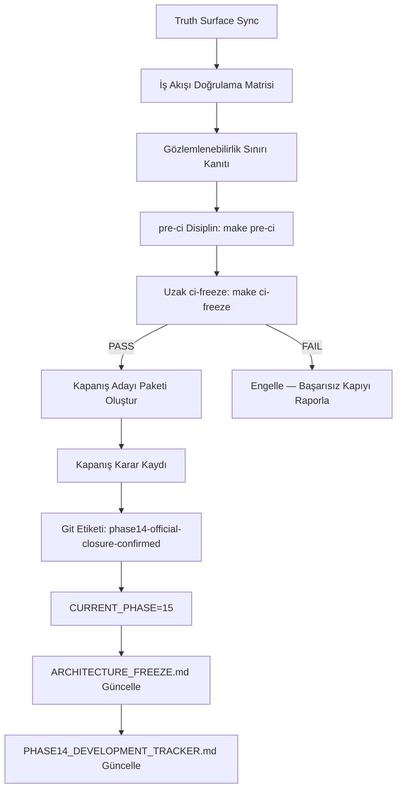

# Tasarım Belgesi — Phase-14 Resmi Kapanışı

## Genel Bakış

Bu belge, AykenOS Phase-14 (Distributed Observability Hardening) fazının resmi
kapanış sürecinin teknik tasarımını tanımlar. Tüm Phase-14 iş akışları (3.1–3.5)
`main` üzerinde birleştirilmiştir; bu belge kapanış sürecinin nasıl yürütüleceğini,
hangi artefaktların üretileceğini ve hangi doğrulama adımlarının izleneceğini
somut olarak belirtir.

Kapanış otoritesi yalnızca uzak GitHub Actions `ci-freeze` çalışmasının PASS
sonucu ve ilişkili HEAD SHA'dır. Yerel çalışmalar danışma niteliğindedir.

### Kapsam

- Phase-14 iş akışları: 3.1 (Harici API Stabilizasyonu), 3.2 (Replay Determinizm
  Sertleştirme), 3.3 (proofd Sorgu/Hizmet Sınırı Sertleştirme), 3.4 (Çapraz Düğüm
  Gözlemlenebilirlik Grafiği), 3.5 (Gözlemlenebilirlik UX)
- Hedef: `CURRENT_PHASE=14` → `CLOSED (official closure confirmed)` + Phase-15 geçişi
- Kapanış paketi dizini: `reports/phase14_official_closure_candidate/`

---

## Yürütme Sorumluluk Sınırı

Kapanış süreci tek bir aktör tarafından tek taraflı olarak tamamlanamaz.
Sorumluluklar aşağıdaki gibi bölünmüştür:

**Geliştirici:**
- Kapanış adayı paketini hazırlar (`reports/phase14_official_closure_candidate/`)
- Truth surface senkronizasyonunu sağlar (tracker, README, mimari harita)
- Yerel pre-ci disiplinini çalıştırır (`make pre-ci`) — danışma niteliğinde

**CI Sistemi (GitHub Actions):**
- `ci-freeze` çalıştırır
- Yetkili PASS/FAIL kararını üretir
- Kararı HEAD SHA'ya bağlar
- Yerel çalışmalar kapanış otoritesi vermez

**Depo Otoritesi (Geliştirici + CI onayı birlikte):**
- Kapanış etiketini uygular (`phase14-official-closure-confirmed`)
- `CURRENT_PHASE`'i günceller
- Kapanış karar kaydını kaydeder

Hiçbir aktör kapanışı tek başına tamamlayamaz; CI PASS olmadan etiket uygulanamaz,
etiket olmadan `CURRENT_PHASE` güncellenemez.

---

## Zaman Tutarlılığı Kısıtı

Tüm kapanış artefaktları UTC zaman damgası kullanır.

`closure_decision_record.json` içindeki `closure_timestamp_utc` alanı:
- `ci-freeze` tamamlanma zamanına eşit veya daha sonra olmalıdır
- Tüm artefaktlar arasında tutarlı olmalıdır (±60 saniye tolerans)

Tutarsız zaman damgaları kapanışı geçersiz kılar. Zaman damgası formatı ISO 8601
UTC: `2026-04-07T23:09:55Z`.

---

## Tek Doğru Kaynak İşaretçisi

Phase-14 kapanış gerçeğinin kesin kaynağı:

```
reports/phase14_official_closure_candidate/closure_index.json
```

Diğer tüm belgeler (tracker, README, raporlar) türetilmiş görünümler olarak
kabul edilir. Çelişki durumunda `closure_index.json` geçerlidir.

Bu hiyerarşi:
```
closure_index.json          ← kesin kaynak
  ↓ türetilmiş
PHASE14_DEVELOPMENT_TRACKER.md
README.md
ARCHITECTURE_FREEZE.md
docs/development/PROJECT_STATUS_REPORT.md
```

---

## Biçimsel Kapanış Tanımı

```
C = kapanış kriterleri kümesi
E = ci-freeze kanıtı
S = truth surface durumu

Phase-14 KAPALI iff:
  ∀c ∈ C: c = karşılandı
  ∧ E = PASS (uzak GitHub Actions)
  ∧ S = tutarlı (closure_index.json ile çelişki yok)
```

Bu tanım `ARCHITECTURE_FREEZE.md` kapanış protokolüyle tutarlıdır ve
Phase-10/11/12/13 kapanışlarında kullanılan `local evidence + remote ci-freeze`
modelini genişletir.

---

## Mimari

### Kapanış Süreci Akışı



### Kanıt Öncelik Sırası

```
1. CI kanıtı (ci-freeze uzak çalışma kimliği + PASS)
2. Çalışma zamanı test sonuçları (210 lib + 6 main + 63 obs-cli)
3. Sözleşme uyumluluğu (endpoint şema + yasak alan taraması)
4. Dokümantasyon (tracker, README, mimari harita)
```

Dokümantasyon tek başına kapanış için yeterli değildir.

---

## Bileşenler ve Arayüzler

### pre-ci Disiplin Zinciri

```bash
make pre-ci
# Çalıştırılan kapılar (sırayla):
# 1. ci-gate-abi
# 2. ci-gate-boundary
# 3. ci-gate-hygiene
# 4. ci-gate-constitutional
# 5. ci-gate-determinism-replay-consistency
```

Tüm pre-ci kapıları PASS olmadan `make ci-freeze` çalıştırılmaz.

### ci-freeze Kapı Zinciri (Phase-14 Özgü)

```bash
make ci-freeze AYKEN_SCHED_FALLBACK=0 AYKEN_CR3_PCID=0
```

Phase-14'e özgü doğrulanması gereken kapılar:

| Kapı | Amaç |
|------|------|
| `ci-gate-proofd-service` | proofd hizmet sözleşmesi uyumluluğu |
| `ci-gate-proofd-schema-coverage` | Tüm public endpoint'ler için şema kapsamı beyanı |
| `ci-gate-proofd-observability-boundary` | Yasak alan çalışma zamanı uygulaması |
| `ci-gate-observability-routing-separation` | Gözlemlenebilirlik/zamanlama sınırı ayrımı |
| `ci-gate-graph-non-authoritative-contract` | Graf yüzeyinin otorite dışı kalması |
| `ci-gate-diagnostics-consumer-non-authoritative-contract` | Tüketici kasasının otorite dışı kalması |
| `ci-gate-determinism-replay-consistency` | Replay deterministik tutarlılık |


---

## Veri Modelleri

### İş Akışı Doğrulama Matrisi

Her iş akışı için aşağıdaki sütunlar zorunludur:

| WS ID | Sözleşme Belgesi | Endpoint / Yüzey | Şema Kapsamı | Negatif Test | PASS Kanıtı | Birleştirme Durumu |
|-------|-----------------|-----------------|--------------|--------------|-------------|-------------------|
| 3.1 | `docs/specs/phase14-distributed-observability/PROOFD_EXTERNAL_DIAGNOSTICS_CONTRACT_v1.md` | `GET /diagnostics/version`, `X-Ayken-API-Version` başlığı | Full | `diagnostics_version_schema_violation_fails_closed` | PR #87, ci-freeze#23989067554 | MERGED |
| 3.2 | `userspace/proofd/verification_determinism_contract.json` | `POST /internal/replay`, `ci-gate-determinism-replay-consistency` | Full | `internal_replay_endpoint_emits_determinism_incident_on_hash_mismatch` | ci-freeze#23989067554 | MERGED |
| 3.3 | `userspace/proofd/src/api_contract.rs` + `userspace/proofd/src/api_schema.rs` | Tüm public diagnostics endpoint'leri | Full | `root_summary_rejects_forbidden_field_score`, `parity_endpoint_fail_closes_when_artifact_exposes_forbidden_field` | PR #94, ci-freeze#23989067554 | MERGED |
| 3.4 | `docs/specs/phase14-distributed-observability/CROSS_NODE_OBSERVABILITY_GRAPH_CONTRACT_v1.md` | `GET /diagnostics/graph`, `GET /diagnostics/graph/overlay` | Full | `graph_endpoint_rejects_truth_selection_query` | PR #96, ci-freeze#23999026616 | MERGED |
| 3.5 | `docs/specs/phase14-distributed-observability/OBSERVABILITY_UX_CONTRACT_v1.md` | `GET /diagnostics/summary`, `GET /diagnostics/runs/{run_id}/summary` | Full | `root_summary_is_queryless`, `root_summary_rejects_forbidden_field_score` | 210+6+63 test PASS, 2026-04-07 | MERGED |

**Bağımlılık Zinciri:**
- WS 3.5 → WS 3.3: `GET /diagnostics/summary` şema doğrulaması `api_schema.rs` altyapısını kullanır
- WS 3.5 → WS 3.4: `build_root_summary_diagnostics` → `build_partitioned_root_graph_diagnostics` + `build_root_graph_overlay_diagnostics`
- WS 3.4 → WS 3.3: Graf endpoint'leri `api_contract.rs` kayıt defterinden çözümlenir

### Gözlemlenebilirlik Sınırı Kanıtı

#### Beş Temel Değişmez

| Değişmez | Kanıt | Uygulama Noktası |
|----------|-------|-----------------|
| `service != authority` | `authority_classification = non_authoritative` tüm yanıtlarda | `api_contract.rs` + `api_schema.rs` |
| `diagnostics != decision` | `produces_decision = false` epistemic sınır beyanı | `SummaryEpistemicBoundary` yapısı |
| `parity != consensus` | Graf yüzeyi `aggregation_mode = overlay_only`; çoğunluk semantiği yok | `CROSS_NODE_OBSERVABILITY_GRAPH_CONTRACT_v1.md` |
| `trust does not affect verdict` | Doğrulama sonucu güven puanından bağımsız | `verification_determinism_contract.json` |
| `observability does not imply scheduling` | Diagnostics endpoint'leri zamanlama kararı üretmez | `ci-gate-observability-routing-separation` |

#### Epistemic Sınır Beyanı

Her summary yanıtı aşağıdaki yapıyı içerir:

```rust
SummaryEpistemicBoundary {
    produces_truth: false,
    produces_decision: false,
    produces_ranking: false,
}
```

Bu beyan `GET /diagnostics/summary` ve `GET /diagnostics/runs/{run_id}/summary`
endpoint'lerinin her yanıtında bulunur.

#### Yasak Alan Listesi

`userspace/proofd/src/api_contract.rs` içindeki `FORBIDDEN_OBSERVABILITY_FIELDS`
sabiti 34 giriş içerir. Temel yasak alanlar:

```
score, winner, routing_hint, resolved_truth, recommended_action,
authority_score, trust_score, ranking, verdict_override,
consensus_result, election_result, scheduling_hint, ...
```

**Çalışma zamanı uygulaması:** `observability_json_response()` fonksiyonu her
yanıtı tarar; yasak alan tespit edilirse `500 forbidden_observability_field_exposed`
döner. Bu davranış `ci-gate-proofd-observability-boundary` kapısı tarafından
doğrulanır.

### Kapanış Adayı Paketi Yapısı

```
reports/phase14_official_closure_candidate/
├── closure_index.json          # Tüm artefakt referansları + SHA-256 özetleri
├── closure_manifest.json       # İş akışı matrisi anlık görüntüsü
├── closure_manifest.sha256     # closure_manifest.json SHA-256 özeti
├── evidence_index.json         # CI çalışma referansları
├── evidence_index.sha256       # evidence_index.json SHA-256 özeti
├── closure_decision_record.json # HEAD SHA, CI çalışma kimliği, zaman damgası, karar
└── README.md                   # Kapanış iddiası + kalan yönetim adımları
```

**Phase-13 referansı:** `reports/phase13_official_closure_candidate/` ile tutarlı yapı.

### Kapanış Karar Kaydı Formatı

`reports/phase14_official_closure_candidate/closure_decision_record.json`:

```json
{
  "phase": "14",
  "closure_state": "OFFICIAL_CLOSURE_CONFIRMED",
  "head_sha": "<kapanış HEAD SHA>",
  "ci_freeze_run_id": "<github_actions_run_id>",
  "closure_timestamp_utc": "<ISO8601>",
  "closure_verdict": "PASS",
  "reproducibility_verified": true,
  "closure_candidate_package": "reports/phase14_official_closure_candidate/",
  "workstreams_closed": ["3.1", "3.2", "3.3", "3.4", "3.5"],
  "next_phase": "15"
}
```

### closure_index.json Formatı

```json
{
  "schema": "ayken-closure-index/1.0",
  "closure_type": "official_closure_candidate",
  "phase": 14,
  "tag": "phase14-official-closure-confirmed",
  "current_phase_after_closure": 15,
  "authority": "ARCHITECTURE_FREEZE.md",
  "closure_state": "OFFICIAL_CONFIRMED",
  "closure_date_utc": "<ISO8601>",
  "remote_ci_confirmation": {
    "workflow": "ci-freeze",
    "run_id": "<github_actions_run_id>",
    "head_sha": "<sha>",
    "result": "success",
    "completed_utc": "<ISO8601>"
  },
  "artifacts": {
    "closure_manifest": {
      "path": "reports/phase14_official_closure_candidate/closure_manifest.json",
      "sha256": "<sha256>"
    },
    "evidence_index": {
      "path": "reports/phase14_official_closure_candidate/evidence_index.json",
      "sha256": "<sha256>"
    },
    "closure_decision_record": {
      "path": "reports/phase14_official_closure_candidate/closure_decision_record.json",
      "sha256": "<sha256>"
    }
  },
  "workstreams_closed": ["3.1", "3.2", "3.3", "3.4", "3.5"],
  "current_phase_file": "docs/roadmap/CURRENT_PHASE",
  "current_phase_value": "CURRENT_PHASE=15"
}
```


---

## Doğruluk Özellikleri

*Bir özellik, bir sistemin tüm geçerli yürütmelerinde doğru olması gereken bir
karakteristik veya davranıştır — temelde sistemin ne yapması gerektiğine dair
biçimsel bir ifadedir. Özellikler, insan tarafından okunabilir spesifikasyonlar
ile makine tarafından doğrulanabilir doğruluk garantileri arasındaki köprüdür.*

### Özellik 1: Yasak Alan Reddi

*Herhangi bir* diagnostics yanıtı için, `FORBIDDEN_OBSERVABILITY_FIELDS`
listesindeki herhangi bir alanı içeren yanıt `500 forbidden_observability_field_exposed`
hatasıyla reddedilmelidir; yanıt asla istemciye iletilmemelidir.

**Doğrular: Gereksinimler 3.4, 3.6**

### Özellik 2: Epistemic Sınır Değişmezi

*Herhangi bir* public diagnostics endpoint yanıtı için,
`produces_truth`, `produces_decision` ve `produces_ranking` alanlarının
tamamı `false` olmalıdır.

**Doğrular: Gereksinimler 3.2**

### Özellik 3: Kapanış Paketi Yapısal Bütünlüğü

*Herhangi bir* geçerli kapanış adayı paketi için, `closure_index.json`
içinde referans verilen tüm artefaktlar mevcut olmalı ve SHA-256 özet
değerleri eşleşmelidir.

**Doğrular: Gereksinimler 6.2, 6.3, 13.3, 13.4**

### Özellik 4: ci-freeze Deterministik Yeniden Üretilebilirlik

*Herhangi bir* HEAD SHA ve sabit ortam koşulları (`AYKEN_SCHED_FALLBACK=0`,
`AYKEN_CR3_PCID=0`) için, `make ci-freeze` çalıştırıldığında özdeş sonuç
üretilmelidir; aynı SHA ile farklı sonuç elde edilmesi `DETERMINISM.GLOBAL`
ihlali olarak raporlanmalıdır.

**Doğrular: Gereksinimler 11.1, 11.3, 11.4**

### Özellik 5: Kapanış Karar Kaydı Zorunlu Alanlar

*Herhangi bir* geçerli kapanış karar kaydı için, `head_sha`, `ci_freeze_run_id`,
`closure_timestamp_utc`, `closure_verdict`, `reproducibility_verified` alanlarının
tamamı mevcut ve dolu olmalıdır; bu alanlardan herhangi biri eksikse kayıt
geçersiz sayılmalıdır.

**Doğrular: Gereksinimler 10.1, 10.4**

### Özellik 6: Truth Surface Tutarsızlık Engeli

*Herhangi bir* truth yüzeyi çifti (tracker, README, mimari harita) için,
iş akışı durumu veya faz değeri birbiriyle çelişiyorsa kapanış süreci
engellenmelidir ve tutarsızlık raporlanmalıdır.

**Doğrular: Gereksinimler 1.4, 2.8**

### Özellik 7: Kapanış Paketi Eksik Kanıt Engeli

*Herhangi bir* iş akışı için PASS kanıtı (CI çalışma kimliği veya yerel
kanıt referansı) eksikse, kapanış adayı paketi eksik olarak işaretlenmeli
ve kapanış süreci engellenmelidir.

**Doğrular: Gereksinimler 2.8, 6.5**

---

## Hata İşleme

### Kapanış Engelleme Koşulları

Aşağıdaki koşulların herhangi biri kapanışı engeller; kısmi kapanış yoktur:

| Koşul | Eylem |
|-------|-------|
| Herhangi bir `ci-freeze` kapısı başarısız | Başarısız kapıyı ve hata mesajını raporla; kapanışı engelle |
| Diagnostics yanıtında yasak alan | `500 forbidden_observability_field_exposed`; kapanışı engelle |
| Truth yüzeyleri birbiriyle çelişiyor | Tutarsızlığı raporla; kapanışı engelle |
| Doğrulama matrisinde PASS kanıtı eksik | Matrisi eksik olarak işaretle; kapanışı engelle |
| Endpoint/şema uyumsuzluğu | Uyumsuzluğu raporla; kapanışı engelle |
| Uzak `ci-freeze` onayı yok | Yerel PASS yeterli değil; kapanışı engelle |
| Hygiene kapısı başarısız (dirty tracked dosyalar) | Dirty dosyaları raporla; kapanışı engelle |
| SHA-256 özet değeri eşleşmiyor | Denetim bütünlüğü ihlali raporla; kapanışı geçersiz say |

### Kapanış Geçersizleştirme

Kapanış sonrası aşağıdaki koşulların herhangi birinde geçersizleştirme tetiklenir:

1. Kapanış sonrası `ci-freeze` observability sözleşmelerinde regresyon
2. Diagnostics yanıtında yasak alan ortaya çıkması
3. Truth yüzeylerinde sürüklenme tespiti

**Geçersizleştirme prosedürü:**
```bash
# 1. Etiketi geçersiz olarak işaretle (yeni etiket mint et)
git tag phase14-closure-invalidated-<tarih> <kapanış-sha>

# 2. PHASE14_DEVELOPMENT_TRACKER.md'ye geçersizleştirme kaydı ekle
# Neden: <geçersizleştirme nedeni>
# Tespit zamanı: <UTC zaman damgası>
# Yeni durum: ACTIVE

# 3. docs/roadmap/CURRENT_PHASE'i geri al
echo "CURRENT_PHASE=14" > docs/roadmap/CURRENT_PHASE

# 4. Yeni kapanış döngüsü başlat
```

---

## Faz Geçiş Yürütme Prosedürü

### Ön Koşul Doğrulama

```bash
# 1. Truth surface sync kontrolü
grep -E "3\.[1-5].*MERGED" docs/specs/phase14-distributed-observability/PHASE14_DEVELOPMENT_TRACKER.md
cat docs/roadmap/CURRENT_PHASE  # CURRENT_PHASE=14 olmalı

# 2. pre-ci disiplin
make pre-ci
# Beklenen: ABI + Boundary + Hygiene + Constitutional + Determinism — tümü PASS

# 3. Tam ci-freeze (uzak GitHub Actions)
# make ci-freeze AYKEN_SCHED_FALLBACK=0 AYKEN_CR3_PCID=0
# NOT: Bu komut GitHub Actions üzerinde çalıştırılır; yerel çalıştırma kapanış otoritesi vermez
```

### Kapanış Adayı Paketi Oluşturma

```bash
# Dizin oluştur
mkdir -p reports/phase14_official_closure_candidate

# closure_manifest.json oluştur (iş akışı matrisi anlık görüntüsü)
# closure_decision_record.json oluştur (HEAD SHA + CI run ID + zaman damgası)
# evidence_index.json oluştur (CI çalışma referansları)

# SHA-256 özetleri hesapla
sha256sum reports/phase14_official_closure_candidate/closure_manifest.json \
  > reports/phase14_official_closure_candidate/closure_manifest.sha256
sha256sum reports/phase14_official_closure_candidate/evidence_index.json \
  > reports/phase14_official_closure_candidate/evidence_index.sha256

# closure_index.json oluştur (tüm artefakt referansları + özetler)
```

### Faz Geçiş Komutları

```bash
# 1. CURRENT_PHASE güncelle
echo "CURRENT_PHASE=15" > docs/roadmap/CURRENT_PHASE

# 2. Git etiketi uygula (kapanış HEAD SHA'sına)
git tag phase14-official-closure-confirmed <kapanış-head-sha>
git push origin phase14-official-closure-confirmed

# 3. PHASE14_DEVELOPMENT_TRACKER.md güncelle
# Kapanış kaydı ekle: tarih, HEAD SHA, CI çalışma kimliği

# 4. ARCHITECTURE_FREEZE.md güncelle
# Phase-14 kapanış girişi ekle (Phase-13 formatıyla tutarlı)
```

---

## Test Stratejisi

### İkili Test Yaklaşımı

Kapanış süreci hem birim testleri hem de özellik tabanlı testler gerektirir.
Birim testleri somut örnekleri ve hata koşullarını doğrularken, özellik tabanlı
testler tüm girdiler üzerinde evrensel özellikleri doğrular.

### Birim Testleri

Aşağıdaki somut örnekler ve hata koşulları birim testleriyle doğrulanır:

**Gözlemlenebilirlik Sınırı:**
- `root_summary_is_queryless`: `GET /diagnostics/summary` sorgu parametresi
  kabul etmez; desteklenmeyen parametre → `400 unsupported_query_parameter`
- `root_summary_rejects_forbidden_field_score`: `score` alanı içeren yanıt
  → `500 forbidden_observability_field_exposed`
- `parity_endpoint_fail_closes_when_artifact_exposes_forbidden_field`: Parity
  endpoint'i yasak alan içeren artefakt → `500`
- `graph_endpoint_rejects_truth_selection_query`: Graf endpoint'i truth seçim
  sorgusu → `400`
- `internal_replay_endpoint_emits_determinism_incident_on_hash_mismatch`:
  Hash uyumsuzluğu → determinizm olayı üretilir
- `diagnostics_version_schema_violation_fails_closed`: Şema ihlali → fail-closed

**Kapanış Paketi:**
- `closure_index_references_all_artifacts`: `closure_index.json` tüm artefaktlara
  referans verir ve tüm referans edilen dosyalar mevcuttur
- `closure_decision_record_has_required_fields`: Karar kaydı tüm zorunlu alanları
  içerir
- `phase_transition_blocked_without_ci_freeze`: Uzak CI onayı olmadan faz geçişi
  engellenir

**Truth Surface:**
- `tracker_shows_all_workstreams_merged`: Tracker 3.1–3.5 tümü MERGED
- `current_phase_file_is_14`: `docs/roadmap/CURRENT_PHASE` = `CURRENT_PHASE=14`

### Özellik Tabanlı Testler

Özellik tabanlı testler için **Rust `proptest`** kütüphanesi kullanılır.
Her test minimum 100 iterasyon çalıştırır.

**Özellik 1: Yasak Alan Reddi**
```rust
// Feature: phase14-closure, Property 1: Forbidden field rejection
// For any diagnostics response containing any field from FORBIDDEN_OBSERVABILITY_FIELDS,
// the response must be rejected with 500 forbidden_observability_field_exposed.
proptest! {
    #[test]
    fn prop_forbidden_field_always_rejected(
        field in proptest::sample::select(FORBIDDEN_OBSERVABILITY_FIELDS.as_slice()),
        value in ".*"
    ) {
        let response = inject_field_into_response(&field, &value);
        let result = observability_json_response(response);
        prop_assert!(matches!(result, Err(ObsError::ForbiddenField(_))));
    }
}
```

**Özellik 2: Epistemic Sınır Değişmezi**
```rust
// Feature: phase14-closure, Property 2: Epistemic boundary invariant
// For any summary response, produces_truth/decision/ranking must all be false.
proptest! {
    #[test]
    fn prop_epistemic_boundary_always_false(summary in arb_summary_response()) {
        prop_assert_eq!(summary.epistemic_boundary.produces_truth, false);
        prop_assert_eq!(summary.epistemic_boundary.produces_decision, false);
        prop_assert_eq!(summary.epistemic_boundary.produces_ranking, false);
    }
}
```

**Özellik 3: Kapanış Paketi SHA-256 Bütünlüğü**
```rust
// Feature: phase14-closure, Property 3: Closure package integrity
// For any closure package, SHA-256 digests in closure_index.json must match artifacts.
proptest! {
    #[test]
    fn prop_closure_index_digests_match_artifacts(
        package in arb_closure_package()
    ) {
        for (path, expected_sha256) in &package.closure_index.artifacts {
            let actual = sha256_of_file(path);
            prop_assert_eq!(actual, *expected_sha256);
        }
    }
}
```

**Özellik 4: ci-freeze Deterministik Yeniden Üretilebilirlik**
```rust
// Feature: phase14-closure, Property 4: ci-freeze deterministic reproducibility
// For any HEAD SHA and fixed env, two ci-freeze runs must produce identical results.
proptest! {
    #[test]
    fn prop_ci_freeze_deterministic(head_sha in arb_sha(), env in arb_fixed_env()) {
        let result1 = simulate_ci_freeze(&head_sha, &env);
        let result2 = simulate_ci_freeze(&head_sha, &env);
        prop_assert_eq!(result1, result2);
    }
}
```

**Özellik 5: Kapanış Karar Kaydı Zorunlu Alanlar**
```rust
// Feature: phase14-closure, Property 5: Closure decision record required fields
// For any valid closure decision record, all required fields must be present and non-empty.
proptest! {
    #[test]
    fn prop_closure_decision_record_complete(record in arb_closure_decision_record()) {
        prop_assert!(!record.head_sha.is_empty());
        prop_assert!(!record.ci_freeze_run_id.is_empty());
        prop_assert!(!record.closure_timestamp_utc.is_empty());
        prop_assert_eq!(record.closure_verdict, "PASS");
        prop_assert_eq!(record.reproducibility_verified, true);
    }
}
```

**Özellik 6: Truth Surface Tutarsızlık Engeli**
```rust
// Feature: phase14-closure, Property 6: Truth surface conflict blocks closure
// For any pair of truth surfaces with conflicting workstream status,
// closure validation must return an error.
proptest! {
    #[test]
    fn prop_conflicting_truth_surfaces_block_closure(
        surfaces in arb_conflicting_truth_surfaces()
    ) {
        let result = validate_truth_surface_sync(&surfaces);
        prop_assert!(result.is_err());
    }
}
```

**Özellik 7: Kapanış Paketi Eksik Kanıt Engeli**
```rust
// Feature: phase14-closure, Property 7: Missing evidence blocks closure
// For any workstream with missing PASS evidence, closure package must be marked incomplete.
proptest! {
    #[test]
    fn prop_missing_evidence_blocks_closure(
        ws_id in proptest::sample::select(&["3.1", "3.2", "3.3", "3.4", "3.5"]),
        matrix in arb_validation_matrix_with_missing_evidence(ws_id)
    ) {
        let result = validate_closure_package(&matrix);
        prop_assert!(result.is_err());
        prop_assert!(result.unwrap_err().contains(ws_id));
    }
}
```

### Test Konfigürasyonu

```toml
# Cargo.toml [dev-dependencies]
proptest = "1.4"

# proptest konfigürasyonu
[profile.test]
# Her özellik testi minimum 100 iterasyon çalıştırır
# proptest varsayılanı 256 iterasyon — yeterli
```

### Mevcut Test Kapsamı

| Kapsam | Test Sayısı | Durum |
|--------|-------------|-------|
| `cargo test -p proofd` (lib) | 210 | PASS (2026-04-07) |
| `cargo test -p proofd` (main) | 6 | PASS (2026-04-07) |
| `cargo test -p obs-cli` | 63 | PASS (2026-04-07) |
| ci-freeze#23989067554 | Tüm kapılar | PASS |
| ci-freeze#23999026616 | Tüm kapılar | PASS |

