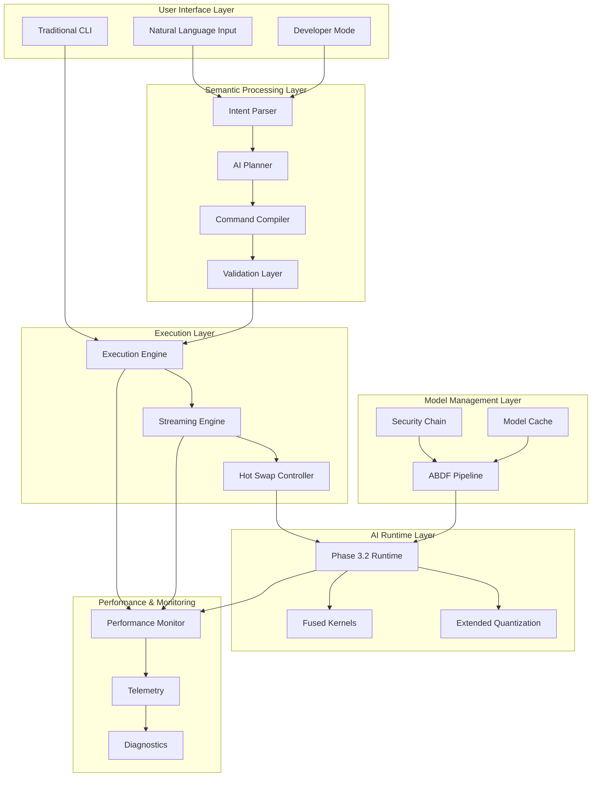
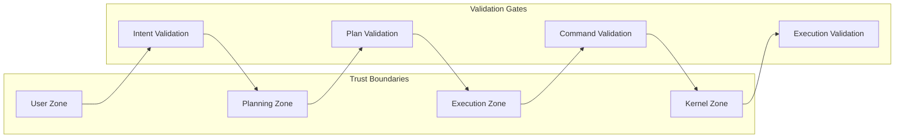

# Design Document: Phase 3.3 AI-Native Semantic Interface & Streaming Intelligence

**Oluşturan:** Kenan AY  
**Tarih:** 11 Ocak 2026  
**Durum:** DRAFT - Design Phase  
**Versiyon:** v0.1  
**Bağımlılık:** Phase 3.2 AI-Native Interface (COMPLETED)

## Overview

Phase 3.3 represents the architectural transformation of AykenOS from an AI-capable system to a truly AI-native operating system. This design implements a semantic interface layer that enables natural language interaction, streaming intelligence capabilities, advanced model optimization pipelines, and comprehensive security hardening.

The core architectural principle is **"AI as Primary Interface"** - where natural language becomes the primary interaction paradigm while maintaining full backward compatibility with traditional CLI operations. The system achieves this through a layered architecture that separates semantic interpretation, planning, compilation, and execution while maintaining strict security boundaries.

**Key Design Goals:**
- **Semantic Transparency**: Natural language commands are parsed, planned, and compiled with full visibility and control
- **Streaming Intelligence**: Real-time response generation with adaptive optimization during inference
- **Security-First**: All AI-generated commands require explicit validation before execution
- **Performance Excellence**: Advanced SIMD optimizations and intelligent model conversion pipelines
- **Backward Compatibility**: Phase 3.2 functionality preserved and enhanced, never replaced

## Architecture

### High-Level System Architecture



### Semantic Processing Pipeline

The semantic processing pipeline implements a four-stage transformation:

1. **Intent Parsing**: Natural language → structured intent representation
2. **Planning**: Intent → step-by-step execution plan
3. **Compilation**: Plan → validated AykenOS commands
4. **Execution**: Commands → system operations with streaming feedback

Each stage maintains audit trails and supports deterministic replay for debugging and security analysis.

### Security Architecture



## Components and Interfaces

### Semantic CLI Interface

**Primary Interface: `SemanticCLI`**
```rust
pub trait SemanticCLI {
    fn parse_natural_language(&self, input: &str) -> Result<Intent, ParseError>;
    fn execute_semantic_command(&self, intent: Intent) -> Result<ExecutionResult, ExecutionError>;
    fn switch_mode(&self, mode: CLIMode) -> Result<(), ModeError>;
    fn get_command_history(&self) -> Vec<CommandMapping>;
}

pub struct Intent {
    pub action: ActionType,
    pub targets: Vec<Target>,
    pub parameters: HashMap<String, Value>,
    pub confidence: f32,
    pub alternatives: Vec<Intent>,
}

pub enum CLIMode {
    Semantic,
    Traditional,
    Developer,
}
```

**Intent Parser Interface:**
```rust
pub trait IntentParser {
    fn parse(&self, input: &str) -> Result<Intent, ParseError>;
    fn request_clarification(&self, ambiguous_intent: &Intent) -> ClarificationRequest;
    fn learn_from_feedback(&self, intent: &Intent, feedback: UserFeedback);
}
```

### AI Planner and Compiler

**Planner Interface:**
```rust
pub trait AIPlanner {
    fn generate_plan(&self, intent: &Intent) -> Result<ExecutionPlan, PlanningError>;
    fn validate_plan(&self, plan: &ExecutionPlan) -> ValidationResult;
    fn estimate_resources(&self, plan: &ExecutionPlan) -> ResourceEstimate;
    fn generate_alternatives(&self, failed_step: &PlanStep) -> Vec<ExecutionPlan>;
    fn enable_replay_mode(&self, deterministic: bool);
}

pub struct ExecutionPlan {
    pub steps: Vec<PlanStep>,
    pub dependencies: Vec<Dependency>,
    pub estimated_time: Duration,
    pub resource_requirements: ResourceRequirements,
    pub rollback_plan: Option<RollbackPlan>,
}

pub struct PlanStep {
    pub id: StepId,
    pub command: String,
    pub parameters: HashMap<String, Value>,
    pub preconditions: Vec<Condition>,
    pub postconditions: Vec<Condition>,
    pub timeout: Duration,
}
```

**Command Compiler Interface:**
```rust
pub trait CommandCompiler {
    fn compile_plan(&self, plan: &ExecutionPlan) -> Result<CompiledCommands, CompilationError>;
    fn validate_commands(&self, commands: &CompiledCommands) -> ValidationResult;
    fn require_approval(&self, commands: &CompiledCommands) -> ApprovalRequest;
}

pub struct CompiledCommands {
    pub commands: Vec<ValidatedCommand>,
    pub security_context: SecurityContext,
    pub approval_required: bool,
}
```

### Streaming Intelligence Engine

**Streaming Engine Interface:**
```rust
pub trait StreamingEngine {
    fn start_streaming(&self, request: InferenceRequest) -> Result<StreamHandle, StreamError>;
    fn get_token_stream(&self, handle: StreamHandle) -> TokenStream;
    fn cancel_stream(&self, handle: StreamHandle) -> Result<(), CancelError>;
    fn get_progress(&self, handle: StreamHandle) -> StreamProgress;
}

pub struct TokenStream {
    pub tokens: Receiver<Token>,
    pub metadata: StreamMetadata,
    pub progress: Receiver<StreamProgress>,
}

pub struct StreamProgress {
    pub tokens_generated: usize,
    pub estimated_remaining: Option<usize>,
    pub generation_rate: f32, // tokens per second
    pub buffer_utilization: f32,
}
```

**Hot Swap Controller Interface:**
```rust
pub trait HotSwapController {
    fn monitor_system_load(&self) -> SystemLoad;
    fn adjust_optimization_level(&self, level: OptimizationLevel) -> Result<(), SwapError>;
    fn can_swap_safely(&self, current_request: &InferenceRequest) -> bool;
    fn get_swap_constraints(&self) -> SwapConstraints;
}

pub struct SwapConstraints {
    pub allowed_optimizations: Vec<OptimizationType>,
    pub forbidden_changes: Vec<ParameterType>,
    pub request_boundary_required: bool,
}

pub enum OptimizationType {
    SchedulingLevel,
    BufferSize,
    BatchSize,
    // Note: Model, Quantization, Kernel selection are FORBIDDEN
}
```

### ABDF Conversion Pipeline

**ABDF Pipeline Interface:**
```rust
pub trait ABDFPipeline {
    fn convert_model(&self, source: ModelSource) -> Result<ABDFModel, ConversionError>;
    fn batch_convert(&self, sources: Vec<ModelSource>) -> BatchConversionResult;
    fn validate_conversion(&self, original: &Model, converted: &ABDFModel) -> ValidationResult;
    fn get_conversion_progress(&self, job_id: JobId) -> ConversionProgress;
}

pub struct ABDFModel {
    pub header: ABDFHeader,
    pub metadata: ModelMetadata,
    pub tensor_data: MappedTensorData,
    pub trust_metadata: TrustMetadata,
    pub performance_profile: PerformanceProfile,
}

pub struct ConversionProgress {
    pub stage: ConversionStage,
    pub progress_percent: f32,
    pub estimated_remaining: Duration,
    pub current_operation: String,
}

pub enum ConversionStage {
    Parsing,
    Validation,
    Optimization,
    Serialization,
    TrustVerification,
}
```

### Advanced SIMD and Fused Kernels

**Fused Kernel Interface:**
```rust
pub trait FusedKernels {
    fn softmax_layernorm_fused(&self, input: &Tensor, params: &LayerNormParams) -> Result<Tensor, KernelError>;
    fn attention_fused(&self, q: &Tensor, k: &Tensor, v: &Tensor) -> Result<Tensor, KernelError>;
    fn get_optimal_kernel(&self, operation: FusedOperation, hardware: &HardwareInfo) -> KernelId;
    fn benchmark_kernel(&self, kernel_id: KernelId, test_data: &TestData) -> BenchmarkResult;
}

pub enum FusedOperation {
    SoftmaxLayerNorm,
    AttentionQKV,
    GELULayerNorm,
}

pub struct BenchmarkResult {
    pub performance_improvement: f32, // vs separate operations
    pub numerical_accuracy: f32,
    pub memory_efficiency: f32,
    pub instruction_set: InstructionSet,
}
```

### Security Chain and Trust Management

**Security Chain Interface:**
```rust
pub trait SecurityChain {
    fn verify_model_integrity(&self, model: &Model) -> IntegrityResult;
    fn validate_signature(&self, model: &Model, ca_store: &CAStore) -> SignatureResult;
    fn isolate_untrusted_model(&self, model: &Model) -> Result<TrustDomain, IsolationError>;
    fn update_trust_score(&self, model_id: &ModelId, event: TrustEvent);
    fn quarantine_model(&self, model_id: &ModelId, reason: QuarantineReason);
}

pub struct TrustDomain {
    pub isolation_level: IsolationLevel,
    pub allowed_operations: Vec<Operation>,
    pub resource_limits: ResourceLimits,
    pub monitoring_level: MonitoringLevel,
}

pub enum IsolationLevel {
    None,
    Sandboxed,
    FullyIsolated,
    Quarantined,
}

pub struct TrustEvent {
    pub event_type: TrustEventType,
    pub timestamp: SystemTime,
    pub context: EventContext,
    pub impact: TrustImpact,
}
```

## Data Models

### Semantic Processing Data Models

**Intent Representation:**
```rust
pub struct Intent {
    pub id: IntentId,
    pub raw_input: String,
    pub parsed_action: ActionType,
    pub targets: Vec<Target>,
    pub parameters: HashMap<String, Value>,
    pub confidence_score: f32,
    pub alternatives: Vec<AlternativeIntent>,
    pub context: UserContext,
    pub timestamp: SystemTime,
}

pub enum ActionType {
    Query,
    Command,
    Configuration,
    Analysis,
    Monitoring,
}

pub struct Target {
    pub target_type: TargetType,
    pub identifier: String,
    pub properties: HashMap<String, Value>,
}

pub enum TargetType {
    File,
    Process,
    Model,
    System,
    Network,
}
```

**Execution Plan Data Model:**
```rust
pub struct ExecutionPlan {
    pub plan_id: PlanId,
    pub intent_id: IntentId,
    pub steps: Vec<PlanStep>,
    pub dependencies: DependencyGraph,
    pub resource_estimate: ResourceEstimate,
    pub risk_assessment: RiskAssessment,
    pub rollback_strategy: RollbackStrategy,
    pub approval_requirements: ApprovalRequirements,
}

pub struct ResourceEstimate {
    pub cpu_usage: CpuUsage,
    pub memory_usage: MemoryUsage,
    pub disk_io: DiskIO,
    pub network_io: NetworkIO,
    pub estimated_duration: Duration,
    pub confidence_interval: (Duration, Duration),
}

pub struct RiskAssessment {
    pub risk_level: RiskLevel,
    pub potential_impacts: Vec<Impact>,
    pub mitigation_strategies: Vec<Mitigation>,
    pub approval_required: bool,
}
```

### Streaming Data Models

**Stream State Management:**
```rust
pub struct StreamState {
    pub stream_id: StreamId,
    pub request: InferenceRequest,
    pub current_position: TokenPosition,
    pub buffer_state: BufferState,
    pub optimization_level: OptimizationLevel,
    pub performance_metrics: StreamMetrics,
    pub hot_swap_history: Vec<SwapEvent>,
}

pub struct BufferState {
    pub input_buffer: CircularBuffer<Token>,
    pub output_buffer: CircularBuffer<Token>,
    pub buffer_utilization: f32,
    pub overflow_count: u64,
    pub underflow_count: u64,
}

pub struct StreamMetrics {
    pub tokens_per_second: f32,
    pub latency_p50: Duration,
    pub latency_p95: Duration,
    pub latency_p99: Duration,
    pub throughput_mbps: f32,
    pub error_rate: f32,
}
```

### Model Management Data Models

**ABDF Model Representation:**
```rust
pub struct ABDFModel {
    pub header: ABDFHeader,
    pub metadata: ABDFMetadata,
    pub tensor_table: TensorTable,
    pub data_region: MappedDataRegion,
    pub trust_info: TrustInformation,
    pub performance_profile: PerformanceProfile,
}

pub struct ABDFHeader {
    pub magic: [u8; 4], // "ABDF"
    pub version: u32,
    pub metadata_offset: u64,
    pub tensor_table_offset: u64,
    pub data_offset: u64,
    pub total_size: u64,
    pub checksum: [u8; 32], // SHA-256
}

pub struct ABDFMetadata {
    pub model_name: String,
    pub architecture: Architecture,
    pub quantization_info: QuantizationInfo,
    pub conversion_info: ConversionInfo,
    pub optimization_flags: OptimizationFlags,
    pub compatibility_info: CompatibilityInfo,
}

pub struct TrustInformation {
    pub source_hash: [u8; 32],
    pub conversion_hash: [u8; 32],
    pub signature: Option<Signature>,
    pub trust_score: f32,
    pub verification_chain: Vec<VerificationStep>,
    pub isolation_requirements: IsolationRequirements,
}
```

### Security Data Models

**Trust and Security State:**
```rust
pub struct SecurityState {
    pub trust_database: TrustDatabase,
    pub active_domains: HashMap<ModelId, TrustDomain>,
    pub security_events: EventLog,
    pub policy_engine: PolicyEngine,
    pub threat_detection: ThreatDetector,
}

pub struct TrustDatabase {
    pub models: HashMap<ModelId, ModelTrustRecord>,
    pub certificates: CAStore,
    pub reputation_scores: HashMap<ModelId, ReputationScore>,
    pub usage_history: HashMap<ModelId, UsageHistory>,
}

pub struct ModelTrustRecord {
    pub model_id: ModelId,
    pub trust_level: TrustLevel,
    pub verification_status: VerificationStatus,
    pub risk_factors: Vec<RiskFactor>,
    pub allowed_operations: Vec<Operation>,
    pub monitoring_requirements: MonitoringRequirements,
}
```

## Correctness Properties

*A property is a characteristic or behavior that should hold true across all valid executions of a system—essentially, a formal statement about what the system should do. Properties serve as the bridge between human-readable specifications and machine-verifiable correctness guarantees.*

Based on the prework analysis, the following correctness properties ensure the system behaves correctly across all inputs and scenarios:

### Property 1: Semantic Command Determinism
*For any* natural language input, parsing the same input multiple times in the same context should produce identical intent representations and execution plans.
**Validates: Requirements 1.1, 2.5**

### Property 2: Security Boundary Enforcement
*For any* planner-generated command, the system should never execute it without explicit validation and policy approval.
**Validates: Requirements 1.5, 7.7**

### Property 3: Streaming Coherence Preservation
*For any* streaming response, the concatenated tokens should form a coherent and properly formatted response identical to non-streaming generation.
**Validates: Requirements 3.1, 3.2**

### Property 4: Hot Swap Boundary Constraints
*For any* active inference request, hot swap operations should never modify model selection, quantization type, or kernel selection—only optimization levels.
**Validates: Requirements 3.3, 3.4**

### Property 5: ABDF Conversion Fidelity
*For any* model converted to ABDF format, the converted model should produce identical outputs to the original model for all valid inputs.
**Validates: Requirements 4.2, 4.3**

### Property 6: Fused Kernel Numerical Accuracy
*For any* input tensor, fused Softmax+LayerNorm operations should produce results within acceptable numerical tolerances compared to separate operations.
**Validates: Requirements 5.6**

### Property 7: Extended Quantization Compatibility
*For any* Phase 3.2 quantization format, the system should continue to load and process it identically to Phase 3.2 behavior.
**Validates: Requirements 6.4, 9.3**

### Property 8: Security Chain Integrity
*For any* model with cryptographic signatures, the security chain should successfully validate authentic signatures and reject invalid ones.
**Validates: Requirements 7.1, 7.2**

### Property 9: Performance Monitoring Completeness
*For any* system operation (semantic processing, streaming, conversion), all performance metrics should be captured and exposed through defined interfaces.
**Validates: Requirements 8.1, 8.2, 8.4**

### Property 10: Graceful Degradation Reliability
*For any* Phase 3.3 feature failure, the system should automatically fall back to Phase 3.2 behavior without service interruption or data corruption.
**Validates: Requirements 9.2, 9.6**

### Property 11: Developer Mode Safety
*For any* developer mode operation, plan generation and dry-run execution should never cause system state changes or security violations.
**Validates: Requirements 11.1, 11.3**

### Property 12: Resource Coordination Consistency
*For any* concurrent AI operations, the system should coordinate resource allocation without conflicts or deadlocks.
**Validates: Requirements 10.2, 10.3**

## Error Handling

### Error Classification and Recovery

**Error Categories:**
1. **Semantic Errors**: Intent parsing failures, ambiguous input, unsupported commands
2. **Planning Errors**: Invalid plans, resource conflicts, capability mismatches
3. **Execution Errors**: Command failures, permission denials, resource exhaustion
4. **Streaming Errors**: Token generation failures, buffer overflows, cancellation issues
5. **Security Errors**: Trust violations, signature failures, isolation breaches
6. **Performance Errors**: Optimization failures, kernel errors, resource bottlenecks

**Recovery Strategies:**

```rust
pub enum ErrorRecovery {
    Retry {
        max_attempts: u32,
        backoff_strategy: BackoffStrategy,
    },
    Fallback {
        fallback_strategy: FallbackStrategy,
        preserve_context: bool,
    },
    Escalate {
        escalation_level: EscalationLevel,
        user_notification: bool,
    },
    Abort {
        cleanup_required: bool,
        rollback_strategy: Option<RollbackStrategy>,
    },
}

pub enum FallbackStrategy {
    Phase32Behavior,
    TraditionalCLI,
    SafeMode,
    ReadOnlyMode,
}
```

**Error Context Preservation:**
- All errors maintain full context for debugging and audit trails
- Error recovery preserves user session state and progress
- Failed operations provide actionable guidance for resolution
- Security errors trigger appropriate isolation and logging

### Streaming Error Handling

**Stream Interruption Recovery:**
```rust
pub struct StreamErrorHandler {
    pub buffer_recovery: BufferRecoveryStrategy,
    pub state_preservation: StatePreservationStrategy,
    pub user_notification: NotificationStrategy,
    pub fallback_generation: FallbackGenerationStrategy,
}
```

Streaming operations implement checkpoint-based recovery to minimize data loss and maintain response coherence even during failures.

## Testing Strategy

### Dual Testing Approach

The testing strategy employs both unit testing and property-based testing to ensure comprehensive coverage:

**Unit Tests:**
- Specific examples and edge cases for each component
- Integration points between semantic processing stages
- Error conditions and recovery mechanisms
- Hardware-specific kernel implementations
- Security boundary validations

**Property-Based Tests:**
- Universal properties across all inputs (minimum 100 iterations each)
- Semantic parsing determinism and consistency
- Streaming coherence and performance characteristics
- Security boundary enforcement under all conditions
- Backward compatibility preservation
- Performance regression prevention

**Property Test Configuration:**
Each property test runs with minimum 100 iterations and includes:
- **Feature Tag**: `Phase3-3-Semantic-Streaming`
- **Property Reference**: Links to specific design document properties
- **Requirements Traceability**: Maps to validated requirements

**Integration Testing:**
- End-to-end semantic command workflows
- Multi-component streaming operations
- Security chain integration across all features
- Performance monitoring and telemetry validation
- Backward compatibility with Phase 3.2 test suites

**Security Testing:**
- Penetration testing of semantic command injection
- Trust domain isolation verification
- Model signature validation and bypass attempts
- Policy enforcement under adversarial conditions

**Performance Testing:**
- Streaming latency and throughput benchmarks
- ABDF conversion performance validation
- Fused kernel performance improvement verification
- Resource utilization under concurrent operations
- Scalability testing with multiple semantic sessions

The testing strategy ensures that Phase 3.3 maintains the stability and performance of Phase 3.2 while adding robust validation for all new AI-native capabilities.