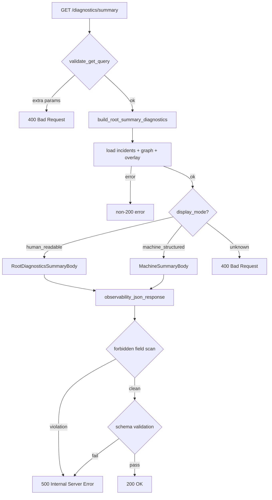

# Design Document: Summary Structured Insight Layer

## Overview

This feature adds a `machine_structured` projection to the existing `/diagnostics/summary` endpoint in Proofd. The projection is opt-in via a `display_mode=machine_structured` query parameter. It returns counts, flags, and incident groupings as typed JSON fields — no narrative text, no scores, no ratios, no floating-point values.

The change is purely additive. The existing `human_readable` default, the Phase-14 graph contract, all existing schema definitions, and all CI gates remain untouched. Both projections flow through the same `observability_json_response` pipeline (forbidden field scan → schema validation → JSON serialization).

Key design decisions:
- `display_mode` is the only new query parameter on `/diagnostics/summary`; the allowlist in `api_contract.rs` is updated from `NO_QUERY_KEYS` to `&["display_mode"]`
- The `machine_structured` projection is built from the same dependency chain as `human_readable` (incidents + graph + overlay), so no new error paths are introduced
- `incident_groups` uses `BTreeMap<String, usize>` to guarantee lexicographic key ordering and byte-identical serialization
- All numeric fields are `usize` (integer); no `f32`/`f64` fields are permitted in the new struct
- The new `MachineSummaryBody` struct is validated by a new `validate_machine_structured_summary_contract_v1` function and a new `MACHINE_SUMMARY_REQUIRED_FIELDS` constant

---

## Architecture

The request path for `display_mode=machine_structured` is:

```
GET /diagnostics/summary?display_mode=machine_structured
  → validate_get_query (allowed_query_keys: ["display_mode"])
  → handle_diagnostics_endpoint → DiagnosticsEndpointId::Summary
  → build_root_summary_diagnostics(evidence_dir, display_mode="machine_structured")
      → [same dependency chain as human_readable]
      → build MachineSummaryBody
      → serde_json::to_value
  → observability_json_response
      → scan_forbidden_observability_fields  (unchanged)
      → validate_response_schema_for_path    (dispatches to new validator)
      → json_response(200, value)
```

The `display_mode` value is parsed from the query string inside `build_root_summary_diagnostics` (or passed as a parameter from the handler). The branching point is after all dependency data is loaded — both projections share the same evidence loading code.



---

## Components and Interfaces

### 1. `api_contract.rs` — Query Key Allowlist

Change the `Summary` endpoint entry in `ROOT_DIAGNOSTICS_ENDPOINTS`:

```rust
// Before
DiagnosticsEndpointContract {
    id: DiagnosticsEndpointId::Summary,
    allowed_query_keys: NO_QUERY_KEYS,
    ...
}

// After
const SUMMARY_QUERY_KEYS: &[&str] = &["display_mode"];

DiagnosticsEndpointContract {
    id: DiagnosticsEndpointId::Summary,
    allowed_query_keys: SUMMARY_QUERY_KEYS,
    ...
}
```

This is the only change to `api_contract.rs`. The `allowed_query_keys_for_path` function and `validate_get_query` in `lib.rs` already enforce rejection of unknown keys, so no further changes are needed for query parameter isolation.

### 2. `lib.rs` — New Struct and Handler Branch

New struct (no `explanation`, no floats, no ratios):

```rust
#[derive(Debug, Clone, Serialize)]
struct MachineSummaryBody {
    summary_origin: &'static str,
    authority_classification: &'static str,
    display_mode: &'static str,
    epistemic_boundary: SummaryEpistemicBoundary,  // reuse existing struct
    counts: MachineSummaryCounts,
    flags: MachineSummaryFlags,
    incident_groups: BTreeMap<String, usize>,
}

#[derive(Debug, Clone, Serialize)]
struct MachineSummaryCounts {
    partition_count: usize,
    total_nodes: usize,
    total_incidents: usize,
    agreement_count: usize,
    conflict_count: usize,
    island_count: usize,
}

#[derive(Debug, Clone, Serialize)]
struct MachineSummaryFlags {
    produces_truth: bool,
    produces_decision: bool,
    produces_ranking: bool,
}
```

New constant for display mode:

```rust
const SUMMARY_DISPLAY_MODE_MACHINE_STRUCTURED: &str = "machine_structured";
```

Handler change in `build_root_summary_diagnostics`: accept a `display_mode: &str` parameter (passed from the `Summary` arm of `handle_diagnostics_endpoint`, which extracts it from the query string). After loading all dependency data, branch on `display_mode`:

```rust
fn build_root_summary_diagnostics(
    evidence_dir: &Path,
    display_mode: &str,
) -> Result<Value, ServiceError> {
    // ... existing dependency loading (unchanged) ...

    match display_mode {
        SUMMARY_DISPLAY_MODE_HUMAN_READABLE => {
            // existing RootDiagnosticsSummaryBody path (unchanged)
        }
        SUMMARY_DISPLAY_MODE_MACHINE_STRUCTURED => {
            let body = MachineSummaryBody {
                summary_origin: SUMMARY_ORIGIN_DERIVED,
                authority_classification: SUMMARY_AUTHORITY_CLASSIFICATION_NON_AUTHORITATIVE,
                display_mode: SUMMARY_DISPLAY_MODE_MACHINE_STRUCTURED,
                epistemic_boundary: summary_epistemic_boundary(),
                counts: MachineSummaryCounts {
                    partition_count,
                    total_nodes,
                    total_incidents,
                    agreement_count: agreements,
                    conflict_count: conflicts,
                    island_count: islands,
                },
                flags: MachineSummaryFlags {
                    produces_truth: false,
                    produces_decision: false,
                    produces_ranking: false,
                },
                incident_groups: incident_distribution_from_report(&incidents)?,
            };
            serde_json::to_value(body)
                .map_err(|_| ServiceError::Runtime("response_serialize_failed"))
        }
        _ => Err(ServiceError::BadRequest("invalid_display_mode")),
    }
}
```

The `Summary` arm in `handle_diagnostics_endpoint` extracts `display_mode` from the query string:

```rust
DiagnosticsEndpointId::Summary => {
    let params = parse_query(target.query.as_deref(), &["display_mode"])
        .unwrap_or_default();
    let display_mode = params
        .iter()
        .find(|(k, _)| k == "display_mode")
        .map(|(_, v)| v.as_str())
        .unwrap_or(SUMMARY_DISPLAY_MODE_HUMAN_READABLE);
    match build_root_summary_diagnostics(evidence_dir, display_mode) {
        Ok(value) => observability_json_response(&target.path, 200, value),
        Err(error) => error_response(error),
    }
}
```

Note: `validate_get_query` already runs before `handle_diagnostics_endpoint`, so by the time we reach the `Summary` arm, the query is already validated to contain only `display_mode`. The `parse_query` call here is for value extraction only.

### 3. `api_schema.rs` — New Schema Fields and Validator

New required fields constant:

```rust
const MACHINE_SUMMARY_REQUIRED_FIELDS: &[SchemaField] = &[
    SchemaField { name: "summary_origin",           kind: SchemaValueKind::String },
    SchemaField { name: "authority_classification", kind: SchemaValueKind::String },
    SchemaField { name: "display_mode",             kind: SchemaValueKind::String },
    SchemaField { name: "epistemic_boundary",       kind: SchemaValueKind::Object },
    SchemaField { name: "counts",                   kind: SchemaValueKind::Object },
    SchemaField { name: "flags",                    kind: SchemaValueKind::Object },
    SchemaField { name: "incident_groups",          kind: SchemaValueKind::Object },
];
```

New validator function:

```rust
pub fn validate_machine_structured_summary_contract_v1(
    value: &Value,
) -> Result<(), SchemaValidationError> {
    let Some(root) = value.as_object() else {
        return Err(SchemaValidationError::RootKindMismatch {
            expected: SchemaValueKind::Object,
        });
    };

    require_exact_string(root, "summary_origin", "derived")?;
    require_exact_string(root, "authority_classification", "non_authoritative")?;
    require_exact_string(root, "display_mode", "machine_structured")?;

    let boundary = require_object(root, "epistemic_boundary")?;
    require_exact_bool(boundary, "produces_truth", false)?;
    require_exact_bool(boundary, "produces_decision", false)?;
    require_exact_bool(boundary, "produces_ranking", false)?;

    let counts = require_object(root, "counts")?;
    require_number_field(counts, "partition_count")?;
    require_number_field(counts, "total_nodes")?;
    require_number_field(counts, "total_incidents")?;
    require_number_field(counts, "agreement_count")?;
    require_number_field(counts, "conflict_count")?;
    require_number_field(counts, "island_count")?;

    let flags = require_object(root, "flags")?;
    require_exact_bool(flags, "produces_truth", false)?;
    require_exact_bool(flags, "produces_decision", false)?;
    require_exact_bool(flags, "produces_ranking", false)?;

    let incident_groups = require_object(root, "incident_groups")?;
    validate_numeric_object_values(incident_groups, "incident_groups")?;

    Ok(())
}
```

The `validate_endpoint_specific_contract` dispatch in `api_schema.rs` is updated to call this validator when `display_mode` is `"machine_structured"`. Since the schema validator receives the already-serialized `Value`, it reads `display_mode` from the root object to decide which contract to apply:

```rust
DiagnosticsEndpointId::Summary => {
    let display_mode = value
        .get("display_mode")
        .and_then(Value::as_str)
        .unwrap_or("human_readable");
    match display_mode {
        "human_readable" => validate_observability_summary_contract_v1(value),
        "machine_structured" => validate_machine_structured_summary_contract_v1(value),
        _ => Err(SchemaValidationError::InvalidFieldValue { field: "display_mode" }),
    }
}
```

The existing `SUMMARY_REQUIRED_FIELDS` and `validate_observability_summary_contract_v1` are unchanged.

---

## Data Models

### `MachineSummaryBody` (new)

| Field | Type | Constraint |
|---|---|---|
| `summary_origin` | `&'static str` | Always `"derived"` |
| `authority_classification` | `&'static str` | Always `"non_authoritative"` |
| `display_mode` | `&'static str` | Always `"machine_structured"` |
| `epistemic_boundary` | `SummaryEpistemicBoundary` | All three booleans `false` |
| `counts` | `MachineSummaryCounts` | All fields non-negative integers (observation counts only, not scores or weights) |
| `flags` | `MachineSummaryFlags` | All three booleans `false` (mirrors epistemic_boundary) |
| `incident_groups` | `BTreeMap<String, usize>` | Keys: incident type strings; values: non-negative integer counts; lexicographic key order guaranteed by BTreeMap |

### `MachineSummaryCounts` (new)

| Field | Type | Source |
|---|---|---|
| `partition_count` | `usize` | `graph.partition_count` |
| `total_nodes` | `usize` | sum of `graph.partitions[*].graph.node_count` |
| `total_incidents` | `usize` | `incidents.determinism_incident_count` |
| `agreement_count` | `usize` | `overlay.agreement_count` |
| `conflict_count` | `usize` | `overlay.conflict_count` |
| `island_count` | `usize` | `overlay.island_count` |

All fields are descriptive observation counts derived from evidence artifacts. They do not imply evaluation, ranking, or ordering of any verification node, partition, or run.

### `MachineSummaryFlags` (new)

| Field | Type | Value |
|---|---|---|
| `produces_truth` | `bool` | Always `false` |
| `produces_decision` | `bool` | Always `false` |
| `produces_ranking` | `bool` | Always `false` |

Mirrors the `SummaryEpistemicBoundary` values. Provided as a flat `flags` object for machine consumers that need boolean fields without navigating the nested `epistemic_boundary` object.

### Existing structures (unchanged)

- `RootDiagnosticsSummaryBody` — unchanged
- `SummaryEpistemicBoundary` — reused by `MachineSummaryBody`
- `RootSummarySnapshot`, `RootSummaryOverlay` — unchanged

---

## Correctness Properties

*A property is a characteristic or behavior that should hold true across all valid executions of a system — essentially, a formal statement about what the system should do. Properties serve as the bridge between human-readable specifications and machine-verifiable correctness guarantees.*

### Property 1: Default projection is human_readable

*For any* evidence directory state, a GET request to `/diagnostics/summary` without a `display_mode` parameter must return a response where `display_mode` equals `"human_readable"`.

**Validates: Requirements 1.1**

### Property 2: Explicit human_readable equals default

*For any* evidence directory state, a GET request with `display_mode=human_readable` must produce a response body byte-identical to the response produced without any `display_mode` parameter.

**Validates: Requirements 1.2**

### Property 3: machine_structured projection is returned when requested

*For any* evidence directory state, a GET request with `display_mode=machine_structured` must return HTTP 200 with a response where `display_mode` equals `"machine_structured"`.

**Validates: Requirements 1.3**

### Property 4: Unknown display_mode values are rejected

*For any* string that is neither `"human_readable"` nor `"machine_structured"`, a GET request with that value as `display_mode` must return HTTP 400.

**Validates: Requirements 1.4**

### Property 5: machine_structured counts match human_readable counts

*For any* evidence directory state, the six count fields in the `counts` object of the `machine_structured` response (`partition_count`, `total_nodes`, `total_incidents`, `agreement_count`, `conflict_count`, `island_count`) must equal the corresponding numeric values in the `human_readable` response produced from the same evidence directory.

**Validates: Requirements 2.1, 2.6**

### Property 6: machine_structured flags are always false

*For any* evidence directory state, the `flags` object in the `machine_structured` response must contain exactly `produces_truth: false`, `produces_decision: false`, and `produces_ranking: false`.

**Validates: Requirements 2.2**

### Property 7: incident_groups values are non-negative integers and explanation is absent

*For any* evidence directory state, every value in `incident_groups` of the `machine_structured` response must be a non-negative integer, and the response must not contain an `explanation` field.

**Validates: Requirements 2.3, 2.4**

### Property 8: Epistemic boundary invariants hold for machine_structured

*For any* evidence directory state, the `machine_structured` response must contain `summary_origin: "derived"`, `authority_classification: "non_authoritative"`, and an `epistemic_boundary` object with all three booleans set to `false`.

**Validates: Requirements 3.1, 3.2, 3.3**

### Property 9: Forbidden field scan returns empty for machine_structured

*For any* evidence directory state, calling `scan_forbidden_observability_fields` on the `machine_structured` response must return an empty violation list.

**Validates: Requirements 3.4, 2.5**

### Property 10: machine_structured responses are byte-identical across repeated calls

*For any* evidence directory state, two successive GET requests to `/diagnostics/summary?display_mode=machine_structured` must produce byte-identical response bodies.

**Validates: Requirements 5.1**

### Property 11: incident_groups keys are non-numeric strings

*For any* evidence directory state, all keys in the `incident_groups` object of the `machine_structured` response must be non-empty strings that cannot be parsed as integers.

**Validates: Requirements 9.2**

### Property 12: Extra query parameters are rejected

*For any* request to `/diagnostics/summary` that contains a query parameter other than `display_mode`, the endpoint must return HTTP 400.

**Validates: Requirements 10.1**

### Property 13: Non-GET methods return 405

*For any* HTTP method other than GET sent to `/diagnostics/summary`, the endpoint must return HTTP 405, regardless of the `display_mode` parameter.

**Validates: Requirements 7.3**

---

## Error Handling

All error paths follow the existing `ServiceError` pattern. No new error variants are introduced.

| Condition | Error | HTTP Status |
|---|---|---|
| Unknown `display_mode` value | `ServiceError::BadRequest("invalid_display_mode")` | 400 |
| Extra query parameters | `ServiceError::BadRequest("unsupported_query_parameter")` | 400 (existing behavior) |
| Evidence dir absent/unreadable | `ServiceError::NotFound("evidence_dir_not_found")` | 404 |
| Malformed artifact | `ServiceError::MalformedArtifact(...)` | 500 |
| Schema validation failure | `ServiceError::Runtime("diagnostics_schema_contract_violation")` | 500 |
| Forbidden field detected | `ServiceError::Runtime("forbidden_observability_field_exposed")` | 500 |
| Serialization failure | `ServiceError::Runtime("response_serialize_failed")` | 500 |

The `machine_structured` path shares the same dependency chain as `human_readable` (incidents → graph → overlay). Any failure in that chain produces the same error codes as the existing path. No new error paths are introduced.

Empty evidence directory (no runs): all counts are zero, `incident_groups` is an empty object `{}`. This is a valid 200 response.

---

## Testing Strategy

### Unit Tests

Unit tests cover specific examples, edge cases, and error conditions:

- `display_mode` absent → `human_readable` response
- `display_mode=human_readable` → identical to absent
- `display_mode=machine_structured` → `MachineSummaryBody` structure
- `display_mode=unknown_value` → HTTP 400
- Extra query param alongside `display_mode` → HTTP 400
- Empty evidence dir → HTTP 200, all counts zero, `incident_groups: {}`
- Missing evidence dir → non-200
- `allowed_query_keys_for_path("/diagnostics/summary")` returns `["display_mode"]` exactly
- Schema validator rejects `machine_structured` response with float in `counts`
- Schema validator rejects `machine_structured` response with `explanation` field present
- Schema validator rejects `machine_structured` response with `authority_classification: "authoritative"`
- Non-GET methods on `/diagnostics/summary` → HTTP 405
- No new URL paths registered for `machine_structured`

### Property-Based Tests

Property tests use the `proptest` crate (already available in the Rust ecosystem). Each test runs a minimum of 100 iterations.

**Property test configuration:**
- Library: `proptest`
- Minimum iterations: 100 per property
- Tag format: `// Feature: summary-structured-insight-layer, Property N: <property_text>`

**Property 1 — Default projection is human_readable**
```
// Feature: summary-structured-insight-layer, Property 1: default projection is human_readable
// For any evidence dir state, no display_mode param → display_mode="human_readable"
proptest! {
    fn prop_default_display_mode_is_human_readable(evidence_state in arb_evidence_dir()) { ... }
}
```

**Property 2 — Explicit human_readable equals default**
```
// Feature: summary-structured-insight-layer, Property 2: explicit human_readable equals default
proptest! {
    fn prop_explicit_human_readable_equals_default(evidence_state in arb_evidence_dir()) { ... }
}
```

**Property 3 — machine_structured returned when requested**
```
// Feature: summary-structured-insight-layer, Property 3: machine_structured returned when requested
proptest! {
    fn prop_machine_structured_returned(evidence_state in arb_evidence_dir()) { ... }
}
```

**Property 4 — Unknown display_mode values are rejected**
```
// Feature: summary-structured-insight-layer, Property 4: unknown display_mode values are rejected
proptest! {
    fn prop_unknown_display_mode_rejected(mode in arb_invalid_display_mode()) { ... }
}
```

**Property 5 — machine_structured counts match human_readable counts**
```
// Feature: summary-structured-insight-layer, Property 5: machine_structured counts match human_readable counts
proptest! {
    fn prop_counts_match_human_readable(evidence_state in arb_evidence_dir()) { ... }
}
```

**Property 6 — machine_structured flags are always false**
```
// Feature: summary-structured-insight-layer, Property 6: machine_structured flags are always false
proptest! {
    fn prop_flags_always_false(evidence_state in arb_evidence_dir()) { ... }
}
```

**Property 7 — incident_groups values are non-negative integers and explanation is absent**
```
// Feature: summary-structured-insight-layer, Property 7: incident_groups values are integers and explanation absent
proptest! {
    fn prop_incident_groups_integer_values_no_explanation(evidence_state in arb_evidence_dir()) { ... }
}
```

**Property 8 — Epistemic boundary invariants hold**
```
// Feature: summary-structured-insight-layer, Property 8: epistemic boundary invariants hold for machine_structured
proptest! {
    fn prop_epistemic_boundary_invariants(evidence_state in arb_evidence_dir()) { ... }
}
```

**Property 9 — Forbidden field scan returns empty**
```
// Feature: summary-structured-insight-layer, Property 9: forbidden field scan returns empty for machine_structured
proptest! {
    fn prop_forbidden_field_scan_empty(evidence_state in arb_evidence_dir()) { ... }
}
```

**Property 10 — Byte-identical across repeated calls**
```
// Feature: summary-structured-insight-layer, Property 10: machine_structured responses are byte-identical across repeated calls
proptest! {
    fn prop_byte_identical_repeated_calls(evidence_state in arb_evidence_dir()) { ... }
}
```

**Property 11 — incident_groups keys are non-numeric strings**
```
// Feature: summary-structured-insight-layer, Property 11: incident_groups keys are non-numeric strings
proptest! {
    fn prop_incident_groups_keys_non_numeric(evidence_state in arb_evidence_dir()) { ... }
}
```

**Property 12 — Extra query parameters are rejected**
```
// Feature: summary-structured-insight-layer, Property 12: extra query parameters are rejected
proptest! {
    fn prop_extra_query_params_rejected(extra_key in arb_non_display_mode_key()) { ... }
}
```

**Property 13 — Non-GET methods return 405**
```
// Feature: summary-structured-insight-layer, Property 13: non-GET methods return 405
proptest! {
    fn prop_non_get_methods_return_405(method in arb_non_get_method()) { ... }
}
```

### Dual Coverage Summary

Unit tests catch concrete structural bugs (missing fields, wrong constants, wrong HTTP codes). Property tests verify universal correctness across all evidence states and input combinations. Together they provide comprehensive coverage without redundancy.
