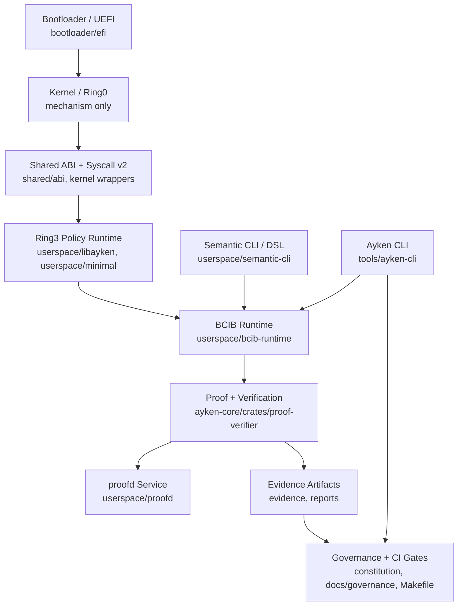
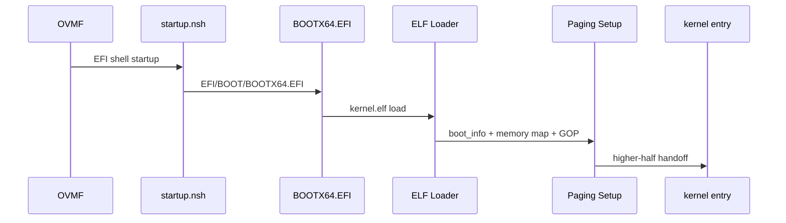
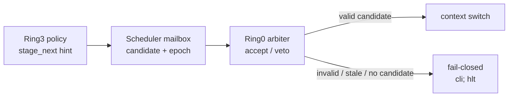
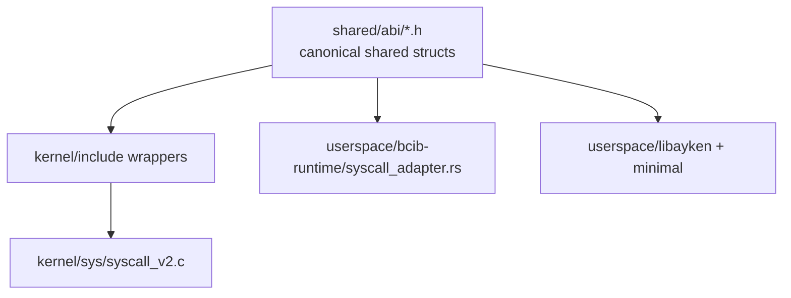
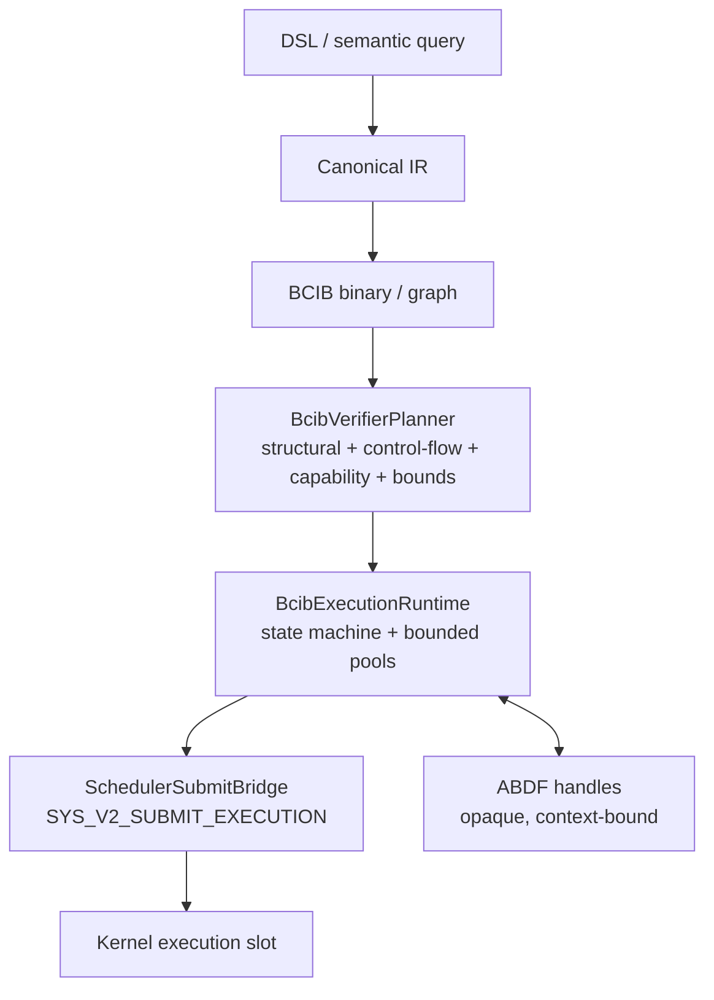
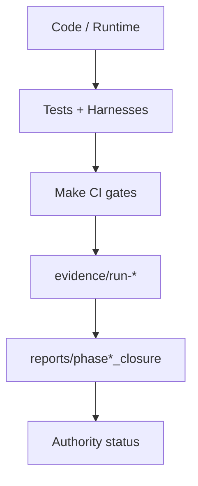

# AykenOS Inceleme Sirasi ve Mimari Rehberi

**Tarih:** 2026-04-18  
**Amac:** Kod yazmadan once AykenOS'un mevcut durumunu, mimari katmanlarini, kritik sozlesmelerini ve dokumantasyon eksiklerini sistematik incelemek.  
**Kapsam:** Bu dosya kod degisikligi degildir; proje okuma, diyagram cikarma ve risk tespiti icin baslangic rehberidir.

---

## 1. Once Nereden Baslanmali?

Projeye dogrudan `kernel/` veya `userspace/` kodundan baslama. Bu repo phase, closure, evidence ve governance uzerinden yurudugu icin once hangi dokumanin guncel kaynak oldugunu ayirmak gerekir.

Ilk okuma sirasi:

1. `README.md`
2. `docs/development/DOCUMENTATION_INDEX.md`
3. `docs/roadmap/CURRENT_PHASE`
4. `docs/roadmap/overview.md`
5. `reports/phase15_official_closure/PHASE15_CLOSURE_REPORT.md`
6. `reports/phase15_official_closure/closure_index.json`
7. `ARCHITECTURE_FREEZE.md`
8. `constitution/ARCHITECTURE_GOVERNANCE.md`
9. `Makefile`
10. `.github/workflows/ci-freeze.yml`

Bu on dosya okunduktan sonra kod tarafina gecmek daha saglikli olur. Cunku mevcut proje gercegi su sekilde gorunuyor:

- `CURRENT_PHASE=15`
- Phase-15 official closure tamamlanmis.
- Phase-16 hedefi Ayken CLI Faz B + BCIB toolchain surface.
- Phase-16 tarafinda BCIB worker / boot observability / kernel integration alani kritik risk bolgesi.

---

## 2. Kaynak-of-Truth ve Tarihsel Dokuman Ayrimi

Guncel durum icin oncelikli kaynaklar:

- `README.md`
- `docs/development/DOCUMENTATION_INDEX.md`
- `docs/roadmap/CURRENT_PHASE`
- `docs/roadmap/overview.md`
- `reports/phase15_official_closure/PHASE15_CLOSURE_REPORT.md`
- `reports/phase15_official_closure/closure_index.json`
- `Makefile`
- `.github/workflows/ci-freeze.yml`

Tarihsel snapshot olarak okunmasi gerekenler:

- `AYKENOS_PROJE_GENEL_YAPI_VE_MIMARI_RAPORU.md`
- `AYKENOS_SON_DURUM_RAPORU_2026_03_05.md`
- `PROJE_DURUM_RAPORU_2026_03_02.md`
- `PHASE_10_FINAL_STATUS.md`
- `PHASE_10_COMPLETION_SUMMARY.md`

Bu tarihsel dosyalar faydali baglam verir, fakat current truth yerine kullanilmamali. Ozellikle phase numarasi, blocker ve closure ifadeleri eski kalmis olabilir.

---

## 3. Genel Mimari Harita

AykenOS'u su katmanlar halinde dusun:



Mimari ozeti:

- `bootloader/efi/` kernel'i yukler, boot bilgilerini hazirlar, paging/handoff yapar.
- `kernel/` Ring0 mechanism-only katmandir: bellek, interrupt, syscall, context switch, capability mekanizmasi.
- `shared/abi/` kernel/userspace sozlesmelerinin ortak yuzeyidir.
- `userspace/` Ring3 policy ve runtime katmanidir.
- `userspace/bcib-runtime/` BCIB execution engine v3 katmanidir.
- `userspace/semantic-cli/` DSL -> canonical IR -> BCIB hattini tasir.
- `ayken-core/crates/proof-verifier/` proof, receipt, trust-policy ve verification semantics katmanidir.
- `userspace/proofd/` verification + diagnostics servis yuzeyidir; authority veya consensus olmamali.
- `tools/ayken-cli/` controlled orchestration entrypoint olarak gelismektedir.
- `constitution/`, `docs/governance/`, `Makefile` ve `.github/workflows/ci-freeze.yml` fail-closed governance hattini tutar.

---

## 4. Detayli Inceleme Sirasi

### 4.1 Current Truth ve Roadmap

Once projenin neyi tamamladigini ve neyin pending oldugunu anla.

Oku:

- `README.md`
- `docs/development/DOCUMENTATION_INDEX.md`
- `docs/roadmap/CURRENT_PHASE`
- `docs/roadmap/overview.md`
- `reports/phase15_official_closure/PHASE15_CLOSURE_REPORT.md`
- `docs/specs/phase16-ayken-orchestration/README.md`
- `docs/reports/YOL_HARITASI_GERCEKLESME_ANALIZI_2026_04_11.md`
- `docs/phase16/bcib_worker_status.md`
- `docs/phase16/boot_observability_debug_plan.md`
- `PHASE16_CUMULATIVE_TEST_PLAN.md`

Bu bolumden cikarman gerekenler:

- Hangi phase official closed?
- Hangi alan production-candidate ama kernel/QEMU kaniti eksik?
- Phase-16'nin gercek blocker'i boot observability mi, scheduler mi, performance mi?
- Roadmap ile gerceklesme arasindaki sapmalar neler?

### 4.2 Governance, Freeze ve Mimari Kurallar

Kod okumadan once degismemesi gereken kurallari ogren.

Oku:

- `ARCHITECTURE_FREEZE.md`
- `constitution/ARCHITECTURE_GOVERNANCE.md`
- `docs/governance/CONSTITUTION_BOUNDARY.md`
- `docs/governance/README.md`
- `docs/governance/MAILBOX_PROTOCOL_V1_FREEZE.md`
- `docs/governance/MAILBOX_PROTOCOL_V2_CAPABILITIES.md`
- `docs/governance/SCHEDULER_OWNER_HANDOFF_REAP_CANDIDATE.md`
- `docs/governance/RING3_RUNTIME_CLOSURE_NOTE.md`
- `docs/architecture-board/RUNTIME_STATE_MACHINE.md`
- `docs/architecture-board/ABDF_BCIB_PHASE11_CONTRACT_MATRIX.md`
- `docs/architecture-board/decisions/20260214-scheduler-arbitration-contract.md`
- `docs/architecture-board/decisions/20260305-two-level-authority-scheduler.md`

Bu bolumden cikarman gerekenler:

- Ring0/Ring3 siniri nasil korunuyor?
- Constitutional fail-closed kurallar hangileri?
- Scheduler arbitration sozlesmesi ne diyor?
- Authority, evidence, diagnostics ve consensus arasindaki sinir nerede?

### 4.3 Build, Toolchain ve CI Gate Gercegi

Build sistemini anlamadan runtime'i anlamak zor olur.

Oku:

- `Makefile`
- `mk/`
- `.github/workflows/ci-freeze.yml`
- `scripts/ci/`
- `tools/ci/`
- `tools/validation/`
- `tools/build/make_efi_img.sh`
- `docs/operations/CONSTITUTIONAL_CI_MODE.md`
- `docs/operations/PROVISIONAL_CI_MODE.md`
- `docs/operations/PERF_BASELINE_POLICY.md`
- `docs/roadmap/freeze-enforcement-workflow.md`
- `docs/operations/RUNTIME_INTEGRATION_GUARDRAILS.md`
- `docs/development/VENDORED_TOOLCHAIN_SNAPSHOTS.md`

Onemli Make hedefleri:

- `make all`
- `make efi-img`
- `make run`
- `make generate-abi`
- `make guard-context-offsets`
- `make ci-freeze`
- `make ci-freeze-local`
- `make ci-gate-boundary`
- `make ci-gate-ring0-exports`
- `make ci-gate-structural-abi`
- `make ci-gate-runtime-marker-contract`
- `make ci-gate-syscall-v2-runtime`
- `make ci-gate-bcib-v3-core`
- `make ci-gate-semantic-cli-contract`
- `make ci-gate-ai-runtime-boundary`

### 4.4 Bootloader ve Kernel Handoff

Boot zinciri stabil olmadan diger kanitlar guvenilir sayilmaz.

Oku:

- `bootloader/efi/efi_main.c`
- `bootloader/efi/elf_loader.c`
- `bootloader/efi/elf_loader.h`
- `bootloader/efi/ayken_boot.c`
- `bootloader/efi/ayken_boot.h`
- `bootloader/efi/paging.c`
- `bootloader/efi/boot.S`
- `bootloader/efi/boot_idt.S`
- `bootloader/efi/startup.nsh`
- `linker.ld`
- `tools/build/make_efi_img.sh`
- `docs/phase16/boot_observability_debug_plan.md`

Boot diyagrami:



Kritik kanit marker'lari:

- `STARTUP_OK`
- `[UEFI_BOOT_START]`
- `[B][KERNEL_ELF_LOADED]`
- `[B][PAGING]`
- `[[AYKEN_KERNEL_ENTRY]]`
- `[K][LATE]`

### 4.5 Kernel Entry, CPU, Interrupt ve Ring3 Gecis

Kernel'in erken init ve Ring3'e gecis hattini oku.

Oku:

- `kernel/kernel.c`
- `kernel/arch/x86_64/boot.S`
- `kernel/arch/x86_64/entry.S`
- `kernel/arch/x86_64/gdt_idt.c`
- `kernel/arch/x86_64/gdt_idt.h`
- `kernel/arch/x86_64/interrupts.c`
- `kernel/arch/x86_64/interrupts.h`
- `kernel/arch/x86_64/timer.c`
- `kernel/arch/x86_64/context_switch.asm`
- `kernel/arch/x86_64/ring3_enter.S`
- `kernel/ring3_jump.c`
- `kernel/include/ring3_jump.h`
- `kernel/include/ring3_contract.h`
- `userspace/minimal/`

Bu bolumde ozellikle sunlari cikar:

- GDT/IDT ne zaman kuruluyor?
- Ring3 selector ve RFLAGS sozlesmesi nerede?
- Timer IRQ, preempt ve context switch sirasinda hangi marker'lar uretiliyor?
- User payload nereden embed ediliyor?

### 4.6 Memory, ELF, Process ve Scheduler

Kernel mechanism-only ilkesini burada dogrula.

Oku:

- `kernel/mm/paging.c`
- `kernel/mm/phys_mem.c`
- `kernel/mm/kheap.c`
- `kernel/mm/user_as.c`
- `kernel/mm/alias_registry.c`
- `kernel/mm/alias_verifier.c`
- `kernel/include/mm.h`
- `kernel/include/mm/user_as.h`
- `kernel/include/alias_registry.h`
- `kernel/elf/parser.c`
- `kernel/include/elf/parser.h`
- `kernel/proc/proc.c`
- `kernel/proc/bcib_worker.c`
- `kernel/include/proc.h`
- `kernel/sched/sched.c`
- `kernel/sched/sched_mailbox.c`
- `kernel/sched/sched_mailbox.h`
- `shared/abi/sched_mailbox_abi.h`

Scheduler diyagrami:



Kritik nokta: Ring3 aday onerir, Ring0 son karari verir. Stale epoch veya invalid candidate context switch'e tasinmamali.

### 4.7 ABI, Syscall ve Capability Yuzeyi

Bu bolum projenin en kritik sozlesme alanidir.

Oku:

- `shared/abi/ayken_abi.h`
- `shared/abi/syscall_v2.h`
- `shared/abi/boot_info.h`
- `shared/abi/boot_flags.h`
- `shared/abi/capability.h`
- `shared/abi/execution_inbox_abi.h`
- `shared/abi/execution_output_abi.h`
- `shared/abi/execution_output_structured_abi.h`
- `shared/abi/execution_result_hash_abi.h`
- `shared/abi/bcib_graph_abi.h`
- `kernel/include/ayken_abi.h`
- `kernel/include/sys_v2_abi_lock.h`
- `kernel/sys/syscall_v2.h`
- `kernel/sys/syscall_v2.c`
- `kernel/sys/capability_manager.c`
- `kernel/sys/execution_slot.c`
- `kernel/include/execution_slot.h`

Canli kodda gozlenen syscall v2 yuzeyi:

- Base: `1000`
- Max index: `14`
- Count: `15`
- Public range: `1000..1014`
- Runtime bridge extension: `SYS_V2_DEVICE_OPERATION`, `SYS_V2_EXTERNAL_CALL`, `SYS_V2_ABDF_OPERATION`

ABI diyagrami:



Dokumantasyon drift uyarisi:

- Bazi ust seviye dokumanlarda syscall araligi eski sekilde `1000..1011` veya `1000..1010` olarak geciyor.
- Canli kod ve ABI lock dosyalari `1000..1014` / 15 syscall diyor.
- Bu fark dokumantasyon guncelleme konusu olarak kayda alinmali; kod degisikligi yapmadan once hangi dokumanin normative oldugu netlestirilmeli.

### 4.8 Ring3 Policy Runtime ve Minimal Payload

Ring0 policy icermemeli; policy ve runtime Ring3 tarafinda okunmali.

Oku:

- `userspace/libayken/README.md`
- `userspace/libayken/vfs.c`
- `userspace/libayken/devfs.c`
- `userspace/libayken/sched_hint.c`
- `userspace/libayken/scheduler_stubs.c`
- `userspace/libayken/ring3_vfs_integration.c`
- `userspace/minimal/Makefile`
- `userspace/minimal/minimal.S`
- `userspace/minimal/minimal.c`
- `userspace/minimal/minimal_user_worker.S`
- `userspace/minimal/minimal_bcib_worker.S`
- `userspace/minimal/minimal_syscall_v2_runtime.S`
- `userspace/minimal/minimal_runtime_bridge_ping.S`
- `userspace/minimal/user_embed.S`

Bu bolumde cevaplanacak sorular:

- Hangi user payload hangi Make flag ile embed ediliyor?
- Runtime bridge marker'lari nereden uretiliyor?
- Ring3 VFS/DevFS/scheduler policy hangi dosyalarda?
- Minimal worker ve BCIB worker arasindaki fark ne?

### 4.9 BCIB, ABDF ve Runtime Bridge

Phase-15 official closure bu alanin uzerine kurulu.

Oku:

- `userspace/bcib-runtime/ARCHITECTURE.md`
- `userspace/bcib-runtime/SUBMIT_EXECUTION_IMPLEMENTATION.md`
- `userspace/bcib-runtime/src/lib.rs`
- `userspace/bcib-runtime/src/verifier_planner.rs`
- `userspace/bcib-runtime/src/execution_runtime.rs`
- `userspace/bcib-runtime/src/scheduler_bridge.rs`
- `userspace/bcib-runtime/src/syscall_adapter.rs`
- `userspace/bcib-runtime/src/capability_manager.rs`
- `userspace/bcib-runtime/src/abdf_boundary.rs`
- `userspace/bcib-runtime/src/isolation/README.md`
- `userspace/bcib-runtime/src/isolation/runtime_bridge.rs`
- `userspace/bcib-runtime/src/isolation/kernel_syscall_validator.rs`
- `userspace/bcib-runtime/tests/golden_fixture_tests.rs`
- `ayken-core/crates/abdf/README.md`
- `ayken-core/crates/abdf/src/lib.rs`
- `ayken-core/crates/abdf-builder/README.md`
- `ayken-core/crates/bcib/README.md`
- `shared/abi/abdf_format.h`
- `shared/abi/bcib_graph_abi.h`

BCIB v3 diyagrami:



Kritik kural:

- BCIB execution, `SYS_V2_SUBMIT_EXECUTION` disinda paralel bir execution authority plane olusturmamali.
- ABDF verisi raw pointer ile degil opaque handle ile erisilmeli.
- Direct ABDF mutation veya out-of-ABDF storage fail-closed olmali.

### 4.10 Semantic CLI, DSL ve Orchestration

Phase-16'nin ilk dil/komut hattini anlamak icin oku.

Oku:

- `userspace/semantic-cli/README.md`
- `userspace/semantic-cli/src/main.rs`
- `userspace/semantic-cli/src/lib.rs`
- `userspace/semantic-cli/src/parser/mod.rs`
- `userspace/semantic-cli/src/parser/commands.rs`
- `userspace/semantic-cli/src/parser/expressions.rs`
- `userspace/semantic-cli/src/ast/nodes.rs`
- `userspace/semantic-cli/src/validator.rs`
- `userspace/semantic-cli/src/transformer.rs`
- `userspace/semantic-cli/src/canonical_query.rs`
- `userspace/semantic-cli/src/canonical_query_lowering.rs`
- `userspace/semantic-cli/src/submission_bridge.rs`
- `userspace/semantic-cli/src/kernel_submit_adapter.rs`
- `userspace/semantic-cli/src/proof_chain.rs`
- `userspace/semantic-cli/src/replay_verification.rs`
- `userspace/orchestration/src/lib.rs`
- `userspace/dsl-parser/README.md`
- `userspace/dsl-parser/src/lib.rs`

Phase-16A locked path:

```text
DSL -> semantic parse -> canonical IR -> canonical IR validation -> BCIB lowering -> submission bridge -> runtime submit -> proof/replay
```

Unsupported komutlar silent fallback yapmamali; explicit error ile fail-closed olmali.

### 4.11 Proof, Trust, Evidence ve proofd

Verification mimarisi koddan once artifact model uzerinden okunmali.

Oku:

- `ayken-core/crates/proof-verifier/README.md`
- `ayken-core/crates/proof-verifier/src/lib.rs`
- `ayken-core/crates/proof-verifier/src/types.rs`
- `ayken-core/crates/proof-verifier/src/verdict/verdict_engine.rs`
- `ayken-core/crates/proof-verifier/src/receipt/`
- `ayken-core/crates/proof-verifier/src/bundle/`
- `ayken-core/crates/proof-verifier/src/audit/`
- `ayken-core/crates/proof-verifier/src/registry/`
- `ayken-core/crates/proof-verifier/src/policy/`
- `ayken-core/crates/proof-verifier/src/authority/`
- `userspace/proofd/src/lib.rs`
- `userspace/proofd/src/api_contract.rs`
- `userspace/proofd/src/api_schema.rs`
- `userspace/proofd/src/determinism/`
- `docs/specs/phase12-trust-layer/AYKENOS_ARCHITECTURE_ONE_PAGE.md`
- `docs/specs/phase12-trust-layer/AYKENOS_GLOBAL_ARCHITECTURE_DIAGRAM.md`
- `docs/specs/phase12-trust-layer/VERIFICATION_MODEL.md`
- `docs/specs/phase12-trust-layer/VERIFICATION_INVARIANTS.md`
- `docs/specs/phase12-trust-layer/PROOFD_DIAGNOSTICS_SERVICE_SURFACE.md`
- `docs/specs/phase14-distributed-observability/PHASE14_ARCHITECTURE_MAP.md`

Kritik ayrim:

- Verification semantics authority demek degildir.
- Evidence artifacts canonical truth surface olarak gorulmeli.
- `proofd` verification + diagnostics servisidir.
- `proofd` consensus, truth election veya authority arbitration olmamali.

### 4.12 Ayken CLI ve Governance Tooling

Phase-16'nin controlled entrypoint tarafini oku.

Oku:

- `tools/ayken-cli/Cargo.toml`
- `tools/ayken-cli/src/main.rs`
- `tools/ayken-cli/src/cli.rs`
- `tools/ayken-cli/src/core/policy.rs`
- `tools/ayken-cli/src/core/authority.rs`
- `tools/ayken-cli/src/core/process.rs`
- `tools/ayken-cli/src/core/env.rs`
- `tools/ayken-cli/src/commands/status.rs`
- `tools/ayken-cli/src/commands/risk.rs`
- `tools/ayken-cli/src/commands/gate.rs`
- `tools/ayken-cli/src/commands/closure.rs`
- `tools/ayken-cli/src/commands/head.rs`
- `tools/ayken-cli/src/commands/bcib.rs`
- `ayken/STATUS.md`
- `ayken/lib.rs`
- `ayken/cli/`
- `ayken/arh/`
- `ayken/ci/`
- `_ayken/steering/`

Not:

- `tools/ayken-cli/` current controlled toolchain entrypoint olarak okunmali.
- `ayken/` altindaki daha genis constitutional toolchain `ayken/STATUS.md` durumuna gore experimental/parked olarak ele alinmali.

### 4.13 Test, Evidence ve Validation

Her mimari iddia icin hangi test/evidence bunu dogruluyor sorusunu sor.

Oku:

- `tests/boot_observability/`
- `tests/kernel/validators/l0/`
- `tests/kernel/scenarios/ring3/`
- `tests/property/`
- `kernel/tests/validation/`
- `userspace/semantic-cli/tests/`
- `userspace/bcib-runtime/tests/`
- `tools/test_runner/pipeline.py`
- `tools/test_runner/run_scenario.py`
- `tools/test_runner/run_validator_set.py`
- `tools/test_runner/normalize_evidence.py`
- `scripts/qemu-boot-observability-harness.sh`
- `scripts/qemu-runtime-bridge-proof-harness.sh`
- `scripts/qemu-runtime-bridge-forbidden-proof-harness.sh`
- `scripts/ci/`
- `evidence/run-local-freeze-p10p11/reports/summary.json`
- `evidence/run-local-phase11-closure/reports/summary.json`
- `reports/phase15_official_closure/`

Validation diyagrami:



---

## 5. Stabil Kalmasi Gereken Kritik Durumlar

Bu durumlar kod yazmadan once tek tek anlasilmali ve dokumantasyonda diagramlanmali:

1. Boot chain: OVMF -> `startup.nsh` -> `BOOTX64.EFI` -> `kernel.elf` -> kernel entry.
2. Boot info ABI: memory map, framebuffer, kernel fiziksel adresleri, `pml4_phys`, boot flags.
3. Higher-half handoff ve paging sozlesmesi.
4. GDT/IDT ve Ring3 selector sozlesmesi.
5. Ring0 mechanism-only, Ring3 policy-only ayrimi.
6. Syscall v2 ABI: base `1000`, max index `14`, count `15`, public range `1000..1014`.
7. Context/IRQ frame offsetlari: `shared/abi/ayken_abi.h`, `kernel/include/ayken_abi.h`, `make guard-context-offsets`.
8. Capability bind/revoke ve execution capability enforcement.
9. `SYS_V2_SUBMIT_EXECUTION` ve `SYS_V2_WAIT_RESULT` execution lifecycle.
10. Scheduler mailbox epoch/candidate sozlesmesi.
11. Ring0 arbiter accept/veto ve fail-closed davranisi.
12. BCIB v3 uc katmanli mimari: verifier/planner, execution runtime, scheduler bridge.
13. BCIB -> ABDF siniri: opaque handle, no raw pointer, no direct mutation.
14. Runtime_Bridge syscall path: device, external call, ABDF operation.
15. Semantic CLI Phase-16A path: DSL -> canonical IR -> BCIB -> proof/replay.
16. Proof-verifier determinism: same subject + same context + same authority -> same verdict.
17. Evidence artifacts canonical truth surface.
18. `proofd` servis siniri: diagnostics/verification var, authority/consensus yok.
19. Closure authority vs verified-head authority ayrimi.
20. `ci-freeze` fail-closed gate zinciri.
21. Performance baseline ve boot/runtime overhead sinirlari.
22. Boot observability marker zinciri; marker yoksa kanit yoktur.

---

## 6. Ilk Tespit Edilen Dokumantasyon ve Mimari Risk Alanlari

Kod degistirmeden once asagidaki alanlar netlestirilmeli:

### 6.1 Syscall ABI dokumantasyon drift'i

Canli kod:

- `shared/abi/syscall_v2.h`
- `kernel/sys/syscall_v2.h`
- `kernel/include/sys_v2_abi_lock.h`

Bu dosyalar `SYS_V2_MAX_INDEX=14`, `SYS_V2_NR=15`, public range `1000..1014` diyor.

Bazi ust seviye dokumanlarda hala `1000..1010`, `1000..1011` veya 10/11/12 syscall ifadeleri var. Bu, kod degil dokumantasyon drift'i olarak ele alinmali.

### 6.2 Phase status drift'i

`docs/specs/phase12-trust-layer/AYKENOS_GLOBAL_ARCHITECTURE_DIAGRAM.md` ve benzeri eski mimari dokumanlari Phase-12/13 sinirinda yazilmis. Current truth artik `CURRENT_PHASE=15`.

Bu dokumanlar diagram kaynagi olarak faydali, fakat phase status icin `docs/roadmap/CURRENT_PHASE` ve Phase-15 closure dosyalari esas alinmali.

### 6.3 Phase-16 boot observability blocker

`docs/phase16/bcib_worker_status.md` su durumu isaret ediyor:

- BCIB worker creation path gozukuyor.
- Scheduler stale epoch root cause izole edilmis.
- Fix var ama runtime'da kanitlanmamis.
- Boot observability kirik oldugunda kernel/worker davranisi kanitlanmis sayilmiyor.

Bu nedenle Phase-16 dokumantasyonunda once boot observability diagrami ve marker karar agaci tamamlanmali.

### 6.4 Performance regression / cumulative overhead riski

`PHASE16_CUMULATIVE_TEST_PLAN.md` Phase-16 feature birikiminin boot/runtime overhead urettigini belirtiyor. Hot path adaylari:

- timer IRQ
- scheduler
- mailbox
- context switch
- Ring3 observability probes

Bu alanlarda yeni gelistirme yapmadan once performance gate ve baseline politikasi okunmali.

### 6.5 Source tree hijyeni ve artifact ayrimi

Repo icinde cok sayida build/log/evidence artifact'i var:

- `EFI.img`
- `kernel.elf`
- `*.o`, `*.d`
- `target/`
- QEMU/debug loglari
- `evidence/run-*`

Bu dosyalarin hangisi tracked, hangisi generated, hangisi source-of-truth oldugu ayrica dokumante edilmeli. CI hygiene gate bu konuda kritik.

---

## 7. Olusturulmasi Gereken Diyagramlar

Kod yazmadan once en az su diyagramlar hazirlanmali:

1. Global layered architecture: boot -> kernel -> ABI -> Ring3 -> BCIB -> proof -> evidence -> governance.
2. Boot sequence: OVMF -> startup.nsh -> BOOTX64.EFI -> ELF loader -> paging -> kernel entry.
3. Kernel init sequence: early init -> GDT/IDT -> memory -> scheduler -> Ring3 payload.
4. Syscall ABI map: shared ABI -> kernel wrappers -> dispatcher -> userspace adapters.
5. Scheduler mailbox state machine: Ring3 hint -> mailbox -> Ring0 accept/veto -> context switch/fail-closed.
6. BCIB execution lifecycle: graph -> verifier planner -> runtime -> scheduler bridge -> kernel slot -> result.
7. BCIB/ABDF boundary: execution != data, handle-only access, revocation, fail-closed.
8. Semantic CLI pipeline: DSL -> AST -> canonical IR -> BCIB lowering -> submission bridge.
9. Proof/evidence architecture: proof-verifier -> receipt/bundle/audit -> proofd -> diagnostics.
10. CI/evidence chain: tests -> gates -> evidence -> closure report -> authority status.

---

## 8. Pratik Calisma Plani

### Gun 1: Current truth ve dokuman ayrimi

- `README.md`
- `docs/development/DOCUMENTATION_INDEX.md`
- `docs/roadmap/CURRENT_PHASE`
- `docs/roadmap/overview.md`
- `reports/phase15_official_closure/PHASE15_CLOSURE_REPORT.md`
- Tarihsel dokumanlari "reference only" olarak etiketle.

### Gun 2: Freeze, governance, CI

- `ARCHITECTURE_FREEZE.md`
- `constitution/ARCHITECTURE_GOVERNANCE.md`
- `docs/governance/`
- `Makefile`
- `.github/workflows/ci-freeze.yml`
- `scripts/ci/`

### Gun 3: Boot ve kernel

- `bootloader/efi/`
- `linker.ld`
- `kernel/kernel.c`
- `kernel/arch/x86_64/`
- `kernel/mm/`
- boot observability marker karar agaci.

### Gun 4: ABI, syscall, scheduler, Ring3

- `shared/abi/`
- `kernel/include/*abi*.h`
- `kernel/sys/syscall_v2.c`
- `kernel/sched/`
- `kernel/proc/`
- `userspace/minimal/`
- `userspace/libayken/`

### Gun 5: BCIB, ABDF, semantic-cli, proof

- `userspace/bcib-runtime/`
- `userspace/semantic-cli/`
- `userspace/proofd/`
- `ayken-core/crates/proof-verifier/`
- `ayken-core/crates/abdf/`
- `ayken-core/crates/bcib/`

### Gun 6: Tooling, tests, evidence

- `tools/ayken-cli/`
- `tools/test_runner/`
- `tools/validation/`
- `tests/`
- `evidence/`
- `reports/`

---

## 9. Kod Yazmadan Once Sorulacak Kontrol Sorulari

Her yeni is icin once su sorular cevaplanmali:

1. Bu is hangi phase ve hangi closure/evidence durumuna dokunuyor?
2. Bu is Ring0/Ring3 sinirini degistiriyor mu?
3. ABI, syscall numarasi, struct layout veya marker formatina dokunuyor mu?
4. `ci-freeze` gate zincirinde hangi gate etkilenir?
5. Bu davranisin canonical source-of-truth dosyasi hangisi?
6. Mevcut dokumantasyonda bununla ilgili drift var mi?
7. Boot observability marker zinciri bu davranisi kanitlayabiliyor mu?
8. Performance baseline veya hot path etkileniyor mu?
9. Evidence artifact'i mi degisiyor, yoksa sadece servis wrapper'i mi?
10. `proofd`, diagnostics'ten authority/consensus alanina kayiyor mu?

---

## 10. Kisa Sonuc

AykenOS'u incelemeye `kernel/` ile degil, current truth ve governance dosyalariyla basla. Sonra boot chain, ABI/syscall, Ring0/Ring3 siniri, BCIB/ABDF runtime, proof/evidence ve CI gate zincirine ilerle.

En kritik ilk isler:

1. Current truth dosyalarini tarihsel raporlardan ayirmak.
2. Syscall ABI dokumantasyon drift'ini not etmek.
3. Phase-16 boot observability blocker'ini diagramlamak.
4. Ring0 mechanism-only / Ring3 policy-only sinirini sabitlemek.
5. BCIB/ABDF/proof/evidence zincirini tek bir global diyagramda gostermek.

