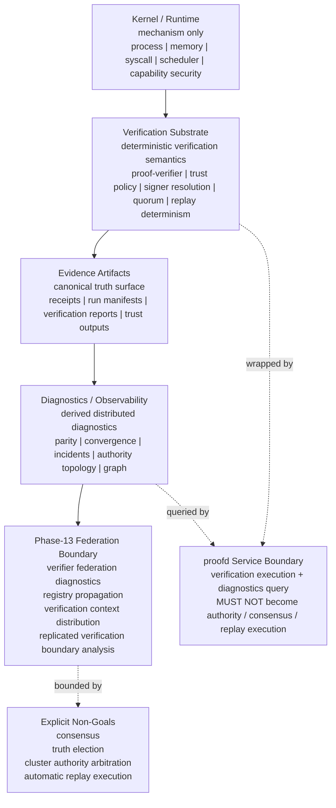

# AykenOS Global Architecture Diagram

**Version:** 1.0
**Status:** Informational architecture diagram
**Date:** 2026-03-13
**Phase:** Phase-12 / Phase-13 boundary
**Type:** Non-normative reference artifact
**Related Spec:** `README.md`, `AYKENOS_ARCHITECTURE_ONE_PAGE.md`, `AYKENOS_TECHNICAL_DEFINITION_SET.md`, `PHASE13_ARCHITECTURE_MAP.md`, `PARITY_LAYER_ARCHITECTURE.md`, `PROOFD_DIAGNOSTICS_SERVICE_SURFACE.md`, `PROOF_VERIFIER_CRATE_ARCHITECTURE.md`

---

## 1. Purpose

This document provides a single global diagram for the current AykenOS architecture.

It is intended for:

- architecture communication
- research and paper figures
- README-level onboarding
- Phase-13 scope control

This diagram is descriptive.

It does not redefine acceptance criteria or governance state.

Current repo truth remains:

- `Phase-10 = official closed`
- `Phase-11 = official closed`
- `Phase-12 = local closure-ready`
- `CURRENT_PHASE = 10` until formal transition workflow executes

---

## 2. Global Diagram

### 2.1 Mermaid



### 2.2 ASCII

```text
+-----------------------------+
| Kernel / Runtime            |
| mechanism only              |
| process / memory / syscall  |
| scheduler / capability sec  |
+-----------------------------+
              |
              v
+-----------------------------+
| Verification Substrate      |
| deterministic verification  |
| proof-verifier              |
| trust policy / signer       |
| quorum / replay determinism |
+-----------------------------+
              |
              v
+-----------------------------+
| Evidence Artifacts          |
| canonical truth surface     |
| receipts / run manifests    |
| verification reports        |
| trust outputs               |
+-----------------------------+
              |
              v
+-----------------------------+
| Diagnostics / Observability |
| derived diagnostics only    |
| parity / convergence        |
| incidents / topology / graph|
+-----------------------------+
              |
              v
+-----------------------------+
| Phase-13 Federation Boundary|
| federation diagnostics      |
| registry propagation        |
| context distribution        |
| replicated verification     |
| boundary analysis           |
+-----------------------------+

proofd service boundary:
  wraps verification execution and diagnostics query
  MUST NOT become authority / consensus / replay execution

explicit non-goals:
  consensus
  truth election
  cluster authority arbitration
  automatic replay execution
```

### 2.3 Legend

```text
Legend
------
-->   canonical architecture flow
-.->  service interaction or boundary relation
```

---

## 3. Layer Semantics

### 3.1 Kernel / Runtime

The kernel provides execution mechanism only.

It is not the home of trust-policy interpretation or distributed truth semantics.

### 3.2 Verification Substrate

This layer owns deterministic verification semantics.

It binds:

- subject
- context
- authority
- verdict

Core invariant:

`same subject + same context + same authority -> same verdict`

### 3.3 Evidence Artifacts

This is the canonical truth surface.

Architectural rule:

`artifacts = canonical interface`

Services may expose or wrap these artifacts, but they do not replace them.

### 3.4 Diagnostics / Observability

This layer exposes distributed observability over verification outcomes.

Architectural rule:

`parity = diagnostics`

not:

`parity = truth election`

### 3.5 Phase-13 Federation Boundary

This boundary captures the next architecture expansion surface.

It may grow:

- federation diagnostics
- registry propagation
- context distribution
- replicated verification boundary analysis

It must not silently grow:

- consensus
- authority arbitration
- cluster control

---

## 4. Service Boundary

`proofd` sits between verification execution and diagnostics query.

Correct service sentence:

`proofd = verification + diagnostics service`

and:

`proofd != authority surface`

The service layer may:

- execute verification
- emit signed receipts
- expose read-only diagnostics
- serve run-scoped artifact discovery

The service layer must not:

- arbitrate authority
- elect truth
- perform consensus
- trigger replay execution

---

## 5. Governing Invariants

The whole diagram is governed by these rules:

- `verification != authority`
- `authority != consensus`
- `parity = diagnostics`
- `artifacts are canonical interfaces`
- `services wrap canonical artifacts`
- `diagnostics remain derived structures`

---

## 6. Why This Diagram Exists

This artifact is meant to keep one global picture stable across:

- README communication
- architecture notes
- research positioning
- paper drafts
- Phase-13 planning

The intended result is:

`one architecture picture, many communication surfaces`
