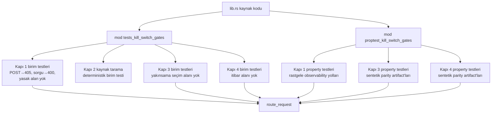

# Tasarım Belgesi: Phase-13 Kill-Switch CI Kapıları

## Genel Bakış

Bu özellik, `userspace/proofd/src/lib.rs` içine dört mimari kill-switch CI kapısı ekler. Bu kapılar, `proofd` servisinin ve diagnostics yüzeylerinin şu dört değişmezi her zaman koruduğunu doğrular:

1. `observability != scheduling` — gözlemlenebilirlik, doğrulama yönlendirmesini yönlendirmez
2. `convergence != truth election` — yakınsama, gerçek seçimi değildir
3. `verification history != verifier reputation` — doğrulama geçmişi, doğrulayıcı itibarına dönüşmez
4. `proofd diagnostics = read-only artifact passthrough` — diagnostics yalnızca salt okunur artifact geçişidir

Kapılar, mevcut `route_request` fonksiyonu ve `lib.rs` kaynak baytları üzerinde çalışır. Yeni dosya, yeni crate bağımlılığı veya yeni public API eklenmez.

## Mimari



Her kapı bağımsız olarak başarısız olur. Kapı 2 deterministik bir kaynak taramasıdır; diğerleri `route_request` davranışını doğrular.

## Bileşenler ve Arayüzler

### Kapı 1: `ci-gate-proofd-observability-boundary`

`route_request` fonksiyonu üzerinde çalışır. İki test stratejisi:

**Birim testleri** (`tests_kill_switch_gates`):
- Somut observability yollarına POST → 405 doğrular
- Somut observability yollarına desteklenmeyen sorgu parametresi → 400 doğrular
- Sentetik artifact içeren yanıt gövdelerinde yasak truth-election ve kontrol düzlemi alanlarının yokluğunu doğrular

**Property testleri** (`proptest_kill_switch_gates`):
- Rastgele observability yolu dizileri üretir, POST → her zaman 405 olduğunu doğrular
- Rastgele sorgu parametresi dizileri üretir, `/diagnostics/incidents` dışında → her zaman 400 olduğunu doğrular
- Sentetik artifact içeren yanıt gövdelerinde yasak alanların hiçbir zaman bulunmadığını doğrular

**Yasak truth-election/kontrol düzlemi alanları (Kapı 1):**
```
dominant_authority_chain_id, largest_outcome_cluster_size,
outcome_convergence_ratio, global_status,
historical_authority_islands, insufficient_evidence_islands,
retry, override, promote, commit, recommended_action,
mitigation, routing_hint, node_priority,
verification_weight, execution_override
```

### Kapı 2: `ci-gate-observability-routing-separation`

Kaynak tarama birim testi. `lib.rs` dosyasını test zamanında okur, yönlendirme fonksiyon gövdelerinde yasak alan adlarını arar.

**Tarama kapsamı:** `handle_run_endpoint`, `route_request`, `route_request_with_body` fonksiyon gövdeleri ve bu fonksiyonların doğrudan çağırdığı yardımcı fonksiyonlar.

**Uygulama yaklaşımı:** Kaynak dosya baytları `include_str!` makrosu ile derleme zamanında değil, `std::fs::read_to_string` ile test zamanında okunur; böylece test her zaman güncel kaynak kodu üzerinde çalışır.

**Yasak alan adları (Kapı 2):**
```
dominant_authority_chain_id, largest_outcome_cluster_size,
outcome_convergence_ratio, global_status,
historical_authority_islands, insufficient_evidence_islands
```

### Kapı 3: `ci-gate-convergence-non-election-boundary`

`route_request` fonksiyonu üzerinde çalışır. Sentetik parity artifact'ları geçici dizine yazılır, `route_request` aracılığıyla sunulur, yanıt gövdelerinde yasak seçim alanları aranır.

**Yasak seçim alanları (Kapı 3):**
```
winning_cluster, selected_partition, preferred_cluster,
cluster_policy_input, partition_replay_admission,
verification_weight, execution_route, committed_cluster
```

**Test edilen artifact yolları:**
- `GET /diagnostics/convergence` → `parity_convergence_report.json`
- `GET /diagnostics/drift` → `parity_drift_attribution_report.json`

### Kapı 4: `ci-gate-verifier-reputation-prohibition`

`route_request` fonksiyonu üzerinde çalışır. Sentetik parity artifact'ları geçici dizine yazılır, tüm parity uç noktaları aracılığıyla sunulur, yanıt gövdelerinde yasak itibar alanları aranır.

**Yasak itibar alanları (Kapı 4):**
```
verifier_score, trust_score, reliability_index,
weighted_authority, correctness_rate, agreement_ratio,
node_success_ratio, verifier_reputation
```

**Test edilen artifact yolları:**
- `GET /diagnostics/parity` → `parity_report.json`
- `GET /diagnostics/convergence` → `parity_convergence_report.json`
- `GET /diagnostics/drift` → `parity_drift_attribution_report.json`
- `GET /diagnostics/authority-suppression` → `parity_authority_suppression_report.json`
- `GET /diagnostics/authority-topology` → `parity_authority_drift_topology.json`
- `GET /diagnostics/graph` → `parity_incident_graph.json`

## Veri Modelleri

### Sentetik Artifact Modeli

Kapı 3 ve 4 testleri, gerçek artifact'lara ihtiyaç duymadan `route_request` davranışını doğrulamak için sentetik JSON artifact'ları kullanır. Sentetik artifact, geçici bir dizine yazılır ve `route_request` bu dizini `evidence_dir` olarak alır.

```
evidence_dir/
└── parity_convergence_report.json   ← sentetik içerik
└── parity_drift_attribution_report.json
└── parity_report.json
└── ...
```

Property testlerinde sentetik artifact içeriği `proptest` stratejileriyle üretilir:
- Rastgele JSON nesnesi (yasak alan içermeyen)
- Rastgele JSON nesnesi + yasak alan enjekte edilmiş (negatif test için)

### Yasak Alan Kontrol Fonksiyonu

Her kapı için ortak bir yardımcı fonksiyon kullanılır:

```rust
fn response_contains_forbidden_field(body: &serde_json::Value, fields: &[&str]) -> bool {
    fields.iter().any(|field| json_contains_key(body, field))
}

fn json_contains_key(value: &serde_json::Value, key: &str) -> bool {
    match value {
        serde_json::Value::Object(map) => {
            map.contains_key(key) || map.values().any(|v| json_contains_key(v, key))
        }
        serde_json::Value::Array(arr) => arr.iter().any(|v| json_contains_key(v, key)),
        _ => false,
    }
}
```

Bu fonksiyon iç içe geçmiş JSON yapılarında da yasak alanları tespit eder.

## Doğruluk Özellikleri

Bir özellik, sistemin tüm geçerli yürütmelerinde doğru olması gereken bir karakteristik veya davranıştır — temelde sistemin ne yapması gerektiğine dair biçimsel bir ifadedir. Özellikler, insan tarafından okunabilir spesifikasyonlar ile makine tarafından doğrulanabilir doğruluk garantileri arasında köprü görevi görür.

Property 1: POST observability yollarına her zaman 405 döner
*Herhangi bir* `/diagnostics/` ile başlayan yol için, `POST` metodu ile yapılan istek her zaman HTTP 405 ve `{"error": "method_not_allowed"}` döndürmelidir.
**Validates: Requirements 1.1**

Property 2: Desteklenmeyen sorgu parametresi her zaman 400 döner
*Herhangi bir* `/diagnostics/incidents` dışındaki observability yolu için, sorgu parametresi içeren `GET` isteği her zaman HTTP 400 ve `{"error": "unsupported_query_parameter"}` döndürmelidir.
**Validates: Requirements 1.2, 1.5**

Property 3: Observability yanıtlarında yasak alan yok
*Herhangi bir* observability `GET` uç noktasından dönen yanıt gövdesi, truth-election veya kontrol düzlemi semantiği taşıyan yasak alanların (`dominant_authority_chain_id`, `largest_outcome_cluster_size`, `outcome_convergence_ratio`, `global_status`, `historical_authority_islands`, `insufficient_evidence_islands`, `retry`, `override`, `promote`, `commit`, `recommended_action`, `mitigation`, `routing_hint`, `node_priority`, `verification_weight`, `execution_override`) hiçbirini içermemelidir.
**Validates: Requirements 1.3, 1.4**

Property 4: Yakınsama artifact yanıtlarında yasak seçim alanı yok
*Herhangi bir* `parity_convergence_report.json` veya `parity_drift_attribution_report.json` artifact içeriği için, `route_request` aracılığıyla sunulan yanıt gövdesi seçim semantiği taşıyan yasak alanların (`winning_cluster`, `selected_partition`, `preferred_cluster`, `cluster_policy_input`, `partition_replay_admission`, `verification_weight`, `execution_route`, `committed_cluster`) hiçbirini içermemelidir.
**Validates: Requirements 3.1, 3.2**

Property 5: Parity artifact yanıtlarında yasak itibar alanı yok
*Herhangi bir* parity artifact içeriği için, `route_request` aracılığıyla sunulan yanıt gövdesi itibar veya puanlama semantiği taşıyan yasak alanların (`verifier_score`, `trust_score`, `reliability_index`, `weighted_authority`, `correctness_rate`, `agreement_ratio`, `node_success_ratio`, `verifier_reputation`) hiçbirini içermemelidir.
**Validates: Requirements 4.1, 4.4**

Property 6: Artifact passthrough bütünlüğü
*Herhangi bir* güvenli JSON artifact için, `route_request` aracılığıyla `GET /diagnostics/convergence` üzerinden sunulan yanıt gövdesi, yazılan artifact ile birebir aynı JSON değerini içermelidir. `proofd` diagnostics servisi artifact içeriğini değiştirmemeli, yorumlamamalı, toparlamamalı, oy vermemeli veya sıralamamalıdır.
**Validates: Requirements 1.3, 1.4, 3.1, 4.1**

## Hata Yönetimi

Kill-switch kapıları başarısız olduğunda test çerçevesi standart Rust test panik mesajı üretir. Her test, hangi yasak alanın veya koşulun ihlali tetiklediğini açıkça raporlar:

| Koşul | Beklenen Davranış |
|---|---|
| POST observability yoluna → 405 değil | Test panikler, gerçek durum kodu raporlanır |
| Desteklenmeyen sorgu → 400 değil | Test panikler, gerçek durum kodu raporlanır |
| Yanıt gövdesinde yasak alan | Test panikler, hangi alan bulunduğu raporlanır |
| Kaynak kodda yasak alan adı | Test panikler, hangi alan ve hangi satırda bulunduğu raporlanır |

Kapı 2 (kaynak tarama) başarısız olduğunda, hangi yasak alanın hangi fonksiyon bağlamında bulunduğunu içeren açıklayıcı bir mesaj üretilir.

## Test Stratejisi

### İkili Test Yaklaşımı

Her kapı hem birim testleri hem de property testleri içerir (Kapı 2 hariç — deterministik kaynak tarama):

- **Birim testleri** (`mod tests_kill_switch_gates`): Somut negatif vakalar, kenar durumlar, hata koşulları
- **Property testleri** (`mod proptest_kill_switch_gates`): Evrensel özellikler, rastgele girdi kapsamı

### Birim Test Kapsamı

**Kapı 1 birim testleri:**
- `POST /diagnostics/graph` → 405 (P13-NEG-01)
- `POST /diagnostics/authority-topology` → 405 (P13-NEG-02)
- `GET /diagnostics/graph?select_winner=true` → 400 (P13-NEG-03)
- `GET /diagnostics/convergence?commit=true` → 400 (P13-NEG-04)
- Sentetik artifact içeren yanıtta `dominant_authority_chain_id` yok (P13-NEG-13)
- Sentetik artifact içeren yanıtta `verification_weight` yok (P13-NEG-14)

**Kapı 2 birim testi (deterministik kaynak tarama):**
- `lib.rs` kaynak baytlarını oku
- `handle_run_endpoint`, `route_request`, `route_request_with_body` fonksiyon gövdelerinde yasak alan adlarını ara (P13-FEED-01 – P13-FEED-05)

**Kapı 3 birim testleri:**
- `parity_convergence_report.json` içinde `winning_cluster` → yanıtta yok (P13-NEG-07, P13-NEG-08)
- `parity_drift_attribution_report.json` içinde `selected_partition` → yanıtta yok (P13-NEG-09, P13-NEG-10)

**Kapı 4 birim testleri:**
- `parity_report.json` içinde `verifier_score` → yanıtta yok (P13-NEG-15)
- `parity_convergence_report.json` içinde `trust_score` → yanıtta yok (P13-NEG-16)

### Property Test Yapılandırması

- Her property testi `ProptestConfig::with_cases(100)` ile çalışır
- Her test, ilgili tasarım özelliğine referans veren bir yorum içerir
- Etiket formatı: `Feature: phase13-kill-switch-gates, Property N: <özellik metni>`
- Her doğruluk özelliği tek bir property testi ile uygulanır

### Property Test Stratejileri

**Property 1 ve 2 için strateji:**
```rust
// Rastgele observability yolu: /diagnostics/ + rastgele alfanümerik suffix
prop::string::string_regex("[a-z0-9-/]{1,30}").map(|s| format!("/diagnostics/{s}"))
// Rastgele sorgu parametresi: rastgele key=value çifti
prop::string::string_regex("[a-z_]{1,20}=[a-z0-9]{1,20}")
```

**Property 3, 4 ve 5 için strateji:**
```rust
// Sentetik artifact: rastgele JSON nesnesi (yasak alan içermeyen)
// Geçici dizine yaz, route_request ile sun, yanıt gövdesini kontrol et
prop::collection::hash_map(
    prop::string::string_regex("[a-z_]{1,20}"),
    prop::string::string_regex("[a-z0-9]{1,20}"),
    0..10,
)
```

Yasak alan içermeyen rastgele artifact'lar üretilir; `route_request` bu artifact'ları olduğu gibi geçirir. Yasak alan hiçbir zaman `proofd` tarafından eklenmemelidir.
