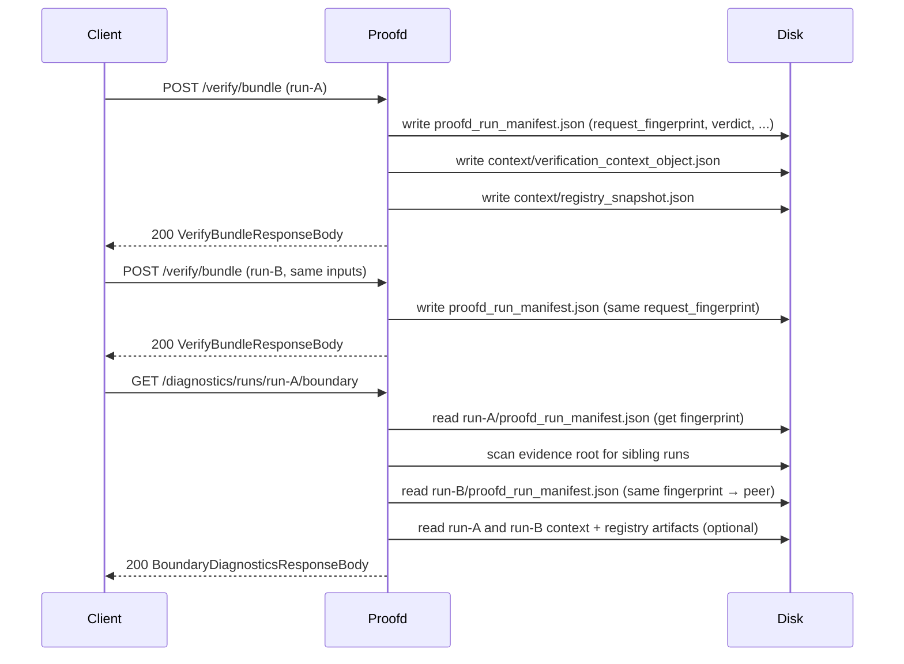

# Design Document: Phase 13 Replicated Verification Boundary

## Overview

This feature extends `userspace/proofd` to expose a cross-run consistency projection via a new
`GET /diagnostics/runs/{run_id}/boundary` endpoint. Multiple runs may verify the same bundle
with identical policy and registry inputs — they share the same `request_fingerprint` in their
`proofd_run_manifest.json`. The boundary endpoint reads existing run artifacts and projects
whether those peer runs produced consistent verdicts, context hashes, and registry hashes.

The pattern is identical to the federation, context, and registry dilims:
- `POST /verify/bundle` already materializes all required artifacts (no changes to the verify path)
- `GET /diagnostics/runs/{run_id}/boundary` exposes a new descriptive projection

No authority resolution, trust election, consensus semantics, or new crate dependencies are
introduced. All implementation is confined to `userspace/proofd/src/lib.rs`.

## Architecture

The feature touches one layer of `proofd`:

**Diagnostics layer** — a new route arm in `handle_run_endpoint` dispatches to
`build_run_boundary_diagnostics`, following the same structure as
`build_run_registry_diagnostics` and `build_run_context_diagnostics`.

The verify path (`POST /verify/bundle`) is unchanged. The `proofd_run_manifest.json` artifact
written during verification already contains `request_fingerprint` and `verdict` — these are
the two fields the boundary endpoint reads from each run's manifest.



## Components and Interfaces

### Route Dispatch

`handle_run_endpoint` gains one new match arm:

```rust
"boundary" if parts.len() == 4 => {
    match build_run_boundary_diagnostics(run_id, &run_dir, evidence_dir) {
        Ok(value) => json_response(200, value),
        Err(error) => error_response(error),
    }
}
```

This arm sits alongside the existing `"registry"`, `"context"`, and `"federation"` arms.
`evidence_dir` is already available in `handle_run_endpoint` — it is passed through to
`build_run_boundary_diagnostics` so that peer run directories can be scanned.

### New Function: `build_run_boundary_diagnostics`

```rust
fn build_run_boundary_diagnostics(
    run_id: &str,
    run_dir: &Path,
    evidence_dir: &Path,
) -> Result<Value, ServiceError>
```

Responsibilities:

1. Check `run_dir.is_dir()` — return `NotFound("run_dir_not_found")` if absent.
2. Load `proofd_run_manifest.json` via `load_required_run_json_artifact::<Value>` with error
   code `"invalid_run_manifest"`. The `NotFound` variant from that helper maps to
   `"artifact_not_found"` (manifest absent); the `MalformedArtifact` variant maps to
   `"invalid_run_manifest"` (present but unparseable).
3. Extract `request_fingerprint: &str` from the manifest — return
   `MalformedArtifact("invalid_run_manifest")` if the field is absent or not a string.
4. Extract `verdict: &str` from the manifest — return
   `MalformedArtifact("invalid_run_manifest")` if the field is absent or not a string.
5. Scan `evidence_dir` for peer runs: iterate subdirectories, skip the primary `run_id`,
   skip entries that are not directories, skip entries with unsafe path segments. For each
   candidate, attempt to read its `proofd_run_manifest.json` as `Value` — silently skip on
   any error. If the manifest's `request_fingerprint` matches, record it as a peer.
6. Build `observed_verdicts`: one entry per run (primary first, then peers), sorted
   lexicographically by `run_id` before serialization.
7. For each run in the peer set (primary + peers), optionally load
   `context/verification_context_object.json` and extract `verification_context_id`. Build
   `observed_context_hashes` from runs where the artifact is present; sort by `run_id`.
8. For each run in the peer set, optionally load `context/registry_snapshot.json` as
   `RegistrySnapshot` and call `compute_registry_snapshot_hash`. Build
   `observed_registry_hashes` from runs where the artifact is present and the hash succeeds;
   sort by `run_id`.
9. Compute consistency booleans from the observation arrays.
10. Serialize and return `BoundaryDiagnosticsResponseBody` (including `peer_run_ids` as the sorted list of peer `run_id` strings).

### New Response Types

```rust
#[derive(Debug, Clone, Serialize)]
struct BoundaryDiagnosticsResponseBody {
    run_id: String,
    request_fingerprint: String,
    peer_run_count: usize,
    peer_run_ids: Vec<String>,
    verdict_consistency: VerdictConsistency,
    context_hash_consistency: ContextHashConsistency,
    registry_hash_consistency: RegistryHashConsistency,
}

#[derive(Debug, Clone, Serialize)]
struct VerdictConsistency {
    all_verdicts_match: bool,
    observed_verdicts: Vec<RunVerdictEntry>,
}

#[derive(Debug, Clone, Serialize)]
struct RunVerdictEntry {
    run_id: String,
    verdict: String,
}

#[derive(Debug, Clone, Serialize)]
struct ContextHashConsistency {
    all_context_hashes_match: Option<bool>,
    observed_context_hashes: Vec<RunHashEntry>,
}

#[derive(Debug, Clone, Serialize)]
struct RegistryHashConsistency {
    all_registry_hashes_match: Option<bool>,
    observed_registry_hashes: Vec<RunHashEntry>,
}

#[derive(Debug, Clone, Serialize)]
struct RunHashEntry {
    run_id: String,
    hash: String,
}
```

`all_context_hashes_match` and `all_registry_hashes_match` are `Option<bool>`:
- `None` (serialized as JSON `null`) when the corresponding `observed_*` array is empty
- `Some(true)` when all entries carry the same hash string
- `Some(false)` when two or more entries carry different hash strings

## Data Models

### Artifact: `proofd_run_manifest.json`

Written during `POST /verify/bundle`. The boundary endpoint reads two fields:

```
{
  "run_id": "run-20260310-abc",
  "request_fingerprint": "sha256:abcdef...",
  "verdict": "TRUSTED",
  ...
}
```

`request_fingerprint` is the SHA-256 hash of the canonical `VerifyBundleRequestBody`. Two runs
share the same fingerprint if and only if they were invoked with identical request parameters.

### Artifact: `context/verification_context_object.json`

Read optionally per run. The `verification_context_id` field is used as the context hash for
that run's entry in `observed_context_hashes`. If the artifact is absent the run is excluded
from `observed_context_hashes`. If the artifact is present but unparseable the run is silently
skipped for context hash observation (fail-open for peer context, fail-closed for primary run
manifest).

### Artifact: `context/registry_snapshot.json`

Read optionally per run as `RegistrySnapshot`. The hash is always recomputed via
`compute_registry_snapshot_hash` — the self-declared `registry_snapshot_hash` field inside the
artifact is never used. If the artifact is absent the run is excluded from
`observed_registry_hashes`. If the artifact is present but unparseable or the hash computation
fails, the run is silently skipped for registry hash observation.

### Response: `GET /diagnostics/runs/{run_id}/boundary`

Full example with two peer runs, all artifacts present, consistent:

```json
{
  "run_id": "run-20260310-abc",
  "request_fingerprint": "sha256:abcdef...",
  "peer_run_count": 2,
  "verdict_consistency": {
    "all_verdicts_match": true,
    "observed_verdicts": [
      { "run_id": "run-20260310-abc", "verdict": "TRUSTED" },
      { "run_id": "run-20260310-def", "verdict": "TRUSTED" },
      { "run_id": "run-20260310-ghi", "verdict": "TRUSTED" }
    ]
  },
  "context_hash_consistency": {
    "all_context_hashes_match": true,
    "observed_context_hashes": [
      { "run_id": "run-20260310-abc", "hash": "ctx-hash-xyz" },
      { "run_id": "run-20260310-def", "hash": "ctx-hash-xyz" },
      { "run_id": "run-20260310-ghi", "hash": "ctx-hash-xyz" }
    ]
  },
  "registry_hash_consistency": {
    "all_registry_hashes_match": true,
    "observed_registry_hashes": [
      { "run_id": "run-20260310-abc", "hash": "sha256:111..." },
      { "run_id": "run-20260310-def", "hash": "sha256:111..." },
      { "run_id": "run-20260310-ghi", "hash": "sha256:111..." }
    ]
  }
}
```

Example with no context objects present:

```json
{
  "context_hash_consistency": {
    "all_context_hashes_match": null,
    "observed_context_hashes": []
  }
}
```

Example with a verdict mismatch across peers:

```json
{
  "verdict_consistency": {
    "all_verdicts_match": false,
    "observed_verdicts": [
      { "run_id": "run-20260310-abc", "verdict": "TRUSTED" },
      { "run_id": "run-20260310-def", "verdict": "UNTRUSTED" }
    ]
  }
}
```

### Observation Order

All three observation arrays (`observed_verdicts`, `observed_context_hashes`,
`observed_registry_hashes`) are sorted lexicographically by `run_id` before serialization.
This ensures deterministic output regardless of filesystem enumeration order.

### Peer Discovery Algorithm

```
1. Read evidence_dir entries
2. For each entry that is a directory and has a safe path segment name:
   a. Skip if name == primary run_id
   b. Attempt to read {entry}/proofd_run_manifest.json as Value
   c. On any error: silently skip
   d. Extract request_fingerprint field as string
   e. On missing/non-string field: silently skip
   f. If fingerprint matches primary: add to peer set
3. peer_run_count = peer set size
```

The fail-open policy for peer discovery (silently skip bad manifests) is intentional: a
corrupted sibling run should not prevent the primary run's boundary projection from being
served. The fail-closed policy applies only to the primary run's manifest.

## Correctness Properties

A property is a characteristic or behavior that should hold true across all valid executions
of a system — essentially, a formal statement about what the system should do. Properties
serve as the bridge between human-readable specifications and machine-verifiable correctness
guarantees.

Property 1: Response structure completeness
*For any* valid run directory containing a parseable `proofd_run_manifest.json` with a
`request_fingerprint` field, the boundary endpoint response SHALL contain `run_id`,
`request_fingerprint` (equal to the value in the manifest), `peer_run_count` (a non-negative
integer), `verdict_consistency`, `context_hash_consistency`, and `registry_hash_consistency`.
**Validates: Requirements 1.1, 3.1, 4.1, 4.2, 4.3**

Property 2: Peer discovery accuracy
*For any* evidence root containing N run directories that share the same `request_fingerprint`,
calling the boundary endpoint on any one of those runs SHALL return `peer_run_count` equal to
N-1 and `observed_verdicts` with exactly N entries (one per run including the primary).
**Validates: Requirements 2.1, 2.4, 4.3, 4.4**

Property 3: Verdict consistency semantics
*For any* set of runs discovered by the boundary endpoint, `all_verdicts_match` SHALL be
`true` if and only if every entry in `observed_verdicts` carries the same verdict string, and
`false` otherwise.
**Validates: Requirements 4.4, 5.1**

Property 4: Context hash consistency semantics
*For any* set of runs discovered by the boundary endpoint, `observed_context_hashes` SHALL
contain exactly one entry per run that has a `context/verification_context_object.json`
artifact, each entry's `hash` field SHALL equal the `verification_context_id` field from that
artifact, `all_context_hashes_match` SHALL be `null` when the array is empty, `Some(true)`
when all hashes are equal, and `Some(false)` when two or more hashes differ.
**Validates: Requirements 4.5, 4.7, 5.2, 5.5**

Property 5: Registry hash consistency semantics
*For any* set of runs discovered by the boundary endpoint, `observed_registry_hashes` SHALL
contain exactly one entry per run that has a `context/registry_snapshot.json` artifact, each
entry's `hash` field SHALL equal `compute_registry_snapshot_hash` applied to the deserialized
snapshot (never the self-declared hash field), `all_registry_hashes_match` SHALL be `null`
when the array is empty, `Some(true)` when all hashes are equal, and `Some(false)` when two
or more hashes differ.
**Validates: Requirements 4.6, 4.8, 5.3, 5.4**

Property 6: Observation arrays are sorted by run_id
*For any* boundary diagnostics response, the `observed_verdicts`, `observed_context_hashes`,
and `observed_registry_hashes` arrays SHALL each be in strict lexicographic order by `run_id`.
**Validates: Requirements 5.6**

Property 7: Endpoint is read-only
*For any* evidence root, calling `GET /diagnostics/runs/{run_id}/boundary` one or more times
SHALL leave the complete set of files on disk identical to the set before the first call.
**Validates: Requirements 3.4, 5.7**

## Error Handling

All errors follow the existing `ServiceError` pattern and produce the same JSON error envelope
used throughout `proofd`:

| Condition | HTTP | Error code |
|---|---|---|
| Run directory does not exist | 404 | `run_dir_not_found` |
| `proofd_run_manifest.json` absent | 404 | `artifact_not_found` |
| `proofd_run_manifest.json` unparseable | 500 | `invalid_run_manifest` |
| `request_fingerprint` field absent or not a string | 500 | `invalid_run_manifest` |
| `verdict` field absent or not a string in primary manifest | 500 | `invalid_run_manifest` |
| Response serialization fails | 500 | `response_serialize_failed` |
| Query string present | 400 | `unsupported_query_parameter` |
| Non-GET method on diagnostics path | 405 | `method_not_allowed` |

**Peer discovery errors (fail-open):** Any error reading or parsing a sibling run's
`proofd_run_manifest.json` causes that sibling to be silently skipped. This includes missing
files, unreadable files, invalid JSON, and missing `request_fingerprint` fields. The primary
run's manifest is always fail-closed.

**Optional artifact errors (fail-open for peers):** For context objects and registry snapshots
on peer runs, any read or parse error causes that run to be excluded from the corresponding
observation array. For the primary run, the same fail-open policy applies — a missing or
unparseable context object or registry snapshot simply means that run is excluded from the
respective observation array (it does not cause a 500 error).

The existing `validate_get_query` function already rejects query strings on all run-scoped
paths. No changes needed there.

## Testing Strategy

### Unit Tests

Unit tests cover specific examples and error conditions using the existing `temp_dir` /
`write_artifact` / `write_json` test helpers in `lib.rs`:

- Happy path: single run, no peers → `peer_run_count: 0`, `observed_verdicts` has one entry
- Happy path: primary + 2 peers with same fingerprint → `peer_run_count: 2`, all three in `observed_verdicts`
- Happy path: sibling run with different fingerprint → not included as peer
- Verdict mismatch: peers have different verdicts → `all_verdicts_match: false`
- Context hash consistency: all runs have context objects with same `verification_context_id` → `all_context_hashes_match: true`
- Context hash mismatch: runs have different `verification_context_id` values → `all_context_hashes_match: false`
- No context objects present → `all_context_hashes_match: null`, `observed_context_hashes: []`
- Registry hash consistency: all runs have registry snapshots with same recomputed hash → `all_registry_hashes_match: true`
- Registry hash mismatch: runs have different registry snapshots → `all_registry_hashes_match: false`
- No registry snapshots present → `all_registry_hashes_match: null`, `observed_registry_hashes: []`
- Sibling with missing manifest → silently skipped, not counted as peer
- Sibling with malformed manifest → silently skipped, not counted as peer
- Missing run directory → 404 `run_dir_not_found`
- Missing `proofd_run_manifest.json` → 404 `artifact_not_found`
- Malformed `proofd_run_manifest.json` → 500 `invalid_run_manifest`
- Manifest missing `request_fingerprint` field → 500 `invalid_run_manifest`
- Query string present → 400 `unsupported_query_parameter`
- POST method → 405 `method_not_allowed`
- Observation arrays are sorted by `run_id` (primary not necessarily first alphabetically)

### Property-Based Tests

Property tests use `proptest` (already available in `proofd`'s dev-dependencies).
Each property test runs a minimum of 100 iterations.

**Property 1 — Response structure completeness**
Tag: `Feature: phase13-replicated-verification-boundary, Property 1: response structure completeness`
Generate a random `run_id` and a random `request_fingerprint` string. Write a minimal
`proofd_run_manifest.json` with those fields plus a `verdict`. Call the boundary endpoint.
Assert the response is HTTP 200 and contains `run_id`, `request_fingerprint` (matching the
manifest), `peer_run_count`, `verdict_consistency`, `context_hash_consistency`, and
`registry_hash_consistency`.

**Property 2 — Peer discovery accuracy**
Tag: `Feature: phase13-replicated-verification-boundary, Property 2: peer discovery accuracy`
Generate an evidence root with N run directories (1–8) all sharing the same
`request_fingerprint`, plus M run directories (0–4) with different fingerprints. For each of
the N runs, call the boundary endpoint and assert `peer_run_count == N - 1` and
`observed_verdicts.len() == N`. Assert runs with different fingerprints are never included.

**Property 3 — Verdict consistency semantics**
Tag: `Feature: phase13-replicated-verification-boundary, Property 3: verdict consistency semantics`
Generate a set of runs with random verdict strings. Call the boundary endpoint. Assert
`all_verdicts_match` equals whether all verdict strings in `observed_verdicts` are identical.

**Property 4 — Context hash consistency semantics**
Tag: `Feature: phase13-replicated-verification-boundary, Property 4: context hash consistency semantics`
Generate a set of runs where each run may or may not have a `context/verification_context_object.json`
with a random `verification_context_id`. Call the boundary endpoint. Assert:
- `observed_context_hashes` contains exactly one entry per run that has the artifact
- each entry's `hash` equals the `verification_context_id` from that run's artifact
- `all_context_hashes_match` is `null` when the array is empty, `true` when all hashes match, `false` when they differ

**Property 5 — Registry hash consistency semantics**
Tag: `Feature: phase13-replicated-verification-boundary, Property 5: registry hash consistency semantics`
Generate a set of runs where each run may or may not have a `context/registry_snapshot.json`
containing a random `RegistrySnapshot`. Call the boundary endpoint. Assert:
- `observed_registry_hashes` contains exactly one entry per run that has the artifact
- each entry's `hash` equals `compute_registry_snapshot_hash` applied to the deserialized snapshot
- `all_registry_hashes_match` is `null` when the array is empty, `true` when all hashes match, `false` when they differ

**Property 6 — Observation arrays are sorted by run_id**
Tag: `Feature: phase13-replicated-verification-boundary, Property 6: observation arrays are sorted by run_id`
Generate a set of runs with random `run_id` strings. Call the boundary endpoint. Assert that
`observed_verdicts`, `observed_context_hashes`, and `observed_registry_hashes` are each in
strict lexicographic order by `run_id`.

**Property 7 — Endpoint is read-only**
Tag: `Feature: phase13-replicated-verification-boundary, Property 7: endpoint is read-only`
Snapshot the complete set of files in an evidence root. Call
`GET /diagnostics/runs/{run_id}/boundary` one or more times. Assert the file set is identical
before and after each call.
