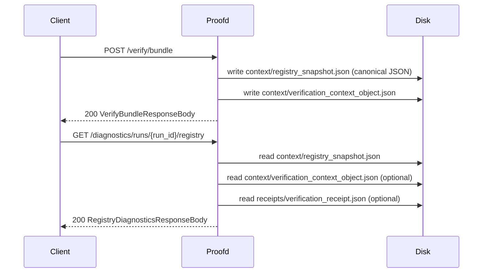

# Design Document: Phase 13 Trust Registry Propagation

## Overview

This feature extends `userspace/proofd` to complete the Phase 13 context package by making the registry propagation material explicit and inspectable. The registry snapshot is already written to `context/registry_snapshot.json` as part of the context propagation dilim — this feature formalizes that artifact's role in the run surface and adds a dedicated read-only diagnostics endpoint that projects registry binding information without any authority resolution or consensus semantics.

The pattern is identical to the federation and context dilims:
- `POST /verify/bundle` materializes the artifact (already done; this feature makes it a first-class named artifact)
- `GET /diagnostics/runs/{run_id}/registry` exposes a descriptive projection

## Architecture

The feature touches two layers of `proofd`:

1. **Artifact layer** — `context/registry_snapshot.json` is promoted to a named nested run-level artifact, enumerated alongside the other context artifacts.
2. **Diagnostics layer** — a new route arm in `handle_run_endpoint` dispatches to `build_run_registry_diagnostics`, following the same structure as `build_run_federation_diagnostics` and `build_run_context_diagnostics`.

No new dependencies are introduced. All required functions (`compute_registry_snapshot_hash`, `load_verification_context_object`) already exist in `proof-verifier`.



## Components and Interfaces

### Route Dispatch

`handle_run_endpoint` gains one new match arm:

```rust
"registry" if parts.len() == 4 => {
    match build_run_registry_diagnostics(run_id, &run_dir) {
        Ok(value) => json_response(200, value),
        Err(error) => error_response(error),
    }
}
```

This arm sits alongside the existing `"federation"` and `"context"` arms. No other routing logic changes.

### Artifact Enumeration

`NESTED_RUN_LEVEL_ARTIFACTS` already contains `CONTEXT_REGISTRY_SNAPSHOT_RELATIVE_PATH` (`"context/registry_snapshot.json"`). No change is needed here — the artifact is already enumerated. This requirement is satisfied by the existing context propagation implementation.

### New Function: `build_run_registry_diagnostics`

```rust
fn build_run_registry_diagnostics(
    run_id: &str,
    run_dir: &Path,
) -> Result<Value, ServiceError>
```

Responsibilities:
1. Load and parse `context/registry_snapshot.json` as `RegistrySnapshot` — fail with `MalformedArtifact("invalid_context_registry_snapshot")` if absent or unparseable.
2. Recompute `registry_snapshot_hash` via `compute_registry_snapshot_hash` — fail with `MalformedArtifact("invalid_context_registry_snapshot")` if it errors. The recomputed hash is always used as `declared_registry_snapshot_hash`; the self-declared `snapshot.registry_snapshot_hash` field is never trusted for this purpose.
3. Load `context/verification_context_object.json` optionally via `load_optional_run_json_artifact`.
4. Load `receipts/verification_receipt.json` optionally.
5. Build `context_binding_status` by comparing the recomputed hash against the context object's `registry_snapshot_hash` field (or `null` if context object absent).
6. Build `observed_registry_hash_sources` by collecting hash values from each present source surface, deduplicating and sorting each `values` array.
7. Serialize and return `RegistryDiagnosticsResponseBody`.

### New Response Type: `RegistryDiagnosticsResponseBody`

```rust
#[derive(Debug, Clone, Serialize)]
struct RegistryDiagnosticsResponseBody {
    run_id: String,
    source_artifact_path: &'static str,
    declared_registry_snapshot_hash: String,
    declared_registry_entry_count: usize,
    context_binding_status: RegistryContextBindingStatus,
    observed_registry_hash_sources: Vec<RegistryObservationSource>,
}

#[derive(Debug, Clone, Serialize)]
struct RegistryContextBindingStatus {
    registry_snapshot_hash_matches_declared_context: Option<bool>,
}

#[derive(Debug, Clone, Serialize)]
struct RegistryObservationSource {
    source: &'static str,
    #[serde(skip_serializing_if = "Option::is_none")]
    source_artifact_path: Option<&'static str>,
    values: Vec<String>,
}
```

`registry_snapshot_hash_matches_declared_context` is `Option<bool>`: `Some(true/false)` when the context object is present, `None` (serialized as JSON `null`) when absent.

## Data Models

### Artifact: `context/registry_snapshot.json`

Written during `POST /verify/bundle` by the existing `write_verification_context_package` function using `write_canonical_json_file_if_absent_or_same`. The file is the canonical JSON encoding of the `RegistrySnapshot` value loaded from `registry_path`.

```
RegistrySnapshot {
    registry_format_version: u32,
    registry_version: u32,
    registry_snapshot_hash: String,       // self-declared hash (may be empty)
    producers: BTreeMap<String, RegistryEntry>,
}
```

`declared_registry_entry_count` = `snapshot.producers.len()`.

### Response: `GET /diagnostics/runs/{run_id}/registry`

```json
{
  "run_id": "run-20260310-abc",
  "source_artifact_path": "context/registry_snapshot.json",
  "declared_registry_snapshot_hash": "sha256:abcdef...",
  "declared_registry_entry_count": 3,
  "context_binding_status": {
    "registry_snapshot_hash_matches_declared_context": true
  },
  "observed_registry_hash_sources": [
    {
      "source": "verification_context_object",
      "source_artifact_path": "context/verification_context_object.json",
      "values": ["sha256:abcdef..."]
    },
    {
      "source": "receipt",
      "source_artifact_path": "receipts/verification_receipt.json",
      "values": ["sha256:abcdef..."]
    }
  ]
}
```

When the context object is absent:

```json
{
  "context_binding_status": {
    "registry_snapshot_hash_matches_declared_context": null
  },
  "observed_registry_hash_sources": []
}
```

### Source Surface Observation Order

Sources are appended in a fixed, deterministic order:
1. `"verification_context_object"` (from `context/verification_context_object.json`)
2. `"receipt"` (from `receipts/verification_receipt.json`)

Entries with empty `values` arrays are dropped before serialization. Each `values` array is deduplicated and lexicographically sorted using the existing `unique_sorted_strings` helper.

## Correctness Properties

A property is a characteristic or behavior that should hold true across all valid executions of a system — essentially, a formal statement about what the system should do. Properties serve as the bridge between human-readable specifications and machine-verifiable correctness guarantees.

Property 1: Registry artifact write idempotence
*For any* valid `RegistrySnapshot`, calling `write_canonical_json_file_if_absent_or_same` twice with the same value should succeed both times and produce identical bytes on disk.
**Validates: Requirements 1.2**

Property 2: Registry diagnostics hash consistency
*For any* run directory containing a valid `context/registry_snapshot.json`, the `declared_registry_snapshot_hash` returned by the registry diagnostics endpoint should equal the value computed by `compute_registry_snapshot_hash` applied to the deserialized snapshot.
**Validates: Requirements 3.3, 5.3, 5.4**

Property 3: Context binding status correctness
*For any* run directory where both `context/registry_snapshot.json` and `context/verification_context_object.json` are present, `context_binding_status.registry_snapshot_hash_matches_declared_context` should be `true` if and only if the recomputed hash equals the `registry_snapshot_hash` field in the context object.
**Validates: Requirements 3.5**

Property 4: Observed sources values are unique and sorted
*For any* registry diagnostics response, every `values` array within `observed_registry_hash_sources` should contain no duplicate strings and should be in lexicographic order.
**Validates: Requirements 3.7**

Property 5: Empty sources are omitted
*For any* run directory where a source surface artifact is absent or carries no registry hash reference, the corresponding source entry should not appear in `observed_registry_hash_sources`.
**Validates: Requirements 3.8, 4.3**

Property 6: Entry count matches producers map
*For any* valid `RegistrySnapshot`, `declared_registry_entry_count` should equal `snapshot.producers.len()`.
**Validates: Requirements 3.4**

Property 7: Endpoint is read-only
*For any* sequence of `GET /diagnostics/runs/{run_id}/registry` calls on the same run directory, the set of files on disk should be identical before and after each call.
**Validates: Requirements 5.1, 5.2**

## Error Handling

All errors follow the existing `ServiceError` pattern and produce the same JSON error envelope used throughout `proofd`:

| Condition | HTTP | Error code |
|---|---|---|
| Run directory does not exist | 404 | `run_dir_not_found` |
| `context/registry_snapshot.json` absent | 404 | `artifact_not_found` |
| `context/registry_snapshot.json` unparseable | 500 | `invalid_context_registry_snapshot` |
| `compute_registry_snapshot_hash` fails | 500 | `invalid_context_registry_snapshot` |
| `context/verification_context_object.json` unparseable | 500 | `invalid_verification_context_object` |
| `receipts/verification_receipt.json` unparseable | 500 | `invalid_receipt_artifact` |
| Response serialization fails | 500 | `response_serialize_failed` |
| Query string present | 400 | `unsupported_query_parameter` |
| Non-GET method on diagnostics path | 405 | `method_not_allowed` |

The existing `validate_get_query` function already rejects query strings on all run-scoped paths except `/diagnostics/incidents`. No changes needed there.

Optional artifacts (`verification_context_object`, `receipt`) use `load_optional_run_json_artifact` — if the file is absent the field is simply omitted from the projection; if the file is present but unparseable it is a hard error.

## Testing Strategy

### Unit Tests

Unit tests cover specific examples and error conditions using the existing `temp_dir` / `write_artifact` / `write_json` test helpers in `lib.rs`:

- Happy path: run with registry snapshot + context object + receipt → correct response fields
- Happy path: run with registry snapshot only (no context object, no receipt) → `null` binding status, empty sources
- Hash mismatch: context object has a different `registry_snapshot_hash` → `false` binding status
- Missing run directory → 404 `run_dir_not_found`
- Missing `context/registry_snapshot.json` → 404 `artifact_not_found`
- Malformed `context/registry_snapshot.json` → 500 `invalid_context_registry_snapshot`
- Query string present → 400 `unsupported_query_parameter`
- POST method → 405 `method_not_allowed`
- `declared_registry_entry_count` equals `producers.len()`

### Property-Based Tests

Property tests use `proptest` (already available transitively via `proof-verifier`'s test dependencies, or added directly to `proofd`'s `[dev-dependencies]`).

Each property test runs a minimum of 100 iterations.

**Property 1 — Registry artifact write idempotence**
Tag: `Feature: phase13-trust-registry-propagation, Property 1: registry artifact write idempotence`
Generate a random `RegistrySnapshot`. Write it twice via `write_canonical_json_file_if_absent_or_same`. Assert both calls succeed and the file bytes are identical.

**Property 2 — Registry diagnostics hash consistency**
Tag: `Feature: phase13-trust-registry-propagation, Property 2: registry diagnostics hash consistency`
Generate a random `RegistrySnapshot`. Write it to a temp run dir. Call the registry diagnostics endpoint. Assert `declared_registry_snapshot_hash` equals `compute_registry_snapshot_hash(&snapshot)`.

**Property 3 — Context binding status correctness**
Tag: `Feature: phase13-trust-registry-propagation, Property 3: context binding status correctness`
Generate a random `RegistrySnapshot` and a `VerificationContextObject`. Write both. Independently vary whether the context object's `registry_snapshot_hash` matches the recomputed hash. Assert `registry_snapshot_hash_matches_declared_context` reflects the actual equality.

**Property 4 — Observed sources values are unique and sorted**
Tag: `Feature: phase13-trust-registry-propagation, Property 4: observed sources values are unique and sorted`
Generate a random run with any combination of present/absent source surfaces. Call the endpoint. For every entry in `observed_registry_hash_sources`, assert `values` has no duplicates and is lexicographically sorted.

**Property 5 — Empty sources are omitted**
Tag: `Feature: phase13-trust-registry-propagation, Property 5: empty sources are omitted`
Generate a run where one or more source surfaces are absent. Assert no entry with an empty `values` array appears in `observed_registry_hash_sources`.

**Property 6 — Entry count matches producers map**
Tag: `Feature: phase13-trust-registry-propagation, Property 6: entry count matches producers map`
Generate a random `RegistrySnapshot` with a random number of producers. Write it and call the endpoint. Assert `declared_registry_entry_count` equals the number of producers.

**Property 7 — Endpoint is read-only**
Tag: `Feature: phase13-trust-registry-propagation, Property 7: endpoint is read-only`
Snapshot the set of files in a run directory. Call `GET /diagnostics/runs/{run_id}/registry` one or more times. Assert the file set is unchanged.
