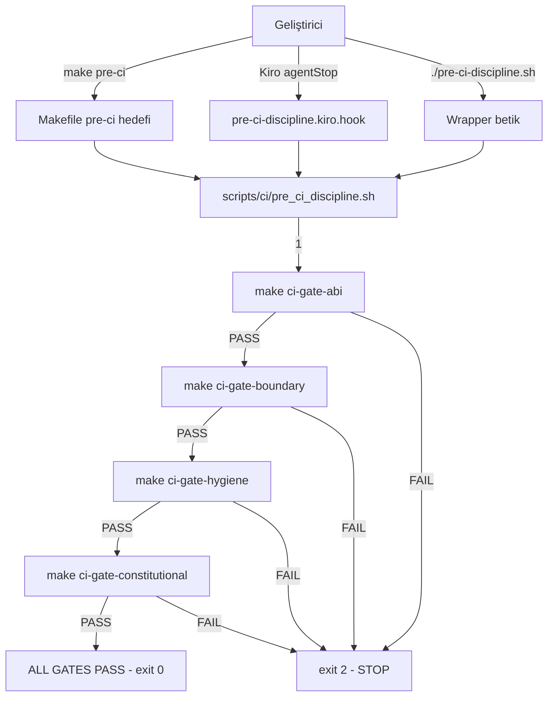

# Tasarım Belgesi: Pre-CI Discipline

## Genel Bakış

Pre-CI Discipline, AykenOS geliştirme iş akışında gerçek CI çalıştırılmadan önce geliştirici iş istasyonunda çalışan yerel, fail-closed bir disiplin katmanıdır. Dört temel anayasal kapıyı (`ci-gate-abi`, `ci-gate-boundary`, `ci-gate-hygiene`, `ci-gate-constitutional`) sabit bir sırayla çalıştırır ve ilk başarısızlıkta durur.

Bu sistem üç bileşenden oluşur:

1. **Shell betiği** (`scripts/ci/pre_ci_discipline.sh`): Kapıları sırayla çalıştıran fail-closed yürütücü
2. **Makefile hedefi** (`make pre-ci`): Betiğe delege eden build sistemi arayüzü
3. **Kiro hook** (`.kiro/hooks/pre-ci-discipline.kiro.hook`): `agentStop` olayında otomatik tetikleyici

Mevcut `ci-gate-simulation.kiro.hook` ile bu spec arasındaki fark: `ci-gate-simulation` hook'u inline shell kodu içerirken, bu spec betiği ayrı bir dosyaya çıkarır ve hook'u o betiğe delege eder. Bu, betiğin bağımsız olarak test edilmesini ve bakımını kolaylaştırır.

## Mimari



### Tasarım Kararları

**Neden betik ayrı bir dosyada?**
Hook içine gömülü inline shell kodu test edilemez ve bakımı zordur. Betiği ayrı tutmak, `make pre-ci`, hook ve wrapper'ın hepsinin aynı kodu çalıştırmasını sağlar (tek kaynak).

**Neden 4 kapı, 12 değil?**
Runtime kapıları (Ring0 Exports, Workspace, Syscall v2, Sched Bridge, Policy Accept, Performance) QEMU ortamı veya CI altyapısı gerektirir. Yerel iş istasyonunda güvenilir şekilde çalışmazlar. 4 temel kapı (~30-60s) hızlı geri bildirim için yeterlidir.

**Neden fail-closed, advisory değil?**
AykenOS anayasal kuralları (Rule 1-10) ihlal toleransı tanımaz. Kapı başarısızlığı her zaman geliştiricinin dikkatini gerektirir; sessiz geçiş mimari bütünlüğü için tehlikelidir.

## Bileşenler ve Arayüzler

### 1. `scripts/ci/pre_ci_discipline.sh`

Ana yürütme betiği. Mevcut haliyle zaten doğru uygulanmış durumda.

**Arayüz:**
- Giriş: Ortam değişkenleri (`EVIDENCE_ROOT`, `KERNEL_PROFILE`)
- Çıkış: `0` (tüm kapılar geçti), `2` (kapı başarısız)
- Stdout: Kapı adları, PASS/FAIL durumları, kanıt yolu

**`run_gate()` fonksiyonu:**
```bash
run_gate(gate_cmd, gate_name)
  → make $gate_cmd çalıştır
  → PASS: devam et
  → FAIL: kapı adını, "fail-closed" mesajını, kanıt yolunu yaz; exit 2
```

### 2. `pre-ci-discipline.sh` (kök wrapper)

Kök dizindeki wrapper; `scripts/ci/pre_ci_discipline.sh`'e delege eder. Mevcut haliyle doğru.

### 3. `Makefile` `pre-ci` hedefi

```makefile
.PHONY: pre-ci
pre-ci:
    @bash scripts/ci/pre_ci_discipline.sh
```

Mevcut haliyle doğru uygulanmış.

### 4. `docs/hooks/pre-ci-discipline.kiro.hook`

`agentStop` olayında `scripts/ci/pre_ci_discipline.sh`'i çalıştıran Kiro hook tanımı.

> **Not**: Hook dosyaları `.kiro/hooks/` yerine `docs/hooks/` altında tutulur. Bu, hook konfigürasyonlarının proje dokümantasyonuyla birlikte yönetilmesini sağlar.

**Hook yapısı:**
```json
{
  "enabled": true,
  "name": "Pre-CI Discipline",
  "description": "...",
  "version": "1.0",
  "when": { "type": "agentStop" },
  "then": {
    "type": "runCommand",
    "command": "bash scripts/ci/pre_ci_discipline.sh"
  },
  "workspaceFolderName": "AykenOS",
  "shortName": "pre-ci-discipline"
}
```

**`runCommand` vs `askAgent`:**
- `runCommand`: Doğrudan shell komutu çalıştırır, doğal dil yorumlaması gerektirmez
- `askAgent`: Agent'a prompt gönderir, yorumlama gerektirir
- Pre-CI Discipline deterministik bir betik çalıştırdığından `runCommand` daha uygun

**Mevcut `ci-gate-simulation.kiro.hook` ile ilişki:**
- `ci-gate-simulation`: Inline shell kodu içerir, `agentStop` olayında çalışır
- `pre-ci-discipline`: Betiğe delege eder, `runCommand` kullanır
- Geçiş planı: `pre-ci-discipline` hook'u aktif edildiğinde `ci-gate-simulation` devre dışı bırakılabilir

### 5. Test Betiği (`scripts/ci/test_pre_ci_discipline.sh`)

Pre-CI Discipline davranışını mock kapılarla doğrulayan test betiği.

**Mock kapı mekanizması:**
```bash
# Mock make komutu: belirli kapılar için başarısız, diğerleri için başarılı
mock_make() {
  case "$1" in
    ci-gate-abi)       return $ABI_EXIT ;;
    ci-gate-boundary)  return $BOUNDARY_EXIT ;;
    ci-gate-hygiene)   return $HYGIENE_EXIT ;;
    ci-gate-constitutional) return $CONSTITUTIONAL_EXIT ;;
  esac
}
```

## Veri Modelleri

### Kapı Yürütme Durumu

```
GateResult {
  name: string          # "ABI Gate" | "Boundary Gate" | "Hygiene Gate" | "Constitutional Gate"
  exit_code: int        # 0 = PASS, non-zero = FAIL
  output: string        # stdout çıktısı
}

DisciplineRun {
  gates: GateResult[]   # Çalıştırılan kapılar (başarısızlıkta kısmi)
  final_exit: int       # 0 = tüm geçti, 2 = başarısız
  evidence_root: string # EVIDENCE_ROOT veya "out/evidence"
  run_id: string        # Format: YYYYMMDDTHHMMSSZ-<git-short-sha>
                        # Örnek: 20260314T143022Z-2f3c91a
}
```

### RUN_ID Formatı

```
RUN_ID = YYYYMMDDTHHMMSSZ-<git-short-sha>
```

- `YYYYMMDDTHHMMSSZ`: UTC zaman damgası (ISO 8601 temel format)
- `<git-short-sha>`: `git rev-parse --short HEAD` çıktısı (7 karakter)
- Örnek: `20260314T143022Z-2f3c91a`
- Bu format `evidence/run-<RUN_ID>/` dizin yapısıyla tutarlıdır

### Hook Konfigürasyon Şeması

```json
{
  "enabled": boolean,
  "name": string,
  "description": string,
  "version": string,
  "when": { "type": "agentStop" },
  "then": { "type": "askAgent", "prompt": string },
  "workspaceFolderName": "AykenOS",
  "shortName": string
}
```

## Doğruluk Özellikleri

*Bir özellik, sistemin tüm geçerli yürütmelerinde doğru olması gereken bir karakteristik veya davranıştır; temelde sistemin ne yapması gerektiğine dair resmi bir ifadedir. Özellikler, insan tarafından okunabilir spesifikasyonlar ile makine tarafından doğrulanabilir doğruluk garantileri arasında köprü görevi görür.*

### Özellik 1: Kapı Sırası Değişmezi

*Herhangi bir* pre-ci disiplin çalıştırması için, kapıların çalıştırılma sırası her zaman ABI → Boundary → Hygiene → Constitutional olmalıdır; bu sıra hiçbir koşulda değişmemelidir.

**Doğrular: Gereksinim 1.1, 1.6**

### Özellik 2: Fail-Closed Davranışı

*Herhangi bir* kapı pozisyonu (1-4) için, o pozisyondaki kapı başarısız olduğunda, sonraki kapıların hiçbiri çalıştırılmamalıdır.

**Doğrular: Gereksinim 1.2**

### Özellik 3: Başarısızlık Çıkış Kodu

*Herhangi bir* kapı başarısız olduğunda, pre-ci disiplin betiğinin çıkış kodu her zaman `2` olmalıdır; `1` veya başka bir değer kabul edilemez.

**Doğrular: Gereksinim 1.3**

### Özellik 4: Başarısızlık Çıktısı Bütünlüğü

*Herhangi bir* başarısız kapı için, çıktı şu üç öğeyi birlikte içermelidir: (a) başarısız kapının adı, (b) "Stopping execution (fail-closed)." mesajı, (c) kanıt dizini yolu.

**Doğrular: Gereksinim 2.1, 2.2, 2.3**

### Özellik 5: Başarı Çıktısı Bütünlüğü

Tüm dört kapı başarıyla tamamlandığında, çıktı şu öğeleri içermelidir: (a) her kapı için "PASS" onayı, (b) "ALL GATES PASS" mesajı, (c) "Real CI remains mandatory for merge." uyarısı; çıkış kodu `0` olmalıdır.

**Doğrular: Gereksinim 1.4, 2.4, 5.1**

### Özellik 6: Deterministik Yeniden Üretilebilirlik

*Herhangi bir* kaynak durumu için, aynı mock kapı sonuçlarıyla iki ardışık çalıştırma aynı çıktıyı ve aynı çıkış kodunu üretmelidir.

**Doğrular: Gereksinim 6.3**

### Özellik 7: Workspace Mutasyon Yasağı

Pre-CI Discipline çalıştırması tamamlandıktan sonra, workspace içeriği (kaynak dosyalar, tracked dosyalar) çalıştırma öncesiyle birebir aynı olmalıdır. Pre-CI Discipline salt okunur doğrulama yapar; hiçbir dosyayı oluşturmaz, değiştirmez veya silmez.

**Doğrular: Gereksinim 1.5, 6.2**

## Hata Yönetimi

### Kapı Başarısızlığı

- **Davranış**: Derhal dur, `exit 2` döndür
- **Çıktı**: Kapı adı + "GATE FAILURE" + "fail-closed" mesajı + kanıt yolu
- **Otomatik düzeltme**: YOK — geliştirici manuel müdahale etmelidir
- **Bypass**: YOK — anayasal kural, bypass yasaktır

### Betik Hataları (`set -euo pipefail`)

- Beklenmedik komut hatası → betik derhal durur
- Tanımsız değişken → betik derhal durur
- Pipe hatası → betik derhal durur

### Hook Hataları

- Hook betiği bulunamazsa → Kiro agent hata raporlar
- Betik çalıştırma izni yoksa → `chmod +x` gerekir

### `EVIDENCE_ROOT` Ortam Değişkeni

- Ayarlanmışsa: o yol kullanılır
- Ayarlanmamışsa: `out/evidence` varsayılanı kullanılır
- Geçersiz yol: betik hata vermez, yalnızca yolu çıktıya yazar (kanıt oluşturma `make ci-gate-*`'ın sorumluluğundadır)

## Test Stratejisi

### İkili Test Yaklaşımı

**Birim testleri** (`scripts/ci/test_pre_ci_discipline.sh`):
- Mock `make` komutuyla betik davranışını doğrular
- Her kapı pozisyonu için başarısızlık senaryoları
- Başarı senaryosu (tüm kapılar geçer)
- Çıkış kodu doğrulaması
- Çıktı içeriği doğrulaması

**Özellik testleri** (shell tabanlı, `proptest` yerine bash döngüleri):
- Pre-CI Discipline bir shell betiği olduğundan Rust `proptest` kullanılamaz
- Özellikler, parametrik bash test fonksiyonlarıyla doğrulanır
- Her özellik için minimum 4 farklı giriş kombinasyonu test edilir

### Özellik Testi Konfigürasyonu

Her özellik testi şu etiketi içermelidir:
`# Feature: pre-ci-discipline, Property N: <özellik metni>`

**Özellik 1 (Kapı Sırası)**: 4 farklı başarısızlık pozisyonu için sıra doğrulaması
**Özellik 2 (Fail-Closed)**: Her kapı pozisyonu için sonraki kapıların çalışmadığını doğrula
**Özellik 3 (Çıkış Kodu)**: 4 başarısızlık pozisyonu × çıkış kodu = 2 doğrulaması
**Özellik 4 (Başarısızlık Çıktısı)**: 4 kapı adı × 3 çıktı öğesi doğrulaması
**Özellik 5 (Başarı Çıktısı)**: Tüm kapılar geçer → 3 çıktı öğesi + exit 0
**Özellik 6 (Deterministik)**: Aynı giriş → aynı çıktı (2 çalıştırma karşılaştırması)

### Birim Test Örnekleri

```bash
# Örnek: ABI kapısı başarısız → exit 2, boundary çalışmaz
test_abi_fail() {
  ABI_EXIT=1 BOUNDARY_EXIT=0 HYGIENE_EXIT=0 CONSTITUTIONAL_EXIT=0 \
    run_discipline
  assert_exit_code 2
  assert_output_contains "ABI Gate"
  assert_output_contains "fail-closed"
  assert_output_not_contains "Boundary Gate"
}

# Örnek: Tüm kapılar geçer → exit 0
test_all_pass() {
  ABI_EXIT=0 BOUNDARY_EXIT=0 HYGIENE_EXIT=0 CONSTITUTIONAL_EXIT=0 \
    run_discipline
  assert_exit_code 0
  assert_output_contains "ALL GATES PASS"
  assert_output_contains "Real CI remains mandatory"
}
```

### Hook Konfigürasyon Testleri

Hook JSON dosyasının doğruluğu `jq` ile doğrulanır:
- `enabled: true`
- `when.type: "agentStop"`
- `then.type: "askAgent"`
- `shortName: "pre-ci-discipline"`
- `workspaceFolderName: "AykenOS"`
